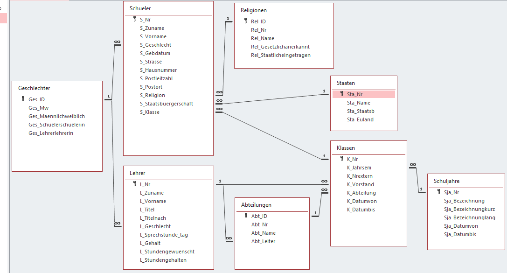

# Übungen zu Microsoft Access

## 1. Import: Erstellen einer Stundenplan Datenbank

1. Erstellen Sie für jede csv Datei des Archives *Stdplan20180906.zip* eine Access Tabelle. Achten 
   Sie dabei auf die Spaltenbezeichnungen, den verwendeten Datentyp und ob eine Eingabe erforderlich ist.
1. Erstellen Sie in jeder Tabelle einen geeigneten Primärschlüssel. Manche Tabellen haben schon 
   Spalten, die dafür geeignet sind. Falls nicht, legen Sie einen AutoWert mit dem Spaltennamen **ID** an.
1. Erstellen Sie Beziehungen zwischen den Tabellen. Aktivieren Sie dabei die Option 
   *Referentielle Integrität*
1. Kopieren Sie die Daten von der CSV Datei in die Access-Tabelle, indem Sie die CSV Datei in einem
   Editor öffnen. Danach kopieren Sie alles mittels `STRG+C` und `STRG+V` in die erstellte Tabelle.
   Da das Trennzeichen der Tabulator ist, wird dies als Spaltentrennung erkannt.
   
### Hinweise
- Die Datentypen und längen müssen exakt ident sein, wenn Sie eine Beziehung zwischen den Spalten herstellen.
- Der Datensatz in der Stundenplantabelle mit dem Raum `~B3.08MF~B5.09` wird ein Problem verursachen:
  Dieser Raum ist nicht in der Raumtabelle eingetragen. Beheben Sie dieses Problem durch Löschen des
  Datensatzes in der Stundenplan Tabelle.

## 2. Abfragen aus einer Tabelle (basierend auf *schuldb1_ablecture3.accdb*)

Lösen Sie die folgenden Abfragebeispiele auf Basis der Datenbank *schuldb1_ablecture3.accdb*. Speichern
Sie diese mit dem Titel EX0x_(Laufnummer) (x ist das Kapitel). Falls nicht ansderes angegeben ist, geben Sie alle Felder
der Tabelle ohne Sortierung aus.

Mit *STRG+F2* können Sie das Kriterienfeld vergrößern um leichter die Kriterien eingeben zu können.

1. Welche Klassen sind Fachschulklassen (enden mit FID)? Sortieren Sie nach der Klassenbezeichnung.
1. Welche Klassen gehören zum 1. Jahrgang (beginnen mit 1). Sortieren Sie nach der Klassenbezeichnung.
1. Welche Klassen hat Griesmayer (GT) als Klassenvorstand.
1. Welche Schuljahre beginnen im Jahr 2009? Verwenden Sie dafür die Funktion *Year()*, die Sie auf die Spalte
   *Sja_Datumvon* anwenden. Filtern Sie diese berechnete Spalte dann nach den Wert 2009.
1. Wie lange dauern die verschiedenen Schuljahre? Geben Sie die alle Spalten aus Schuljahre und eine
   berechnete Spalte *AnzTage* aus. Subtrahieren Sie hierfür einfach die Datumswerte, die Differenz
   wird in Tagen geliefert.
1. Welche Staaten sind kein EU Land? Diese Staaten haben in der Tabelle *Staaten* den Wert NULL in der
   Spalte *Sta_Euland*.
1. Welche Lehrer sind männlich (*L_Geschlecht* ist 1) und haben ein Gehalt von über 700 Euro?
1. Welche Schüler besuchen Biomedizin- und Gesundheitstechnik? Diese Schüler haben *HBG* in ihrer
   Klassenbezeichnung. Sortieren Sie zuerst nach *S_Zuname* und dann nach *S_Vorname*.
1. Welche Schüler der Abteilung HIF (haben HIF im Klassennamen) haben den Vornamen Michael oder Alexander.
   Verwenden Sie für die Filterung des Vornamens die Funktion *IN*.
1. Gibt es Lehrer, bei denen der Wert von *L_Stundengehalten* größer als der in *L_Stundengewuenscht* ist?
   Ignorieren Sie dabei Werte, wo *L_Stundengewuenscht* NULL ist.
   Hinweis: Erstellen Sie eine Spalte, die die Differenz zwischen den Werten berechnet. Filtern Sie dann
   nach den Datensätzen, die kleiner als 0 sind.
   
## 3. Abfragen aus mehreren Tabellen (INNER JOIN, basierend auf *schuldb1_ablecture3.accdb*)

1. In welcher Abteilung ist der Lehrer Bruckner der Abteilungsvorstand. Geben Sie alle Spalten aus
   der Abteiöungstabelle aus, filtern aber nach *L_Zuname*.
1. In welchen Klassen (*K_Nr*, *K_jahrsem* ausgeben) sind Schüler, die aus den PLZ Gebieten 1210 oder 1220 kommen?
1. Geben Sie alle Klassen (nur Spalte *K_Nr*) mit dem Langnamen (*Abt_Name*) der Abteilung aus.
1. Geben Sie alle Spalten aus der Tabelle Abteilungen mit dem Namen (*L_Zuname* und *L_Vorname*) des AV (Abt_Leiter) aus.
1. Welche Schüler haben ein evangelisches Religionsbekenntnis (Spalte *Rel_Nr* ist *evab*)? Warum liefert die Abfrage keine Werte?
1. Geben Sie alle Klassen (Ausgabe von *K_Nr*) mit dem Namen des AV (*L_Zuname* und *L_Vorname*) aus.
1. Geben Sie alle Schülerinnennamen (*S_Geschlecht* ist 2) mit dem Namen des KV (*L_Zuname* und *L_Vorname*) aus, falls auch dieser weiblich ist (*L_Geschlecht* ist 2).
1. Geben Sie alle Klassen (Ausgabe von *K_Nr*) mit dem Namen des KV (*L_Zuname* und *L_Vorname*) und des AV (*L_Zuname* und *L_Vorname*) aus? Hinweis: Diese Abfrage benötigt Lehrer 2x.
1. Geben Sie zu den Abteilungen (Ausgabe von *Abt_Name*) aus, in welchen Schuljahren (Ausgabe von *Sja_Bezeichnung*) sie Klassen haben. Hinweis: Führen Sie einen Join zwischen Abteilung, Klasse und Schuljahr durch.
   Warum müssen Sie die Bedingung "nur in welchen Schuljahren sie Klassen haben" nicht extra berücksichtigen?
1. Geben Sie für jeden Schüler (Ausgabe von *S_Zuname* und *S_Vorname*) aus, wie viele Tage er/sie am Ende des jeweiligen Klassenbesuchs alt ist (Differenz von *S_Gebdat* und *K_Datumbis*)
1. Gibt es Fälle, wo Schüler und Lehrer den gleichen Vornamen haben? Geben Sie nur den Vornamen aus.
1. Geben Sie alle Klassen samt Beginndatum das Endedatum aus. Falls *K_Datumvon* bzw. *K_Datumbis* leer ist, verwenden Sie die Spalten aus dem Schuljahr (*Sja_Datumvon* und *Sja_Datumbis*).
   Hinweis: Mit *Nz(Spalte1, Spalte2)* können Sie die erste Spalte, die nicht NULL ist, zurückgeliefert bekommen.
   