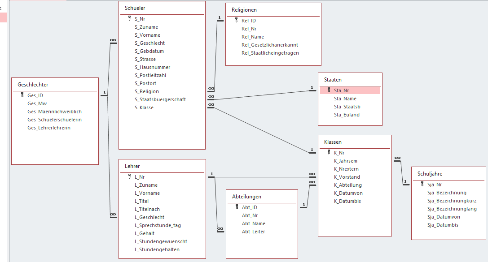

# Übung zu Abfragen

## Abfragen aus einer Tabelle
Lösen Sie die folgenden Abfragebeispiele auf Basis der Datenbank *schuldb1_ablecture3.accdb*. Speichern
Sie diese mit dem Titel EX02_(Laufnummer). Falls nicht ansderes angegeben ist, geben Sie alle Felder
der Tabelle ohne Sortierung aus.

Mit *STRG+F2* können Sie das Kriterienfeld vergrößern um leichter die Kriterien eingeben zu können.

1. Welche Klassen sind Fachschulklassen (enden mit FID)? Sortieren Sie nach der Klassenbezeichnung.
1. Welche Klassen gehören zum 1. Jahrgang (beginnen mit 1). Sortieren Sie nach der Klassenbezeichnung.
1. Welche Klassen hat Griesmayer (GT) als Klassenvorstand.
1. Welche Schuljahre beginnen im Jahr 2009? Verwenden Sie dafür die Funktion *Year()*, die Sie auf die Spalte
   *Sja_Datumvon* anwenden. Filtern Sie diese berechnete Spalte dann nach den Wert 2009.
1. Wie lange dauern die verschiedenen Schuljahre? Geben Sie die alle Spalten aus Schuljahre und eine
   berechnete Spalte *AnzTage* aus. Subtrahieren Sie hierfür einfach Datumswerte Werte, die Differenz
   wird in Tagen geliefert.
1. Welche Staaten sind kein EU Land? Diese Staaten haben in der Tabelle *Staaten* den Wert NULL in der
   Spalte *Sta_Euland*.
1. Welche Lehrer sind männlich (*L_Geschlecht* ist 1) und haben ein Gehalt von über 700 Euro?
1. Welche Schülerbesuchen Biomedizin-und Gesundheitstechnik? Diese Schüler haben *HBG* in ihrer
   Klassenbezeichnung. Sortieren Sie zuerst nach *S_Zuname* und dann nach *S_Vorname*.
1. Welche Schüler der Abteilung HIF (haben HIF im Klassennamen) haben den Vornamen Michael oder Alexander.
   Verwenden Sie für die Filterung des Vornamens die Funktion *IN*.
1. Gibt es Lehrer, bei denen der Wert von *L_Stundegehalten* größer als der in *L_Stundegewuenscht* ist?
   Ignorieren Sie dabei Werte, wo *L_Stundegewuenscht* NULL ist. Hinweis: vergleichen Sie einfach im Kriterium beide Spalten.