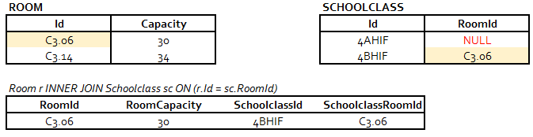

# NULL und dreiwertige Logik

Seit wir mit Datenbanken arbeiten, haben wir es auch mit Spalten zu tun gehabt, die den Wert
NULL haben können. Das fällt schon auf, wenn wir in einer *WHERE* Bedingung *IS NULL* bzw.
*IS NOT NULL* verwenden müssen, und nicht einfach mit *= NULL* vergleichen können.

Es gibt aber noch andere Fälle, wo ein NULL Wert scheinbar seltsame Ergebnisse liefert. Lege dafür
die folgende Datenbank in SQL Server (HIF) oder Oracle (Kolleg) an.

<details>
<summary>Skript für SQL Server anzeigen</summary>

Verbinde dich mit dem SQL Editor zur SQL Server Datenbank und führe das folgende Skript aus:

```sql
USE master
GO
-- Prevent 'database is in use' error when deleting.
IF EXISTS (SELECT 1 FROM sys.databases WHERE [name] = N'NullDemoDb')
BEGIN
    ALTER DATABASE NullDemoDb SET SINGLE_USER WITH ROLLBACK IMMEDIATE;
    DROP DATABASE NullDemoDb;
END;
GO
CREATE DATABASE NullDemoDb
GO
USE NullDemoDb
GO

CREATE TABLE Patient (
    Id             INTEGER PRIMARY KEY,
    Name           VARCHAR(100) NOT NULL,
    Healthy        CHAR(1),
    Examinations   INTEGER,
    Operations     INTEGER,
    Diseases       INTEGER
);

CREATE TABLE DiseasesClass (
    Id            INTEGER PRIMARY KEY,
    DiseasesCount INTEGER,
    Condition     VARCHAR(20)
);

INSERT INTO Patient VALUES (1, 'Hans',   'Y',    NULL, 0,    3);
INSERT INTO Patient VALUES (2, 'Werner',  NULL,  2,    2,    2);
INSERT INTO Patient VALUES (3, 'Thomas', 'N',    0,    0,    NULL);
INSERT INTO Patient VALUES (4, 'Susi',   'N',    NULL, 2,    2);
INSERT INTO Patient VALUES (5, 'Alex',    NULL,  1,    NULL, NULL);
INSERT INTO Patient VALUES (6, 'Kurt',   'Y',    2,    NULL, 1);
INSERT INTO Patient VALUES (7, 'Max',    'Y',    NULL, NULL, NULL);

INSERT INTO DiseasesClass VALUES (1, NULL, 'NOT APPLICABLE');
INSERT INTO DiseasesClass VALUES (2, 0,    'GOOD');
INSERT INTO DiseasesClass VALUES (3, 1,    'OK');
INSERT INTO DiseasesClass VALUES (4, 2,    'POOR');
INSERT INTO DiseasesClass VALUES (5, 3,    'BAD');
INSERT INTO DiseasesClass VALUES (6, 4,    'VERY BAD');
```
</details>

<details>
<summary>Skript für Oracle anzeigen</summary>

Öffne zuerst die Shell des Oracle Containers und lege mit dem folgenden Befehl den
User *NullDemoDb* mit dem Passwort *oracle* an:

```bash
sqlplus system/oracle@//localhost/XEPDB1 <<< "
    DROP USER NullDemoDb CASCADE;
    CREATE USER NullDemoDb IDENTIFIED BY oracle;
    GRANT CONNECT, RESOURCE, CREATE VIEW TO NullDemoDb;
    GRANT UNLIMITED TABLESPACE TO NullDemoDb;
"
```

Verbinde dich nun im SQL Editor mit diesem User und führe das nachfolgende Skript aus.

```sql
CREATE TABLE Patient (
    Id             INTEGER PRIMARY KEY,
    Name           VARCHAR2(100) NOT NULL,
    Healthy        CHAR(1),
    Examinations  INTEGER,
    Operations     INTEGER,
    Diseases       INTEGER
);

CREATE TABLE DiseasesClass (
    Id            INTEGER PRIMARY KEY,
    DiseasesCount INTEGER,
    Condition     VARCHAR2(20)
);

INSERT INTO Patient VALUES (1, 'Hans',   'Y',    NULL, 0,    3);
INSERT INTO Patient VALUES (2, 'Werner',  NULL,  2,    2,    2);
INSERT INTO Patient VALUES (3, 'Thomas', 'N',    0,    0,    NULL);
INSERT INTO Patient VALUES (4, 'Susi',   'N',    NULL, 2,    2);
INSERT INTO Patient VALUES (5, 'Alex',    NULL,  1,    NULL, NULL);
INSERT INTO Patient VALUES (6, 'Kurt',   'Y',    2,    NULL, 1);
INSERT INTO Patient VALUES (7, 'Max',    'Y',    NULL, NULL, NULL);

INSERT INTO DiseasesClass VALUES (1, NULL, 'NOT APPLICABLE');
INSERT INTO DiseasesClass VALUES (2, 0,    'GOOD');
INSERT INTO DiseasesClass VALUES (3, 1,    'OK');
INSERT INTO DiseasesClass VALUES (4, 2,    'POOR');
INSERT INTO DiseasesClass VALUES (5, 3,    'BAD');
INSERT INTO DiseasesClass VALUES (6, 4,    'VERY BAD');
```
</details>

Die Datenbank speichert eine Tabelle *Patient*, die die Anzahl der Untersuchungen (*Examinations*),
Operationen (*Operations*) Erkrankungen (*Diseases*) speichert.
Je nach Anzahl der Erkrankungen wird der Zustand (*Condition*) der Person festgelegt.


## NULL ist nicht 0

Betrachten wir eine Tabelle *Measurements*, die z. B. Messwerte der Temperatur speichert.
Am 11.11.2022 um 12:00 UTC wurden 0° gemessen. Um 13:00 fiel aber der Sensor aus, d. h. es
konnte kein Messwert übertragen werden. Wir wissen daher nicht, wie hoch die Temperatur um diese
Zeit gewesen ist. Daher können wir nur den Wert *NULL* speichern.

**Tabelle Measurements**

| StationId | Date                 | Temperature |
| --------  | -------------------- | ----------- |
| 11082     | 2022-11-11T12:00:00Z | 0           |
| 11082     | 2022-11-11T13:00:00Z | NULL        |

> NULL bedeutet "nicht gemessen" oder "unbekannt". Es könnte jeder beliebige Wert gewesen sein,
> nur haben wir ihn eben nicht bestimmt.

Dadurch dürfen wir NULL nicht einfach durch 0 ersetzen, denn sonst hätte der Datensatz um 13:00 UTC
eine andere Aussage (es sind 0° gemessen worden). Auch das Ersetzen durch andere Werte (z. B. -999)
ist kritisch, da bei einer Berechnung des Mittelwertes diese Zahlen mit einbezogen werden.

## NULL als Abfragekriterium

Fragen wir ab, wie viele Patienten gesund sind (Spalte *Healthy*), erhalten wir wie erwartet
3 Patienten als Antwort:

```sql
SELECT * FROM Patient WHERE Healthy = 'Y';

-- | Id  | Name | Healthy | Examinations | Operations | Diseases |
-- | --- | ---- | ------- | ------------ | ---------- | -------- |
-- | 1   | Hans | Y       | NULL         | 0          | 3        |
-- | 6   | Kurt | Y       | 2            | NULL       | 1        |
-- | 7   | Max  | Y       | NULL         | NULL       | NULL     |
```

Die nächste Abfrage liefert aber ein nicht so vorhersehbares Ergebnis. Wir fragen ab,
welche Patienten *Healthy ungleich Y* haben.

```sql
SELECT * FROM Patient WHERE Healthy <> 'Y';

-- | Id  | Name   | Healthy | Examinations | Operations | Diseases |
-- | --- | ------ | ------- | ------------ | ---------- | -------- |
-- | 3   | Thomas | N       | 0            | 0          | NULL     |
-- | 4   | Susi   | N       | NULL         | 2          | 2        |
```

Wir bekommen *nur 2 Patienten* als Ergebnis, nämlich alle mit dem Wert *Healthy = N*. Dieses Verhalten
sorgt oft für Verwirrung. Vergleichen wir dafür folgendes Snippet in Java:

```java
String x = "x", y = null;

if (x.equals(y))
    System.out.println("x is equal to y.");
else
    System.out.println("x is not equal to y.");
```

Die Ausgabe ist *x is not equal to y*.
Programmiersprachen wie Java oder C# setzen eine *zweiwertige Logik* um. Ein Vergleich liefert
den Typ *Boolean*, der *true* oder *false* sein kann. Wenn
x den Wert "x" und y den Wert *null* hat, sind die Ausdrücke nicht gleich. Daher ist das Ergebnis
des Vergleiches *false* und der *else* Zweig wird aufgerufen. Datenbanken haben eine *dreiwertige Logik*.
Das bedeutet, dass neben *true* und *false* noch der Wert *null* als Ergebnis existiert.

> Merke: In Datenbanken liefern Vergleiche mit *NULL* - anders als in Programmiersprachen -
> auch als Ergebnis den Wert *NULL*.

So liefert der Ausdruck *HEALTHY <> 'Y'* für alle Spalten, die den Wert NULL in *Healthy* haben,
auch den Wert *NULL* als Ergebnis.

> Die WHERE Bedingung liefert nur Datensätze, wo das Kriterium *true* liefert und nicht *null*
> oder *false*. NULL bedeutet schließlich "kann alles sein", und die WHERE Klausel soll nur Daten liefern,
> die das Kriterium sicher erfüllen.

Möchten wir also auch die Patienten ausgeben, die für *Healthy* den Wert *NULL* haben, müssen
wir folgende Abfrage schreiben:

```sql
SELECT * FROM Patient WHERE Healthy <> 'Y' OR Healthy IS NULL;
```

Die *WHERE* Bedingung liefert beim Wert *NULL* durch den Ausdruck *OR Healthy IS NULL* eindeutig
*true* und daher wird die Zeile ausgegeben.

## Die Funktion COALESCE

Die Funktion COALESCE (Aussprache [k???'les], siehe https://de.pons.com/%C3%BCbersetzung/englisch-deutsch/coalesce)
bedeutet verbinden oder vereinigen. Sie liefert den ersten Parameter, der nicht NULL ist.

```
COALESCE(1,    NULL)   liefert 1
COALESCE(NULL, 2)      liefert 2
COALESCE(1,    2)      liefert 1
COALESCE(NULL, NULL)   liefert NULL
```

Setzen wir sie nun in SQL ein, können wir für jeden Wert in *Healthy*, der NULL ist, einfach den
Wert *?* erzeugen. Hat *Healthy* einen Wert, der nicht *NULL* ist, nimmt COALESCE den ersten Parameter,
also den Wert in *Healthy*.

```sql
SELECT * FROM Patient WHERE COALESCE(Healthy, '?') <> 'Y';

-- | Id  | Name   | Healthy | Examinations | Operations | Diseases |
-- | --- | ------ | ------- | ------------ | ---------- | -------- |
-- | 2   | Werner | NULL    | 2            | 2          | 2        |
-- | 3   | Thomas | N       | 0            | 0          | NULL     |
-- | 4   | Susi   | N       | NULL         | 2          | 2        |
-- | 5   | Alex   | NULL    | 1            | NULL       | NULL     |
```

Diese Abfrage liefert 4 Patienten, nämlich alle die *N* oder *NULL* in der Spalte *Healthy* haben.

Alle Parameter von COALESCE müssen vom selben Typ oder implizit umzuwandeln sein. Wollen wir
z. B. ein Fragezeichen statt dem Wert NULL in *Diseases* (eine INTEGER Spalte) schreiben,
müssen wir einen expliziten Cast durchführen:

```sql
-- SQL Server
SELECT p.Id, p.Name, COALESCE(CAST(p.Diseases AS VARCHAR), '?') FROM Patient p;

-- Oracle
SELECT p.Id, p.Name, COALESCE(TO_CHAR(p.Diseases), '?') FROM Patient p;
```

## NULL in Berechnungen

In Berechnungen ist das Ergebnis *NULL*, wenn ein Operand *NULL* ist:

```sql
SELECT Id, Diseases, Operations,
    Diseases + 1,
    Diseases - Operations,
    0 * Diseases
FROM Patient;

-- | Id  | Diseases | Operations | Diseases + 1 | Diseases - Operations | 0 * Diseases |
-- | --- | -------- | ---------- | ------------ | --------------------- | ------------ |
-- | 1   | 3        | 0          | 4            | 3                     | 0            |
-- | 2   | 2        | 2          | 3            | 0                     | 0            |
-- | 3   | NULL     | 0          | NULL         | NULL                  | NULL         |
-- | 4   | 2        | 2          | 3            | 0                     | 0            |
-- | 5   | NULL     | NULL       | NULL         | NULL                  | NULL         |
-- | 6   | 1        | NULL       | 2            | NULL                  | 0            |
-- | 7   | NULL     | NULL       | NULL         | NULL                  | NULL         |
```

## NULL in Gruppenfunktionen und Listen

Gruppenfunktionen bearbeiten eine *Liste von Werten*. Wir sehen uns daher an, wie diese Funktionen
reagieren, wenn in der Werteliste ein oder mehrere Werte mit NULL vorkommen.

### In COUNT

Wird in der Funktion *COUNT* eine Spalte angegeben, werden nur Werte gezählt, die nicht NULL
sind.

```sql
SELECT COUNT(*) AS RowsTotal, COUNT(Healthy) AS RowsHealthy, COUNT(*) - COUNT(Healthy) AS RowsHealthyNull
FROM Patient;

-- RowsTotal    RowsHealthy    RowsHealthyNull
-- 7            5              2
```

### In MAX/MIN/AVG

NULL Werte werden einfach ignoriert.

```sql
SELECT
    AVG(Diseases) AS AvgDiseases, MIN(Diseases) AS MinDiseases, MAX(Diseases) AS MaxDiseases
FROM Patient;

-- AvgDiseases    MinDiseases    MaxDiseases
-- 2              1              3
```

Sind alle Werte NULL, liefern diese Funktionen auch NULL:

```sql
SELECT
    AVG(Diseases) AS AvgDiseases, MIN(Diseases) AS MinDiseases, MAX(Diseases) AS MaxDiseases
FROM Patient
WHERE Diseases IS NULL;

-- AvgDiseases    MinDiseases    MaxDiseases
-- NULL              NULL           NULL
```

### IN Operator

Die folgende Abfrage wird nur Patienten, die den Wert 1 in *Diseases* haben liefern. Es kommen
keine Datensätze mit dem Wert NULL in Diseases vor. Der Grund ist schon bei WHERE erklärt:
Der IN Operator fragt ab, ob der Wert der Spalte dem 1. oder 2. oder 3. ... Element der Liste
entspricht. Es wird also wieder ein Vergleich durchgeführt. Da Vergleiche mit NULL nicht *true*
sondern *NULL* liefern, erscheinen diese Werte auch nicht im Ergebnis.

```sql
SELECT * FROM Patient WHERE Diseases IN (NULL, 1);

-- Id    Name    Healthy    Examinations    Operations    Diseases
-- 6     Kurt    Y          2                  NULL         1
```

Mit *COALESCE* könnten wir den Wert NULL auf z. B. -1 abbilden und so die Patienten ausgeben,
die NULL oder 1 in der Spalte Diseases haben:

```sql
SELECT * FROM Patient WHERE COALESCE(Diseases, -1) IN (-1, 1);

-- | Id  | Name   | Healthy | Examinations | Operations | Diseases |
-- | --- | ------ | ------- | ------------ | ---------- | -------- |
-- | 3   | Thomas | N       | 0            | 0          | NULL     |
-- | 5   | Alex   | NULL    | 1            | NULL       | NULL     |
-- | 6   | Kurt   | Y       | 2            | NULL       | 1        |
-- | 7   | Max    | Y       | NULL         | NULL       | NULL     |
```
## NULL in JOIN Operationen

JOIN Operationen, wo eine Spalte NULL sein kann, wurden in den Übungen schon oft durchgeführt.
Normalerweise wird ein JOIN über die Verknüpfung *Primärschlüssel von A = Fremdschlüssel in B*
durchgeführt. Fremdschlüssel können aber auch NULL sein.



Die 4AHIF kommt im Ergebnis nicht vor, da sie als Stammraum (*RoomId*) den Wert NULL hat. Daher
findet sich kein Id Wert in der Tabelle *Room*. Dieses Verhalten entspricht auch dem, was wir
erwarten.

Was aber, wenn zwei NULL Werte im Join aufeinandertreffen? In der Tabelle *Patient* wird die
Anzahl der Erkrankungen (*Diseases*) gespeichert. In der Tabelle *DiseasesClass* wird die
Anzahl auf eine Kategorie (*Condition*) abgebildet:
(NULL = NOT APPLICABLE, 0 = GOOD, 1 = OK, 2 = POOR, 3 = BAD, ...).

Wollen wir nun die Condition für jeden Patienten angeben, können wir einen JOIN ausführen.
Die Join Bedingung ist dann *Patient.Diseases = DiseasesClass.DiseasesCount*. Da die JOIN
Bedingung wie eine *WHERE* Klausel zu behandeln ist, können wir schon vermuten, dass die Patienten
mit dem Wert *NULL* in *Diseases* nicht ausgegeben werden. NULL ist schließlich mit nichts gleich.


```sql
SELECT p.Id, p.Name, p.Diseases, d.Condition
FROM Patient p INNER JOIN DiseasesClass d ON (p.Diseases = d.DiseasesCount);

-- | Id  | Name   | Diseases | Condition |
-- | --- | ------ | -------- | --------- |
-- | 1   | Hans   | 3        | BAD       |
-- | 2   | Werner | 2        | POOR      |
-- | 4   | Susi   | 2        | POOR      |
-- | 6   | Kurt   | 1        | OK        |
```

Wenn wir also die NULL Spalten verknüpfen wollen, können wir mittels *COALESCE* diesen NULL Werten
für den Vergleich z. B. den Wert -1 zuordnen. Danach kann verglichen werden:

```sql
SELECT p.Id, p.Name, p.Diseases, d.Condition
FROM Patient p INNER JOIN DiseasesClass d ON (COALESCE(Diseases,-1) = COALESCE(DiseasesCount,-1));

-- | Id  | Name   | Diseases | Condition      |
-- | --- | ------ | -------- | -------------- |
-- | 1   | Hans   | 3        | BAD            |
-- | 2   | Werner | 2        | POOR           |
-- | 3   | Thomas | NULL     | NOT APPLICABLE |
-- | 4   | Susi   | 2        | POOR           |
-- | 5   | Alex   | NULL     | NOT APPLICABLE |
-- | 6   | Kurt   | 1        | OK             |
-- | 7   | Max    | NULL     | NOT APPLICABLE |
```

Eine bessere Lösung ist allerdings die, dass wir in *DiseasesClass* keine Kategorie mit NULL
speichern, sondern diese über COALESCE und einen LEFT JOIN einfach ausgeben lassen.

```sql

SELECT p.Id, p.Name, p.Diseases,
    COALESCE(d.Condition, 'NOT APPLICABLE') AS Condition
FROM Patient p LEFT JOIN DiseasesClass d ON (p.Diseases = d.DiseasesCount);


-- | Id  | Name   | Diseases | Condition      |
-- | --- | ------ | -------- | -------------- |
-- | 1   | Hans   | 3        | BAD            |
-- | 2   | Werner | 2        | POOR           |
-- | 3   | Thomas | NULL     | NOT APPLICABLE |
-- | 4   | Susi   | 2        | POOR           |
-- | 5   | Alex   | NULL     | NOT APPLICABLE |
-- | 6   | Kurt   | 1        | OK             |
-- | 7   | Max    | NULL     | NOT APPLICABLE |
```

## NULL und String Concatenation

In Oracle und SQL Server ist eine Stringverknüpfung mit einem Operator (+ oder ||) sowie über
die Funktion *CONCAT()* möglich. SQL Server liefert als Ergebnis NULL, wenn ein Teilstring NULL
ist und mit + verknüpft wird. Daher sollte die *CONCAT()* Funktion verwendet werden, sie liefert
auf jedem Datenbanksystem das selbe Ergebnis.

```sql
-- SQL Server
SELECT 'A' + NULL AS Text         -- liefert NULL
SELECT CONCAT('A', NULL) AS Text   -- liefert A

-- Oracle; da bei einem Select immer eine Tabelle angegeben werden muss, verwenden wir die
--         dummy Tabelle DUAL
SELECT 'A' || NULL AS Text FROM DUAL       -- liefert A
SELECT CONCAT('A', NULL) AS Text FROM DUAL -- liefert A
```

## Übung

In 3 Tabellen werden Prüfungsergebnisse von Studierenden gespeichert. In der Tabelle *Exam*
können die Spalten *GradeDate* und *GradeNr* den Wert NULL haben. Ist der Wert von *GradeDate*
(Korrekturdatum) NULL bedeutet das, dass die Prüfung noch nicht korrigiert wurde. *GradeNr* ist
die Note (1-5). Ist dieser Wert *NULL*, aber die Prüfung schon korrigiert, konnte sie nicht
beurteilt werden. Das ist z. B. dann der Fall, wenn der Studierende geschummelt hat.


<details>
<summary>Datenbank für SQL Server (HIF) anzeigen</summary>

Verbinde dich in deinem SQL Editor zum SQL Server Container und führe das folgende Skript aus.
Schreibe die Abfragebeispiele gleich unter die *INSERT* Befehle in das Skript hinein.

```sql
USE master
GO
-- Prevent 'database is in use' error when deleting.
IF EXISTS (SELECT 1 FROM sys.databases WHERE [name] = N'ExamsDb')
BEGIN
    ALTER DATABASE ExamsDb SET SINGLE_USER WITH ROLLBACK IMMEDIATE;
    DROP DATABASE ExamsDb;
END;
GO
CREATE DATABASE ExamsDb
GO
USE ExamsDb
GO

CREATE TABLE Grade (
    Nr INTEGER PRIMARY KEY,
    Name VARCHAR(16) NOT NULL
);

CREATE TABLE Student (
    Id INTEGER PRIMARY KEY,
    Firstname VARCHAR(255) NOT NULL,
    Lastname VARCHAR(255) NOT NULL
);

CREATE TABLE Exam (
    Id INTEGER PRIMARY KEY,
    Subject VARCHAR(8) NOT NULL,
    StudentId int NOT NULL,
    TeacherId VARCHAR(8) NOT NULL,
    GradeDate DATETIME,
    GradeNr INTEGER,
    FOREIGN KEY(StudentId) REFERENCES Student(Id),
    FOREIGN KEY(GradeNr) REFERENCES Grade(Nr)
);

INSERT INTO Grade (Nr,Name) VALUES
     (1,'Sehr gut'),
     (2,'Gut'),
     (3,'Befriedigend'),
     (4,'Genügend'),
     (5,'Nicht genügend');

INSERT INTO Student (Id,Firstname,Lastname) VALUES
     (1000,'Oskar','Friedek'),
     (1001,'Patrizia','Danner'),
     (1002,'Simo','Schäffel'),
     (1003,'Hamza','Straub'),
     (1004,'Melike','Best'),
     (1005,'Leroy','Abramovic'),
     (1006,'Lino','Reusse'),
     (1007,'Ferdinand','Löser'),
     (1008,'Joli','Heinke'),
     (1009,'Linda','Pingpank');

INSERT INTO Exam (Id,Subject,TeacherId,GradeDate,GradeNr,StudentId) VALUES
     (1000,'POS','HIK',NULL,NULL,1000),
     (1001,'AM','HIK','2022-01-22T09:40:00',4,1000),
     (1002,'POS','BAM','2022-03-05T16:00:00',NULL,1003),
     (1003,'AM','HIK',NULL,NULL,1003),
     (1004,'POS','SZ','2021-10-14T10:33:00',2,1000),
     (1005,'AM','SZ','2021-11-05T12:51:00',2,1000),
     (1006,'POS','HIK','2021-11-29T12:12:00',NULL,1008),
     (1007,'AM','SRM',NULL,NULL,1004),
     (1008,'POS','HIK',NULL,NULL,1005),
     (1009,'DBI','SZ','2022-05-18T11:54:00',NULL,1009),
     (1010,'AM','SRM','2021-10-07T13:02:00',3,1008),
     (1011,'AM','SRM',NULL,NULL,1001),
     (1012,'AM','BAM',NULL,NULL,1007),
     (1013,'DBI','SZ',NULL,NULL,1003),
     (1014,'POS','HIK',NULL,NULL,1005),
     (1015,'DBI','BAM','2021-12-10T08:30:00',NULL,1004),
     (1016,'POS','SRM','2022-06-17T08:51:00',2,1006),
     (1017,'POS','SRM','2022-01-30T15:32:00',2,1005),
     (1018,'AM','SZ','2021-12-11T10:09:00',1,1005),
     (1019,'DBI','SRM','2022-04-08T12:55:00',2,1006),
     (1020,'POS','SRM','2021-12-27T10:15:00',3,1005),
     (1021,'POS','BAM',NULL,NULL,1007),
     (1022,'AM','BAM','2022-04-21T08:53:00',1,1005),
     (1023,'POS','BAM',NULL,NULL,1002),
     (1024,'POS','BAM',NULL,NULL,1009),
     (1025,'AM','SZ',NULL,NULL,1001),
     (1026,'DBI','SZ','2022-05-01T10:06:00',1,1008),
     (1027,'DBI','SZ','2022-05-25T12:27:00',1,1008),
     (1028,'DBI','BAM',NULL,NULL,1002),
     (1029,'POS','BAM',NULL,NULL,1006),
     (1030,'POS','HIK','2022-05-16T09:23:00',1,1004),
     (1031,'DBI','SRM','2022-02-22T12:13:00',NULL,1000),
     (1032,'POS','HIK',NULL,NULL,1001),
     (1033,'DBI','SRM','2022-06-26T14:42:00',1,1009),
     (1034,'POS','HIK',NULL,NULL,1006),
     (1035,'DBI','SRM','2022-05-13T11:12:00',4,1000),
     (1036,'AM','SRM','2022-04-25T11:55:00',5,1000),
     (1037,'AM','BAM','2021-10-25T10:33:00',NULL,1001),
     (1038,'DBI','BAM',NULL,NULL,1005),
     (1039,'POS','SRM','2022-03-16T15:10:00',NULL,1004),
     (1040,'POS','BAM','2022-06-08T13:24:00',NULL,1006),
     (1041,'AM','BAM','2022-03-22T10:26:00',NULL,1003),
     (1042,'AM','HIK','2022-02-16T15:27:00',4,1006),
     (1043,'POS','SZ','2022-02-08T09:41:00',3,1002),
     (1044,'AM','SZ',NULL,NULL,1002),
     (1045,'AM','HIK','2022-05-10T12:18:00',1,1007),
     (1046,'POS','HIK',NULL,NULL,1002),
     (1047,'POS','SRM','2021-12-29T12:42:00',2,1008),
     (1048,'DBI','BAM',NULL,NULL,1001),
     (1049,'AM','BAM',NULL,NULL,1002),
     (1050,'AM','BAM',NULL,NULL,1003),
     (1051,'POS','HIK','2022-03-09T14:04:00',1,1005),
     (1052,'POS','SRM',NULL,NULL,1006),
     (1053,'DBI','SZ',NULL,NULL,1005),
     (1054,'POS','BAM','2022-01-07T15:23:00',5,1009),
     (1055,'DBI','BAM',NULL,NULL,1000),
     (1056,'POS','BAM',NULL,NULL,1001),
     (1057,'AM','SRM',NULL,NULL,1002),
     (1058,'AM','HIK','2022-01-23T15:42:00',1,1001),
     (1059,'AM','BAM',NULL,NULL,1001),
     (1060,'AM','SZ',NULL,NULL,1006),
     (1061,'POS','SZ',NULL,NULL,1003),
     (1062,'DBI','BAM',NULL,NULL,1009),
     (1063,'AM','HIK','2022-03-21T09:26:00',4,1005),
     (1064,'AM','BAM',NULL,NULL,1001),
     (1065,'POS','SZ','2022-02-05T12:17:00',1,1006),
     (1066,'DBI','HIK','2022-03-31T08:18:00',2,1004),
     (1067,'DBI','SRM','2022-06-08T12:59:00',1,1008),
     (1068,'POS','SRM','2022-04-11T11:22:00',NULL,1000),
     (1069,'POS','SZ','2022-02-07T13:51:00',NULL,1004),
     (1070,'POS','BAM','2022-06-25T15:58:00',5,1005),
     (1071,'DBI','SZ','2022-01-23T15:54:00',3,1000),
     (1072,'DBI','SRM','2021-12-14T13:54:00',1,1005),
     (1073,'AM','SRM','2022-04-11T14:46:00',3,1009),
     (1074,'POS','SZ',NULL,NULL,1004),
     (1075,'POS','BAM','2021-11-11T12:50:00',2,1008),
     (1076,'POS','BAM','2021-11-03T15:59:00',5,1006),
     (1077,'AM','HIK','2022-06-29T10:58:00',NULL,1001),
     (1078,'DBI','SRM','2022-04-18T11:43:00',4,1006),
     (1079,'POS','BAM','2021-10-26T14:49:00',5,1002),
     (1080,'AM','HIK','2022-05-23T14:30:00',5,1000),
     (1081,'AM','SRM','2022-01-09T09:25:00',4,1002),
     (1082,'POS','SRM','2022-01-08T12:30:00',3,1006),
     (1083,'DBI','HIK','2022-04-04T09:40:00',1,1008),
     (1084,'POS','HIK',NULL,NULL,1003),
     (1085,'DBI','SZ','2022-01-30T14:13:00',NULL,1005),
     (1086,'AM','BAM','2022-06-09T09:18:00',2,1002),
     (1087,'DBI','HIK','2022-03-02T14:31:00',NULL,1000),
     (1088,'DBI','SZ','2022-01-10T13:43:00',NULL,1009),
     (1089,'AM','HIK',NULL,NULL,1001),
     (1090,'DBI','SRM','2022-05-09T14:48:00',1,1004),
     (1091,'DBI','SZ',NULL,NULL,1003),
     (1092,'AM','BAM',NULL,NULL,1003),
     (1093,'DBI','SRM','2021-10-30T12:10:00',2,1005),
     (1094,'DBI','HIK','2021-11-17T12:09:00',4,1006),
     (1095,'AM','BAM',NULL,NULL,1009),
     (1096,'AM','BAM',NULL,NULL,1004),
     (1097,'DBI','HIK','2021-11-21T08:11:00',1,1002),
     (1098,'AM','SRM','2022-01-15T11:46:00',NULL,1006),
     (1099,'DBI','SRM',NULL,NULL,1001);

```
</details>

<details>
<summary>Datenbank für Oracle (Kolleg) anzeigen</summary>

Erstelle in der Shell des Oracle Containers mit folgendem Befehl einen User *ExamDb* mit dem
Passwort *oracle*:

```bash
sqlplus system/oracle@//localhost/XEPDB1 <<< "
    DROP USER ExamDb CASCADE;
    CREATE USER ExamDb IDENTIFIED BY oracle;
    GRANT CONNECT, RESOURCE, CREATE VIEW TO ExamDb;
    GRANT UNLIMITED TABLESPACE TO ExamDb;
"
```

Öffne danach deinen SQL Editor, verbinde dich mit diesem User zur Datenbank und führe das
folgende Skript aus. Schreibe die Abfragebeispiele gleich unter die *INSERT* Befehle in
das Skript hinein.

```sql
CREATE TABLE Grade (
    Nr   INTEGER PRIMARY KEY,
    Name VARCHAR2(16) NOT NULL
);

CREATE TABLE Student (
    Id        INTEGER PRIMARY KEY,
    Firstname VARCHAR2(255) NOT NULL,
    Lastname  VARCHAR2(255) NOT NULL
);

CREATE TABLE Exam (
    Id INTEGER PRIMARY KEY,
    Subject VARCHAR2(8) NOT NULL,
    StudentId INTEGER NOT NULL,
    TeacherId VARCHAR2(8) NOT NULL,
    GradeDate TIMESTAMP,
    GradeNr INTEGER,
    FOREIGN KEY(StudentId) REFERENCES Student(Id),
    FOREIGN KEY(GradeNr) REFERENCES Grade(Nr)
);

INSERT INTO Grade (Nr,Name) VALUES (1,'Sehr gut');
INSERT INTO Grade (Nr,Name) VALUES (2,'Gut');
INSERT INTO Grade (Nr,Name) VALUES (3,'Befriedigend');
INSERT INTO Grade (Nr,Name) VALUES (4,'Genügend');
INSERT INTO Grade (Nr,Name) VALUES (5,'Nicht genügend');

INSERT INTO Student (Id,Firstname,Lastname) VALUES (1000,'Oskar','Friedek');
INSERT INTO Student (Id,Firstname,Lastname) VALUES (1001,'Patrizia','Danner');
INSERT INTO Student (Id,Firstname,Lastname) VALUES (1002,'Simo','Schäffel');
INSERT INTO Student (Id,Firstname,Lastname) VALUES (1003,'Hamza','Straub');
INSERT INTO Student (Id,Firstname,Lastname) VALUES (1004,'Melike','Best');
INSERT INTO Student (Id,Firstname,Lastname) VALUES (1005,'Leroy','Abramovic');
INSERT INTO Student (Id,Firstname,Lastname) VALUES (1006,'Lino','Reusse');
INSERT INTO Student (Id,Firstname,Lastname) VALUES (1007,'Ferdinand','Löser');
INSERT INTO Student (Id,Firstname,Lastname) VALUES (1008,'Joli','Heinke');
INSERT INTO Student (Id,Firstname,Lastname) VALUES (1009,'Linda','Pingpank');

INSERT INTO Exam (Id,Subject,TeacherId,GradeDate,GradeNr,StudentId) VALUES (1000,'POS','HIK',NULL,NULL,1000);
INSERT INTO Exam (Id,Subject,TeacherId,GradeDate,GradeNr,StudentId) VALUES (1001,'AM','HIK',TO_TIMESTAMP('2022-01-22T09:40:00', 'YYYY-MM-DD"T"HH24:MI:SS'),4,1000);
INSERT INTO Exam (Id,Subject,TeacherId,GradeDate,GradeNr,StudentId) VALUES (1002,'POS','BAM',TO_TIMESTAMP('2022-03-05T16:00:00', 'YYYY-MM-DD"T"HH24:MI:SS'),NULL,1003);
INSERT INTO Exam (Id,Subject,TeacherId,GradeDate,GradeNr,StudentId) VALUES (1003,'AM','HIK',NULL,NULL,1003);
INSERT INTO Exam (Id,Subject,TeacherId,GradeDate,GradeNr,StudentId) VALUES (1004,'POS','SZ',TO_TIMESTAMP('2021-10-14T10:33:00', 'YYYY-MM-DD"T"HH24:MI:SS'),2,1000);
INSERT INTO Exam (Id,Subject,TeacherId,GradeDate,GradeNr,StudentId) VALUES (1005,'AM','SZ',TO_TIMESTAMP('2021-11-05T12:51:00', 'YYYY-MM-DD"T"HH24:MI:SS'),2,1000);
INSERT INTO Exam (Id,Subject,TeacherId,GradeDate,GradeNr,StudentId) VALUES (1006,'POS','HIK',TO_TIMESTAMP('2021-11-29T12:12:00', 'YYYY-MM-DD"T"HH24:MI:SS'),NULL,1008);
INSERT INTO Exam (Id,Subject,TeacherId,GradeDate,GradeNr,StudentId) VALUES (1007,'AM','SRM',NULL,NULL,1004);
INSERT INTO Exam (Id,Subject,TeacherId,GradeDate,GradeNr,StudentId) VALUES (1008,'POS','HIK',NULL,NULL,1005);
INSERT INTO Exam (Id,Subject,TeacherId,GradeDate,GradeNr,StudentId) VALUES (1009,'DBI','SZ',TO_TIMESTAMP('2022-05-18T11:54:00', 'YYYY-MM-DD"T"HH24:MI:SS'),NULL,1009);
INSERT INTO Exam (Id,Subject,TeacherId,GradeDate,GradeNr,StudentId) VALUES (1010,'AM','SRM',TO_TIMESTAMP('2021-10-07T13:02:00', 'YYYY-MM-DD"T"HH24:MI:SS'),3,1008);
INSERT INTO Exam (Id,Subject,TeacherId,GradeDate,GradeNr,StudentId) VALUES (1011,'AM','SRM',NULL,NULL,1001);
INSERT INTO Exam (Id,Subject,TeacherId,GradeDate,GradeNr,StudentId) VALUES (1012,'AM','BAM',NULL,NULL,1007);
INSERT INTO Exam (Id,Subject,TeacherId,GradeDate,GradeNr,StudentId) VALUES (1013,'DBI','SZ',NULL,NULL,1003);
INSERT INTO Exam (Id,Subject,TeacherId,GradeDate,GradeNr,StudentId) VALUES (1014,'POS','HIK',NULL,NULL,1005);
INSERT INTO Exam (Id,Subject,TeacherId,GradeDate,GradeNr,StudentId) VALUES (1015,'DBI','BAM',TO_TIMESTAMP('2021-12-10T08:30:00', 'YYYY-MM-DD"T"HH24:MI:SS'),NULL,1004);
INSERT INTO Exam (Id,Subject,TeacherId,GradeDate,GradeNr,StudentId) VALUES (1016,'POS','SRM',TO_TIMESTAMP('2022-06-17T08:51:00', 'YYYY-MM-DD"T"HH24:MI:SS'),2,1006);
INSERT INTO Exam (Id,Subject,TeacherId,GradeDate,GradeNr,StudentId) VALUES (1017,'POS','SRM',TO_TIMESTAMP('2022-01-30T15:32:00', 'YYYY-MM-DD"T"HH24:MI:SS'),2,1005);
INSERT INTO Exam (Id,Subject,TeacherId,GradeDate,GradeNr,StudentId) VALUES (1018,'AM','SZ',TO_TIMESTAMP('2021-12-11T10:09:00', 'YYYY-MM-DD"T"HH24:MI:SS'),1,1005);
INSERT INTO Exam (Id,Subject,TeacherId,GradeDate,GradeNr,StudentId) VALUES (1019,'DBI','SRM',TO_TIMESTAMP('2022-04-08T12:55:00', 'YYYY-MM-DD"T"HH24:MI:SS'),2,1006);
INSERT INTO Exam (Id,Subject,TeacherId,GradeDate,GradeNr,StudentId) VALUES (1020,'POS','SRM',TO_TIMESTAMP('2021-12-27T10:15:00', 'YYYY-MM-DD"T"HH24:MI:SS'),3,1005);
INSERT INTO Exam (Id,Subject,TeacherId,GradeDate,GradeNr,StudentId) VALUES (1021,'POS','BAM',NULL,NULL,1007);
INSERT INTO Exam (Id,Subject,TeacherId,GradeDate,GradeNr,StudentId) VALUES (1022,'AM','BAM',TO_TIMESTAMP('2022-04-21T08:53:00', 'YYYY-MM-DD"T"HH24:MI:SS'),1,1005);
INSERT INTO Exam (Id,Subject,TeacherId,GradeDate,GradeNr,StudentId) VALUES (1023,'POS','BAM',NULL,NULL,1002);
INSERT INTO Exam (Id,Subject,TeacherId,GradeDate,GradeNr,StudentId) VALUES (1024,'POS','BAM',NULL,NULL,1009);
INSERT INTO Exam (Id,Subject,TeacherId,GradeDate,GradeNr,StudentId) VALUES (1025,'AM','SZ',NULL,NULL,1001);
INSERT INTO Exam (Id,Subject,TeacherId,GradeDate,GradeNr,StudentId) VALUES (1026,'DBI','SZ',TO_TIMESTAMP('2022-05-01T10:06:00', 'YYYY-MM-DD"T"HH24:MI:SS'),1,1008);
INSERT INTO Exam (Id,Subject,TeacherId,GradeDate,GradeNr,StudentId) VALUES (1027,'DBI','SZ',TO_TIMESTAMP('2022-05-25T12:27:00', 'YYYY-MM-DD"T"HH24:MI:SS'),1,1008);
INSERT INTO Exam (Id,Subject,TeacherId,GradeDate,GradeNr,StudentId) VALUES (1028,'DBI','BAM',NULL,NULL,1002);
INSERT INTO Exam (Id,Subject,TeacherId,GradeDate,GradeNr,StudentId) VALUES (1029,'POS','BAM',NULL,NULL,1006);
INSERT INTO Exam (Id,Subject,TeacherId,GradeDate,GradeNr,StudentId) VALUES (1030,'POS','HIK',TO_TIMESTAMP('2022-05-16T09:23:00', 'YYYY-MM-DD"T"HH24:MI:SS'),1,1004);
INSERT INTO Exam (Id,Subject,TeacherId,GradeDate,GradeNr,StudentId) VALUES (1031,'DBI','SRM',TO_TIMESTAMP('2022-02-22T12:13:00', 'YYYY-MM-DD"T"HH24:MI:SS'),NULL,1000);
INSERT INTO Exam (Id,Subject,TeacherId,GradeDate,GradeNr,StudentId) VALUES (1032,'POS','HIK',NULL,NULL,1001);
INSERT INTO Exam (Id,Subject,TeacherId,GradeDate,GradeNr,StudentId) VALUES (1033,'DBI','SRM',TO_TIMESTAMP('2022-06-26T14:42:00', 'YYYY-MM-DD"T"HH24:MI:SS'),1,1009);
INSERT INTO Exam (Id,Subject,TeacherId,GradeDate,GradeNr,StudentId) VALUES (1034,'POS','HIK',NULL,NULL,1006);
INSERT INTO Exam (Id,Subject,TeacherId,GradeDate,GradeNr,StudentId) VALUES (1035,'DBI','SRM',TO_TIMESTAMP('2022-05-13T11:12:00', 'YYYY-MM-DD"T"HH24:MI:SS'),4,1000);
INSERT INTO Exam (Id,Subject,TeacherId,GradeDate,GradeNr,StudentId) VALUES (1036,'AM','SRM',TO_TIMESTAMP('2022-04-25T11:55:00', 'YYYY-MM-DD"T"HH24:MI:SS'),5,1000);
INSERT INTO Exam (Id,Subject,TeacherId,GradeDate,GradeNr,StudentId) VALUES (1037,'AM','BAM',TO_TIMESTAMP('2021-10-25T10:33:00', 'YYYY-MM-DD"T"HH24:MI:SS'),NULL,1001);
INSERT INTO Exam (Id,Subject,TeacherId,GradeDate,GradeNr,StudentId) VALUES (1038,'DBI','BAM',NULL,NULL,1005);
INSERT INTO Exam (Id,Subject,TeacherId,GradeDate,GradeNr,StudentId) VALUES (1039,'POS','SRM',TO_TIMESTAMP('2022-03-16T15:10:00', 'YYYY-MM-DD"T"HH24:MI:SS'),NULL,1004);
INSERT INTO Exam (Id,Subject,TeacherId,GradeDate,GradeNr,StudentId) VALUES (1040,'POS','BAM',TO_TIMESTAMP('2022-06-08T13:24:00', 'YYYY-MM-DD"T"HH24:MI:SS'),NULL,1006);
INSERT INTO Exam (Id,Subject,TeacherId,GradeDate,GradeNr,StudentId) VALUES (1041,'AM','BAM',TO_TIMESTAMP('2022-03-22T10:26:00', 'YYYY-MM-DD"T"HH24:MI:SS'),NULL,1003);
INSERT INTO Exam (Id,Subject,TeacherId,GradeDate,GradeNr,StudentId) VALUES (1042,'AM','HIK',TO_TIMESTAMP('2022-02-16T15:27:00', 'YYYY-MM-DD"T"HH24:MI:SS'),4,1006);
INSERT INTO Exam (Id,Subject,TeacherId,GradeDate,GradeNr,StudentId) VALUES (1043,'POS','SZ',TO_TIMESTAMP('2022-02-08T09:41:00', 'YYYY-MM-DD"T"HH24:MI:SS'),3,1002);
INSERT INTO Exam (Id,Subject,TeacherId,GradeDate,GradeNr,StudentId) VALUES (1044,'AM','SZ',NULL,NULL,1002);
INSERT INTO Exam (Id,Subject,TeacherId,GradeDate,GradeNr,StudentId) VALUES (1045,'AM','HIK',TO_TIMESTAMP('2022-05-10T12:18:00', 'YYYY-MM-DD"T"HH24:MI:SS'),1,1007);
INSERT INTO Exam (Id,Subject,TeacherId,GradeDate,GradeNr,StudentId) VALUES (1046,'POS','HIK',NULL,NULL,1002);
INSERT INTO Exam (Id,Subject,TeacherId,GradeDate,GradeNr,StudentId) VALUES (1047,'POS','SRM',TO_TIMESTAMP('2021-12-29T12:42:00', 'YYYY-MM-DD"T"HH24:MI:SS'),2,1008);
INSERT INTO Exam (Id,Subject,TeacherId,GradeDate,GradeNr,StudentId) VALUES (1048,'DBI','BAM',NULL,NULL,1001);
INSERT INTO Exam (Id,Subject,TeacherId,GradeDate,GradeNr,StudentId) VALUES (1049,'AM','BAM',NULL,NULL,1002);
INSERT INTO Exam (Id,Subject,TeacherId,GradeDate,GradeNr,StudentId) VALUES (1050,'AM','BAM',NULL,NULL,1003);
INSERT INTO Exam (Id,Subject,TeacherId,GradeDate,GradeNr,StudentId) VALUES (1051,'POS','HIK',TO_TIMESTAMP('2022-03-09T14:04:00', 'YYYY-MM-DD"T"HH24:MI:SS'),1,1005);
INSERT INTO Exam (Id,Subject,TeacherId,GradeDate,GradeNr,StudentId) VALUES (1052,'POS','SRM',NULL,NULL,1006);
INSERT INTO Exam (Id,Subject,TeacherId,GradeDate,GradeNr,StudentId) VALUES (1053,'DBI','SZ',NULL,NULL,1005);
INSERT INTO Exam (Id,Subject,TeacherId,GradeDate,GradeNr,StudentId) VALUES (1054,'POS','BAM',TO_TIMESTAMP('2022-01-07T15:23:00', 'YYYY-MM-DD"T"HH24:MI:SS'),5,1009);
INSERT INTO Exam (Id,Subject,TeacherId,GradeDate,GradeNr,StudentId) VALUES (1055,'DBI','BAM',NULL,NULL,1000);
INSERT INTO Exam (Id,Subject,TeacherId,GradeDate,GradeNr,StudentId) VALUES (1056,'POS','BAM',NULL,NULL,1001);
INSERT INTO Exam (Id,Subject,TeacherId,GradeDate,GradeNr,StudentId) VALUES (1057,'AM','SRM',NULL,NULL,1002);
INSERT INTO Exam (Id,Subject,TeacherId,GradeDate,GradeNr,StudentId) VALUES (1058,'AM','HIK',TO_TIMESTAMP('2022-01-23T15:42:00', 'YYYY-MM-DD"T"HH24:MI:SS'),1,1001);
INSERT INTO Exam (Id,Subject,TeacherId,GradeDate,GradeNr,StudentId) VALUES (1059,'AM','BAM',NULL,NULL,1001);
INSERT INTO Exam (Id,Subject,TeacherId,GradeDate,GradeNr,StudentId) VALUES (1060,'AM','SZ',NULL,NULL,1006);
INSERT INTO Exam (Id,Subject,TeacherId,GradeDate,GradeNr,StudentId) VALUES (1061,'POS','SZ',NULL,NULL,1003);
INSERT INTO Exam (Id,Subject,TeacherId,GradeDate,GradeNr,StudentId) VALUES (1062,'DBI','BAM',NULL,NULL,1009);
INSERT INTO Exam (Id,Subject,TeacherId,GradeDate,GradeNr,StudentId) VALUES (1063,'AM','HIK',TO_TIMESTAMP('2022-03-21T09:26:00', 'YYYY-MM-DD"T"HH24:MI:SS'),4,1005);
INSERT INTO Exam (Id,Subject,TeacherId,GradeDate,GradeNr,StudentId) VALUES (1064,'AM','BAM',NULL,NULL,1001);
INSERT INTO Exam (Id,Subject,TeacherId,GradeDate,GradeNr,StudentId) VALUES (1065,'POS','SZ',TO_TIMESTAMP('2022-02-05T12:17:00', 'YYYY-MM-DD"T"HH24:MI:SS'),1,1006);
INSERT INTO Exam (Id,Subject,TeacherId,GradeDate,GradeNr,StudentId) VALUES (1066,'DBI','HIK',TO_TIMESTAMP('2022-03-31T08:18:00', 'YYYY-MM-DD"T"HH24:MI:SS'),2,1004);
INSERT INTO Exam (Id,Subject,TeacherId,GradeDate,GradeNr,StudentId) VALUES (1067,'DBI','SRM',TO_TIMESTAMP('2022-06-08T12:59:00', 'YYYY-MM-DD"T"HH24:MI:SS'),1,1008);
INSERT INTO Exam (Id,Subject,TeacherId,GradeDate,GradeNr,StudentId) VALUES (1068,'POS','SRM',TO_TIMESTAMP('2022-04-11T11:22:00', 'YYYY-MM-DD"T"HH24:MI:SS'),NULL,1000);
INSERT INTO Exam (Id,Subject,TeacherId,GradeDate,GradeNr,StudentId) VALUES (1069,'POS','SZ',TO_TIMESTAMP('2022-02-07T13:51:00', 'YYYY-MM-DD"T"HH24:MI:SS'),NULL,1004);
INSERT INTO Exam (Id,Subject,TeacherId,GradeDate,GradeNr,StudentId) VALUES (1070,'POS','BAM',TO_TIMESTAMP('2022-06-25T15:58:00', 'YYYY-MM-DD"T"HH24:MI:SS'),5,1005);
INSERT INTO Exam (Id,Subject,TeacherId,GradeDate,GradeNr,StudentId) VALUES (1071,'DBI','SZ',TO_TIMESTAMP('2022-01-23T15:54:00', 'YYYY-MM-DD"T"HH24:MI:SS'),3,1000);
INSERT INTO Exam (Id,Subject,TeacherId,GradeDate,GradeNr,StudentId) VALUES (1072,'DBI','SRM',TO_TIMESTAMP('2021-12-14T13:54:00', 'YYYY-MM-DD"T"HH24:MI:SS'),1,1005);
INSERT INTO Exam (Id,Subject,TeacherId,GradeDate,GradeNr,StudentId) VALUES (1073,'AM','SRM',TO_TIMESTAMP('2022-04-11T14:46:00', 'YYYY-MM-DD"T"HH24:MI:SS'),3,1009);
INSERT INTO Exam (Id,Subject,TeacherId,GradeDate,GradeNr,StudentId) VALUES (1074,'POS','SZ',NULL,NULL,1004);
INSERT INTO Exam (Id,Subject,TeacherId,GradeDate,GradeNr,StudentId) VALUES (1075,'POS','BAM',TO_TIMESTAMP('2021-11-11T12:50:00', 'YYYY-MM-DD"T"HH24:MI:SS'),2,1008);
INSERT INTO Exam (Id,Subject,TeacherId,GradeDate,GradeNr,StudentId) VALUES (1076,'POS','BAM',TO_TIMESTAMP('2021-11-03T15:59:00', 'YYYY-MM-DD"T"HH24:MI:SS'),5,1006);
INSERT INTO Exam (Id,Subject,TeacherId,GradeDate,GradeNr,StudentId) VALUES (1077,'AM','HIK',TO_TIMESTAMP('2022-06-29T10:58:00', 'YYYY-MM-DD"T"HH24:MI:SS'),NULL,1001);
INSERT INTO Exam (Id,Subject,TeacherId,GradeDate,GradeNr,StudentId) VALUES (1078,'DBI','SRM',TO_TIMESTAMP('2022-04-18T11:43:00', 'YYYY-MM-DD"T"HH24:MI:SS'),4,1006);
INSERT INTO Exam (Id,Subject,TeacherId,GradeDate,GradeNr,StudentId) VALUES (1079,'POS','BAM',TO_TIMESTAMP('2021-10-26T14:49:00', 'YYYY-MM-DD"T"HH24:MI:SS'),5,1002);
INSERT INTO Exam (Id,Subject,TeacherId,GradeDate,GradeNr,StudentId) VALUES (1080,'AM','HIK',TO_TIMESTAMP('2022-05-23T14:30:00', 'YYYY-MM-DD"T"HH24:MI:SS'),5,1000);
INSERT INTO Exam (Id,Subject,TeacherId,GradeDate,GradeNr,StudentId) VALUES (1081,'AM','SRM',TO_TIMESTAMP('2022-01-09T09:25:00', 'YYYY-MM-DD"T"HH24:MI:SS'),4,1002);
INSERT INTO Exam (Id,Subject,TeacherId,GradeDate,GradeNr,StudentId) VALUES (1082,'POS','SRM',TO_TIMESTAMP('2022-01-08T12:30:00', 'YYYY-MM-DD"T"HH24:MI:SS'),3,1006);
INSERT INTO Exam (Id,Subject,TeacherId,GradeDate,GradeNr,StudentId) VALUES (1083,'DBI','HIK',TO_TIMESTAMP('2022-04-04T09:40:00', 'YYYY-MM-DD"T"HH24:MI:SS'),1,1008);
INSERT INTO Exam (Id,Subject,TeacherId,GradeDate,GradeNr,StudentId) VALUES (1084,'POS','HIK',NULL,NULL,1003);
INSERT INTO Exam (Id,Subject,TeacherId,GradeDate,GradeNr,StudentId) VALUES (1085,'DBI','SZ',TO_TIMESTAMP('2022-01-30T14:13:00', 'YYYY-MM-DD"T"HH24:MI:SS'),NULL,1005);
INSERT INTO Exam (Id,Subject,TeacherId,GradeDate,GradeNr,StudentId) VALUES (1086,'AM','BAM',TO_TIMESTAMP('2022-06-09T09:18:00', 'YYYY-MM-DD"T"HH24:MI:SS'),2,1002);
INSERT INTO Exam (Id,Subject,TeacherId,GradeDate,GradeNr,StudentId) VALUES (1087,'DBI','HIK',TO_TIMESTAMP('2022-03-02T14:31:00', 'YYYY-MM-DD"T"HH24:MI:SS'),NULL,1000);
INSERT INTO Exam (Id,Subject,TeacherId,GradeDate,GradeNr,StudentId) VALUES (1088,'DBI','SZ',TO_TIMESTAMP('2022-01-10T13:43:00', 'YYYY-MM-DD"T"HH24:MI:SS'),NULL,1009);
INSERT INTO Exam (Id,Subject,TeacherId,GradeDate,GradeNr,StudentId) VALUES (1089,'AM','HIK',NULL,NULL,1001);
INSERT INTO Exam (Id,Subject,TeacherId,GradeDate,GradeNr,StudentId) VALUES (1090,'DBI','SRM',TO_TIMESTAMP('2022-05-09T14:48:00', 'YYYY-MM-DD"T"HH24:MI:SS'),1,1004);
INSERT INTO Exam (Id,Subject,TeacherId,GradeDate,GradeNr,StudentId) VALUES (1091,'DBI','SZ',NULL,NULL,1003);
INSERT INTO Exam (Id,Subject,TeacherId,GradeDate,GradeNr,StudentId) VALUES (1092,'AM','BAM',NULL,NULL,1003);
INSERT INTO Exam (Id,Subject,TeacherId,GradeDate,GradeNr,StudentId) VALUES (1093,'DBI','SRM',TO_TIMESTAMP('2021-10-30T12:10:00', 'YYYY-MM-DD"T"HH24:MI:SS'),2,1005);
INSERT INTO Exam (Id,Subject,TeacherId,GradeDate,GradeNr,StudentId) VALUES (1094,'DBI','HIK',TO_TIMESTAMP('2021-11-17T12:09:00', 'YYYY-MM-DD"T"HH24:MI:SS'),4,1006);
INSERT INTO Exam (Id,Subject,TeacherId,GradeDate,GradeNr,StudentId) VALUES (1095,'AM','BAM',NULL,NULL,1009);
INSERT INTO Exam (Id,Subject,TeacherId,GradeDate,GradeNr,StudentId) VALUES (1096,'AM','BAM',NULL,NULL,1004);
INSERT INTO Exam (Id,Subject,TeacherId,GradeDate,GradeNr,StudentId) VALUES (1097,'DBI','HIK',TO_TIMESTAMP('2021-11-21T08:11:00', 'YYYY-MM-DD"T"HH24:MI:SS'),1,1002);
INSERT INTO Exam (Id,Subject,TeacherId,GradeDate,GradeNr,StudentId) VALUES (1098,'AM','SRM',TO_TIMESTAMP('2022-01-15T11:46:00', 'YYYY-MM-DD"T"HH24:MI:SS'),NULL,1006);
INSERT INTO Exam (Id,Subject,TeacherId,GradeDate,GradeNr,StudentId) VALUES (1099,'DBI','SRM',NULL,NULL,1001);
```
</details>


**(1)** Welche Prüfungen von HIK (*TeacherId*) im Gegenstand AM (*Subject*) wurden nach dem
        1.06.2022 korrigiert oder sind noch nicht korrigiert (*GradeDate* ist NULL)?
        Hinweis für Oracle: Wandle den String mit *TO_TIMESTAMP* wie in den INSERT Anweisungen
        in einen TIMESTAMP Typ um.

| Id   | Subject | StudentId | TeacherId | GradeDate               | GradeNr |
| --- | ------- | --------- | --------- | ----------------------- | ------- |
| 1003 | AM      | 1003      | HIK       | NULL                    | NULL    |
| 1077 | AM      | 1001      | HIK       | 2022-06-29 10:58:00.000 | NULL    |
| 1089 | AM      | 1001      | HIK       | NULL                    | NULL    |


**(2)** Erstelle eine Übersicht, wie viele Prüfungen pro Lehrer korrigiert wurden
        (*GradeDate* ist nicht NULL), wie viele Prüfungen noch nicht korrigiert wurden
        (*GradeDate* ist NULL) und wie viele Prüfungen schon benotet wurden (*GradeNr* ist nicht NULL).

| TeacherId | Korrigiert | NichtKorrigiert | Benotet |
| -------- | ---------- | --------------- | ------- |
| BAM       | 12         | 18              | 7       |
| HIK       | 15         | 9               | 12      |
| SRM       | 21         | 5               | 17      |
| SZ        | 12         | 8               | 8       |


**(3)** Welche Note wurde wie oft vergeben? Muss etwas beachtet werden, wenn nach einer Spalte mit
        dem Wert NULL gruppiert wird? Probiere es aus.

| GradeNr | Anzahl |
| ------ | ------ |
| NULL    | 56     |
| 1       | 15     |
| 2       | 10     |
| 3       | 6      |
| 4       | 7      |
| 5       | 6      |

**(4)** Gib alle Prüfungen von HIK (*TeacherId*) im Gegenstand AM (*Subject*) aus. Wenn das
        Korrekturdatum (*GradeDate*) NULL ist, soll der letzte Tag des Schuljahres
        (1.7.2022 um 0:00) in der Liste aufscheinen.
        Hinweis für Oracle: Wandle den String mit *TO_TIMESTAMP* wie in den INSERT Anweisungen
        in einen TIMESTAMP Typ um.        

| Id   | Subject | StudentId | TeacherId | GradeDate               | GradeNr |
| --- | ------- | --------- | --------- | ----------------------- | ------- |
| 1003 | AM      | 1003      | HIK       | 2022-07-01 00:00:00.000 | NULL    |
| 1077 | AM      | 1001      | HIK       | 2022-06-29 10:58:00.000 | NULL    |
| 1089 | AM      | 1001      | HIK       | 2022-07-01 00:00:00.000 | NULL    |

**(5)** Welche Prüfungen von HIK (*TeacherId*) im Gegenstand AM (*Subject*) haben die Note
        4, 5 oder sind nicht beurteilt? Löse das Beispiel mit dem *IN* Operator.

| Id   | Subject | StudentId | TeacherId | GradeDate               | GradeNr |
| --- | ------- | --------- | --------- | ----------------------- | ------- |
| 1001 | AM      | 1000      | HIK       | 2022-01-22 09:40:00.000 | 4       |
| 1003 | AM      | 1003      | HIK       | 2022-07-01 00:00:00.000 | NULL    |
| 1042 | AM      | 1006      | HIK       | 2022-02-16 15:27:00.000 | 4       |
| 1063 | AM      | 1005      | HIK       | 2022-03-21 09:26:00.000 | 4       |
| 1077 | AM      | 1001      | HIK       | 2022-06-29 10:58:00.000 | NULL    |
| 1080 | AM      | 1000      | HIK       | 2022-05-23 14:30:00.000 | 5       |
| 1089 | AM      | 1001      | HIK       | 2022-07-01 00:00:00.000 | NULL    |

**(6)** Gib alle Prüfungen von SRM (*TeacherId*) im Fach POS (*Subject*) mit dem Namen
        der Note aus der Tabelle *Grade* aus. Wurde noch keine Note eingetragen, so ist
        "Nicht beurteilt" anzugeben. Wähle nur Prüfungen aus, die auch schon korrigiert
        wurden (*GradeDate* ist nicht NULL).

| Id   | Subject | StudentId | TeacherId | GradeDate               | GradeNr | GradeName       |
| --- | ------- | --------- | --------- | ----------------------- | ------- | --------------- |
| 1016 | POS     | 1006      | SRM       | 2022-06-17 08:51:00.000 | 2       | Gut             |
| 1017 | POS     | 1005      | SRM       | 2022-01-30 15:32:00.000 | 2       | Gut             |
| 1020 | POS     | 1005      | SRM       | 2021-12-27 10:15:00.000 | 3       | Befriedigend    |
| 1039 | POS     | 1004      | SRM       | 2022-03-16 15:10:00.000 |         | Nicht beurteilt |
| 1047 | POS     | 1008      | SRM       | 2021-12-29 12:42:00.000 | 2       | Gut             |
| 1068 | POS     | 1000      | SRM       | 2022-04-11 11:22:00.000 |         | Nicht beurteilt |
| 1082 | POS     | 1006      | SRM       | 2022-01-08 12:30:00.000 | 3       | Befriedigend    |
