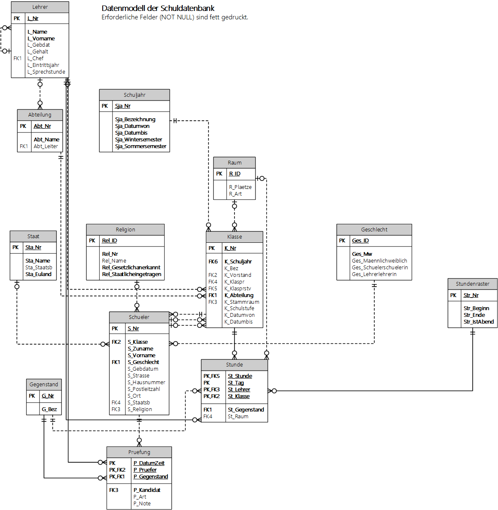
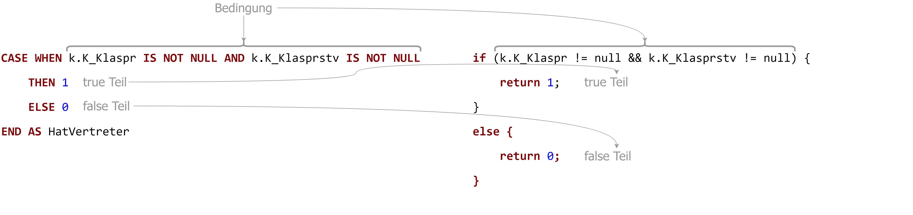

# IF in SQL: Die CASE Anweisung

> Die nachfolgenden Abfragen beziehen sich auf die Schuldatenbank. Sie können die Datei
> [hier als SQLite Datenbank](../Schule.db) laden. Wenn Sie die Datenbank in einem Oracle
> oder SQL Server Docker Container laufen lassen möchten, finden Sie die Anleitung im Kurs
> [Dbi2Sem](https://github.com/schletz/Dbi2Sem#informationen-zum-start)



Bis jetzt haben wir Bedingungen in SQL nur in der *WHERE* oder *HAVING* Klausel geschrieben.
Manchmal möchte man aber auch Spalten ergänzen, die aufgrund anderer Werte ermittelt werden.
Betrachten wir die Tabelle *Klasse*. Sie hat 2 Spalten: Klassensprecher (*K_Klaspr*) und
Stellvertreter (*K_Klasprstv*). Wir möchten nun eine Abfrage erstellen, die die Klassen und die Info,
ob eine Klasse einen Klassensprecher und einen Stellvertreter hat, in der Spalte *HatVertreter*
ausgeben.

Schreiben wir diese Bedingung in die *WHERE* Klausel, können wir dieses Ziel nicht erreichen,
denn wir wollen ja alle Klassen der Schule ausgeben. Die Lösung ist ein *CASE* Ausdruck:

```sql
SELECT k.K_Nr, k.K_Klaspr, k.K_Klasprstv,
CASE WHEN k.K_Klaspr IS NOT NULL AND k.K_Klasprstv IS NOT NULL
	THEN 1
	ELSE 0
END AS HatVertreter
FROM Klasse k;
```

```
| K_Nr   | K_Klaspr | K_Klasprstv | HatVertreter |
| ------ | -------- | ----------- | ------------ |
| 1AFITN | 1971     | 1990        | 1            |
| 1AHBGM | 2199     | 2203        | 1            |
| 1AHIF  | 2478     | 2480        | 1            |
| 1AHKUI | 1012     | 1027        | 1            |
| 1AHMNA | 1042     |             | 0            |
| 1AHMNG | 1072     | 1068        | 1            |
```

Die Syntax ist zwar etwas gewöhnugsbedürftig, aber wenn wir sie mit einem if Befehl in Java oder C#
gegenüberstellen, ist der Aufbau gleich.



Statt geschweifte Klammern wird der Block mit *END* beendet. Die Anweisungen unter *THEN* und *ELSE*
kann man sich wie bei einem *return* vorstellen. Die Werte, die hier geschrieben werden, werden
für die erstellte Spalte verwendet.

Wir können natürlich auch - so wie *if* Anweisungen in Programmieren - *CASE* Anweisungen verschachteln.
Damit können wir z. B. bei den Gegenständen ausgeben, für welche Gruppe (x, y, z oder keine)
sie gelten. Endet der Gegenstand oder die Bezeichnung mit x, y oder z, so wollen wir x, y oder z
als Gruppe zurückgeben.


```sql
SELECT *,
CASE WHEN g.G_Nr LIKE '%x' OR g.G_Bez LIKE '%x'
    THEN 'x'
    ELSE
        CASE WHEN g.G_Nr LIKE '%y' OR g.G_Bez LIKE '%y'
            THEN 'y'
            ELSE 
                CASE WHEN g.G_Nr LIKE '%z' OR g.G_Bez LIKE '%z'
                    THEN 'z'
                    ELSE NULL
                END
        END
END AS Gruppe
FROM Gegenstand g;
```

```
| G_Nr  | G_Bez                  | Gruppe |
| ----- | ---------------------- | ------ |
| AINF  | Angew. Informatik      |        |
| AM    | ANGEW. MATHEMATIK      |        |
| AMEC  | Angewandte Mechatronik |        |
| AMx   | ANGEW. MATHEMATIK      | x      |
| AMx-E | Mathematik ESF x       | x      |
| AMy   | ANGEW. MATHEMATIK      | y      |
| AP4   | Atelier und Produktion |        |
```

In einem *CASE* Ausdruck kann auch ein Spaltenwert zurückgegeben werden. Wir wollen
für alle Unterrichtsstunden, wo kein Raum eingetragen ist (*Stunde.St_Raum* ist NULL) den Stammraum
der Klasse (*Klasse.K_Stammraum*) eintragen, wenn dieser im C-Gebäude ist. Beachte den
*LEFT JOIN* zwischen Stunde und Raum. Er ist wichtig, da wir die Stunden ohne Raum ja behalten
wollen.

```sql
SELECT s.*,
CASE WHEN s.St_Raum IS NULL AND k.K_Stammraum LIKE 'C%'
    THEN k.K_Stammraum 
    ELSE s.St_Raum
END AS Raum
FROM Stunde s LEFT JOIN Raum r ON (s.St_Raum = r.R_ID)
              INNER JOIN Klasse k ON (s.St_Klasse = k.K_Nr);
```

```
| St_Stunde | St_Tag | St_Lehrer | St_Klasse | St_Gegenstand | St_Raum | Raum  |
| --------- | ------ | --------- | --------- | ------------- | ------- | ----- |
| 1         | 2      | HAV       | 4CHIF     | POS1          |         | C4.10 |
| 1         | 2      | HL        | 5AHBGM    | GOM3          | C2.06   | C2.06 |
| 1         | 2      | HOT       | 1CHIF     | GGP           | C5.09   | C5.09 |
| 1         | 2      | HOV       | 3BHBGM    | PRE           |         | C2.08 |
```

Eine nicht so auf der Hand liegende Verwendung von *CASE* ist die Verwendung in Aggregatsfunktionen
wie *SUM()*. Wir wollen die Anzahl der männlichen und weiblichen SchülerInnen ausgeben. Mit einer Gruppierung
und *COUNT* konnten wir das bisher schon lösen, allerdings wollen wir das Ergebnis in *einer Zeile*
zurückgeben lassen.

Die Lösung ist dieser Ausdruck:

```sql
SELECT 
	SUM(CASE WHEN s.S_Geschlecht = 1 THEN 1 ELSE 0 END) AS StudentsMale,
	SUM(CASE WHEN s.S_Geschlecht = 2 THEN 1 ELSE 0 END) AS StudentsFemale
FROM Schueler s; 
```

```
| StudentsMale | StudentsFemale |
| ------------ | -------------- |
| 1568         | 1024           |
```

Die beiden *SUM()* Funktionen summieren eine Liste, die nur aus 1 oder 0 besteht. In der Spalte
*StudentsMale* ist für jeden männlichen Schüler (*S_Geschlecht* ist 1) eine 1, sonst eine 0. Bei
den weiblichen Schülerinnen ist es umgekehrt. Somit liefert uns die Summenfunktion die Anzahl.

> Hinweis: Ob die Abfrage langsamer als die *GROUP BY* und *COUNT* Variante ist, kann nicht allgemein
> angegeben werden. Es kommt auf die Indexierungen der Felder, also ob die Werte der Spalte sortiert 
> in einem Index vorliegen, an.

## Übungen

**(1)** Gib alle Räume mit der Zusatzinfo *GanzeKlasse* aus. Die Spalte *GanzeKlasse* wird gesetzt,
wenn der Raum 24 oder mehr Plätze (*R_Plaetze*) hat.

```
Ausgabe (erste 5 Datensätze nach R_ID sortiert):

| R_ID  | R_Plaetze | R_Art         | GanzeKlasse |
| ----- | --------- | ------------- | ----------- |
| A1.03 | 12        | Jugencoaching | 0           |
| A1.05 | 35        | Klassenraum   | 1           |
| A1.06 | 28        | Klassenraum   | 1           |
| A1.14 | 30        | Klassenraum   | 1           |
| A1.15 | 24        | Klassenraum   | 1           |
```

**(2)** Ermittle für alle Lehrenden eine Spalte *Alterszuschlag*. Für Geburtsjahre vor 1960 ist
dieser 10% des Gehaltes in *L_Gehalt*. Im Jahr 1960 - 1969 geborene bekommen 5%. Ansonsten ist
der Zuschlag 0. Ist kein Geburtsdatum oder Gehalt gespeichert, so ist dieser Wert ebenfalls 0.
Hinweis: Mit *DATEPART(year, L_Gebdat)* (SQL Server) oder *EXTRACT(YEAR FROM L_GEBDAT)*
(Oracle) kann das Jahr aus dem Geburtsdatum ermittelt werden.

```
Ausgabe (erste 37 Datensätze nach L_Nr sortiert):

| L_Nr | L_Name       | L_Vorname      | L_Gebdat   | L_Gehalt | L_Chef | L_Eintrittsjahr | L_Sprechstunde | Alterszuschlag |
| ---- | ------------ | -------------- | ---------- | -------- | ------ | --------------- | -------------- | -------------- |
| AF   | Akyildiz     | Fatma          | 1971-01-26 | 3425     | HEB    |                 | DI2            | 0              |
| AGU  | Augustin     | Susanne        |            | 3326     | PRW    |                 | MO5            | 0              |
| AH   | Auinger      | Harald         | 1962-07-17 | 2083     | ZLA    | 2020            | DI7            | 104.150000     |
| ALS  | Almesberger  | Silke          | 1972-06-29 | 3560     | HEB    | 2008            | MI5            | 0              |
| AMA  | Amcha        | Alfred         | 1973-12-06 |          | ZLA    | 2005            | MO5            | 0              |
| AT   | Antonescu    | Margareth      |            | 3062     | STH    | 2011            | MO3            | 0              |
| BAB  | Bauer        | Beatrice       | 1981-02-11 | 3569     | ZLA    | 2005            |                | 0              |
| BAE  | Blaschke     | Waltraude      | 1989-10-11 |          | STH    | 2021            |                | 0              |
| BAM  | Balluch      | Manfred        |            | 2615     | PRW    | 2015            | DO10           | 0              |
| BAN  | Bankuti      | Judit          | 1989-07-13 | 2596     | PRW    | 2016            | MO4            | 0              |
| BAR  | Bartl-Binder | Petra          | 1979-08-17 | 1980     | PRW    |                 | DI5            | 0              |
| BEC  | Beyer        | Catherine      | 1990-03-23 | 2352     | ZLA    | 2017            | MI6            | 0              |
| BEP  | Benkö        | Patrick        | 1979-04-21 |          | STH    | 2003            | MI3            | 0              |
| BES  | Beil         | Sabine         | 1978-08-03 | 3126     | HEB    | 2010            | MO2            | 0              |
| BH   | Berger       | Hans-Peter     | 1992-05-05 | 2532     | STH    | 2016            | DO4            | 0              |
| BI   | Binder       | Florian        | 1993-04-21 | 2225     | HEB    | 2020            | DO9            | 0              |
| BIE  | Bierbamer    | Peter          | 1976-05-13 |          | STH    | 2015            | DI4            | 0              |
| BIG  | Binder       | Georg          | 1966-04-08 | 4259     | HEB    | 1998            | DO3            | 212.950000     |
| BIM  | Bierbamer    | Michael        |            | 2680     | STH    | 2015            | DO5            | 0              |
| BIN  | Binder       | Florian        | 1967-02-27 | 2155     | JEL    | 2021            | MO12           | 107.750000     |
| BIT  | Bitterer     | Marcus Wilhelm | 1976-10-10 | 3771     | STH    |                 | FR4            | 0              |
| BLJ  | Blöch        | Julia          | 1977-02-06 | 2756     | STH    | 2015            | DO7            | 0              |
| BOA  | Bohn         | Adele          | 1977-12-22 | 3498     | JEL    | 2006            |                | 0              |
| BOB  | Bogensperger | Brigitte       |            | 2724     | STH    |                 | DO3            | 0              |
| BOK  | Boyer        | Katharina      | 1985-06-24 | 3216     | JEL    | 2010            | DI2            | 0              |
| BOM  | Boltz        | Michael        | 1960-07-12 | 3636     | PRW    | 2005            | FR5            | 181.800000     |
| BR   | Brandtner    | Thomas         | 1965-06-21 | 3787     | PRW    | 2004            |                | 189.350000     |
| BRA  | Bramkamp     | Heiko          | 1984-09-22 | 2865     | PRW    |                 | MO7            | 0              |
| BRC  | Bruckner     | Caroline       | 1958-09-27 | 2988     | PRW    | 2012            | MI4            | 298.800000     |
| BRS  | Breiteneder  | Stefan         | 1982-08-13 |          | PRW    | 2020            | DO11           | 0              |
| BV   | Bregar       | Volker         |            | 2669     | ZLA    | 2014            | DO3            | 0              |
| BW   | Bergmann     | Wolfgang       | 1995-04-07 | 1965     | STH    | 2021            | DO8            | 0              |
| CAM  | Camrda       | Christian      | 1979-03-18 | 2349     | PRW    | 2018            | MO4            | 0              |
| CEC  | Celeda       | Claus          | 1991-07-21 | 1995     | STH    | 2021            |                | 0              |
| CES  | Cejka        | Stephan        | 1965-08-31 | 4390     | HEB    | 1998            | FR11           | 219.500000     |
| CHA  | Chwatal      | Andreas        | 1958-08-20 | 2620     | STH    |                 | DO11           | 262            |
| CO   | Coufal       | Klaus          | 1967-12-24 | 3937     | PRW    | 2001            | MI12           | 196.850000     |
```

**(3)** Für die Sprachreise der 4AHIF soll ermittelt werden, ob die SchülerInnen der 4AHIF ein
Visum für Großbritannien benötigen. Erstelle dafür eine Spalte *Einreiseinfo* nach folgenden Regeln:

- Ist keine Staatsbürgerschaft gespeichert, soll *?* zurückgegeben werden.
- Ist die Staatsbürgerschaft "A" (Österreich), soll *AUT* zurückgegeben werden.
- Ist die Staatsbürgerschaft eine EU Staatsbürgerschaft, soll *EU* zurückgegeben werden. Die Info,
  ob ein Staat in der EU ist, kannst du in der Tabelle *Staat* nachsehen. Überlege dir den richtigen
  Join.
- Für nicht EU Staatsbürger soll *NICHT EU* zurückgegeben werden.

```
Ausgabe:

| S_Nr | S_Zuname   | S_Vorname | S_Staatsb | Einreiseinfo |
| ---- | ---------- | --------- | --------- | ------------ |
| 2907 | Schiller   | Constance |           | ?            |
| 2908 | Pacocha    | Bill      | A         | AUT          |
| 2909 | Gleason    | Don       | A         | AUT          |
| 2910 | Pfeffer    | Marc      |           | ?            |
| 2911 | Marks      | Felicia   |           | ?            |
| 2912 | Bailey     | Darin     |           | ?            |
| 2913 | Carter     | Caleb     | A         | AUT          |
| 2914 | Rogahn     | Gilbert   | TR        | NICHT EU     |
| 2915 | Schumm     | Wilson    |           | ?            |
| 2916 | Rutherford | Gilbert   | A         | AUT          |
| 2917 | Ritchie    | Everett   | A         | AUT          |
| 2918 | Nicolas    | Winston   | TR        | NICHT EU     |
| 2919 | Nader      | Darryl    | A         | AUT          |
| 2920 | Gaylord    | Curtis    | TR        | NICHT EU     |
| 2921 | Rau        | Don       |           | ?            |
| 2922 | Sauer      | Byron     |           | ?            |
| 2923 | Fisher     | Loren     | CRO       | EU           |
| 2924 | Orn        | Jody      | A         | AUT          |
| 2925 | Rath       | Sammy     | TR        | NICHT EU     |
| 2926 | Treutel    | Javier    | A         | AUT          |
| 2927 | Lehner     | Al        |           | ?            |
| 2928 | Bayer      | Clay      |           | ?            |
| 2929 | Murray     | Ricky     | A         | AUT          |
| 2930 | Kohler     | Shane     | A         | AUT          |
| 2931 | Hagenes    | Rudolph   |           | ?            |
| 2932 | Kuhn       | Allison   | A         | AUT          |
| 2933 | Doyle      | Jon       | A         | AUT          |
| 2934 | Dare       | Marc      | TR        | NICHT EU     |

```

**(4)** Ermittle die Anzahl der Lehrenden nach ihrer Erfahrung im Beruf. Verwende dafür den Wert
in der Spalte *L_Eintrittsjahr*. *L_Eintrittsjahr* ist eine INTEGER Spalte mit dem Jahr,
kein Datumswert.

- Ist ein Lehrender vor 2015 eingetreten, kommt er in die Kategorie *Master*.
- Ist ein Lehrender 2015 (inklusive) - 2019 (inklusive) eingetreten, kommt er in die Kategorie *Experienced*.
- Ist ein Lehrender 2020 oder später eingetreten, kommt er in die Kategorie *Junior*.
- Ist das Eintrittsjahr NULL, wird er der Kategorie *Unknown* zugerechnet.

```
Ausgabe (darf nur 1 Zeile enthalten):

| Master | Experienced | Junior | Unknown |
| ------ | ----------- | ------ | ------- |
| 142    | 56          | 33     | 50      |
```
