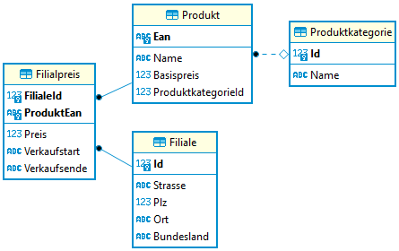

# SQL Übungen: Eine Filialdatenbank

In einer kleinen Datenbank sind Filialen eines Unternehmens gespeichert. Produkte werden in den
Filialen zu unterschiedlichen Preisen angeboten. Jedes Produkt hat einen Basispreis, in der
Filiale wird jedoch der Preis in der Tabelle Filialpreis verrechnet.

Laden Sie die Datenbank [Filialen.db](Filialen.db) auf Ihren Rechner und öffnen Sie diese mit
einem SQL Editor wie DBeaver. Die Datenbank hat folgendes Aussehen:

Die Ausgaben müssen den angegebenen Musterausgaben entsprechen. Die Sortierung muss aber - wenn
dies nicht angegeben ist - nicht übereinstimmen. Formatierungen von Nummern oder Datumswerten
können entsprechend der lokalen Einstellung des Rechners abweichen.

## Filterabfragen

**(1)** Welche Filialen sind in Niederösterreich (Bundesland ist NÖ)?

|Id|Strasse|Plz|Ort|Bundesland|
|--|-------|---|---|----------|
|1|Buschkämpchen 62c|2760|Süd Henriette|NÖ|
|3|Kochergarten 02|2210|Mögenburgscheid|NÖ|
|4|Umlag 2|2320|Berendsland|NÖ|
|5|Grillenweg 21c|2910|West Merlinland|NÖ|
|8|Bruchhauser Str. 8|1300|Alt Kimland|NÖ|
|9|Am Alten Schafstall 09b|2380|Ittburg|NÖ|

**(2)** Welche Filialen befinden sich in Orten, die mit *land* enden?

|Id|Strasse|Plz|Ort|Bundesland|
|--|-------|---|---|----------|
|4|Umlag 2|2320|Berendsland|NÖ|
|5|Grillenweg 21c|2910|West Merlinland|NÖ|
|8|Bruchhauser Str. 8|1300|Alt Kimland|NÖ|

**(3)** Welche Produkte haben einen Basispreis zwischen 1500 (inkl.) und 1600 (exkl.) Euro?

|Ean|Name|Basispreis|ProduktkategorieId|
|---|----|----------|------------------|
|191968|Small Plastic Mouse|1536.92|4|
|455951|Incredible Rubber Car|1556.59|5|
|720936|Sleek Metal Soap|1521.27|3|
|756407|Fantastic Soft Shoes|1572.24|1|

**(4)** Welche Produkte sind keiner Kategorie zugeordnet? Geben Sie nur Produkte aus, dessen EAN mit 3 beginnt.

|Ean|Name|Basispreis|ProduktkategorieId|
|---|----|----------|------------------|
|340179|Small Fresh Mouse|1308.12||
|386531|Small Steel Computer|237||
|397267|Handcrafted Concrete Chips|525.74||

## INNER JOIN

**(1)**  Geben Sie die Produkte, deren EAN mit 1 beginnt, samt dem Namen der Produktkategorie aus. Sortieren Sie nach der EAN Nummer.

|Ean|Name|Basispreis|ProduktkategorieId|Id|Name|
|---|----|----------|------------------|--|----|
|115715|Tasty Concrete Car|1617.01|6|6|Licensed|
|120622|Incredible Rubber Shoes|1973.94|3|3|Unbranded|
|129128|Small Plastic Pizza|1824.94|3|3|Unbranded|
|140323|Practical Metal Shirt|615.2|8|8|Handmade|
|142882|Handmade Rubber Pants|1269.18|6|6|Licensed|
|146775|Intelligent Granite Shoes|522.5|3|3|Unbranded|
|191968|Small Plastic Mouse|1536.92|4|4|Intelligent|
|197332|Unbranded Concrete Pants|1046.77|3|3|Unbranded|

**(2)** In welchen Filialen wird ein Produkt unter dem Basispreis verkauft? Geben Sie nur Produkte aus, dessen EAN mit 3 beginnt.

|Ean|Name|Basispreis|ProduktkategorieId|FilialeId|ProduktEan|Preis|Verkaufstart|Verkaufsende|
|---|----|----------|------------------|---------|----------|-----|------------|------------|
|377013|Practical Fresh Keyboard|621.7|1|1|377013|596.74|2020-07-02|2021-05-07|
|397267|Handcrafted Concrete Chips|525.74||4|397267|473.25|2020-08-15|2021-08-03|
|329460|Handmade Frozen Computer|100.73|2|9|329460|93.55|2020-04-16|2020-05-27|
|330088|Refined Metal Hat|1732.9|7|10|330088|1712.54|2020-03-30|2021-02-12|

**(3)**  In welchen Filialen ist der Verkaufspreis 5 % unter dem Basispreis des Produktes?  Geben Sie nur Produkte aus, dessen EAN mit 4 beginnt.

|Ean|Name|Basispreis|ProduktkategorieId|FilialeId|ProduktEan|Preis|Verkaufstart|Verkaufsende|
|---|----|----------|------------------|---------|----------|-----|------------|------------|
|417818|Fantastic Plastic Towels|929.73|4|2|417818|838.19|2020-04-28||
|453921|Tasty Fresh Salad|228.69||3|453921|214.91|2020-06-19||
|499274|Handcrafted Concrete Chips|271.02|5|6|499274|246.94|2020-08-29||
|453216|Unbranded Granite Car|776.85|3|7|453216|721.35|2020-07-01|2020-08-15|
|464843|Incredible Granite Bacon|368.67|5|8|464843|348.19|2020-03-30||
|498943|Fantastic Plastic Shirt|1641.06|2|8|498943|1494.97|2020-02-02||

**(4)** Welche Produkte werden in der Filiale 1 nicht mehr verkauft (Verkaufsende ist nicht NULL).
        Geben Sie die in der Lösung angegebenen Spalten aus. Mit AS können Sie einen Alias definieren.

|FilialeId|Strasse|Plz|Ort|Produktname|
|---------|-------|---|---|-----------|
|1|Buschkämpchen 62c|2760|Süd Henriette|Intelligent Concrete Bike|
|1|Buschkämpchen 62c|2760|Süd Henriette|Practical Fresh Keyboard|
|1|Buschkämpchen 62c|2760|Süd Henriette|Fantastic Steel Gloves|
|1|Buschkämpchen 62c|2760|Süd Henriette|Awesome Concrete Chicken|

## (LEFT) OUTER JOIN

**(1)** Geben Sie die Produkte mit einem Basispreis von unter 200 Euro samt Kategorien aus.
        Produkte ohne Kategorien sollen auch gelistet werden.

|Ean|Name|Basispreis|ProduktkategorieId|Id|Name|
|---|----|----------|------------------|--|----|
|329460|Handmade Frozen Computer|100.73|2|2|Incredible|
|476292|Handcrafted Soft Shoes|52.22|5|5|Practical|
|566998|Refined Metal Bike|183.61||||
|752684|Handcrafted Plastic Pizza|131.94|7|7|Awesome|
|817719|Generic Rubber Table|95.72|3|3|Unbranded|
|887609|Sleek Steel Mouse|142.15|4|4|Intelligent|
|916095|Handcrafted Soft Shoes|91.34|4|4|Intelligent|

**(2)** Welche Kategorien haben keine Produkte?

|Id|Name|
|--|----|
|9|Small|
|10|Fantastic|

**(3)** Welche Produkte werden in keiner Filiale verkauft, haben also keinen Eintrag in der Tabelle Filialpreis? Geben Sie nur Produkte aus, dessen EAN mit 3 beginnt.

|Ean|Name|Basispreis|ProduktkategorieId|
|---|----|----------|------------------|
|313493|Gorgeous Metal Pants|1708.34|5|
|348949|Sleek Cotton Pizza|282.33|7|
|359366|Practical Soft Shoes|1119.9|8|
|381481|Tasty Soft Pants|441.75|3|

## GROUP BY

**(1)**Geben Sie die Anzahl der Filialen pro Bundesland aus

|Bundesland|Anzahl|
|----------|------|
|NÖ|6|
|W|4|

**(2)** Geben Sie den Durchschnittspreis des Produktes aus. Dies ist der Durchschnittswert von allen Preisen in der Tabelle Filialpreis des Produktes.
        Verwenden Sie die AVG() Funktion. Geben Sie nur die Produkte aus, dessen EAN Nummer mit 1 beginnt.

|Ean|Name|AvgPreis|
|---|----|--------|
|103353|Gorgeous Plastic Shirt|1683.6|
|115715|Tasty Concrete Car|1709.08|
|120622|Incredible Rubber Shoes|1800.52|
|129128|Small Plastic Pizza|1654.27|
|140323|Practical Metal Shirt|595.82|
|142882|Handmade Rubber Pants|1316.74|
|146775|Intelligent Granite Shoes|559.53|
|191968|Small Plastic Mouse|1414.4|
|197332|Unbranded Concrete Pants|995.37|

**(3)** Wie Beispiel 2, nur sollen nun der minimale und der maximale Preis ausgegeben werden.
        Geben Sie zudem noch den Basispreis des Produktes aus. Nach welchen Spalten muss gruppiert werden?

|Ean|Name|Basispreis|AvgPreis|MinPreis|MaxPreis|
|---|----|----------|--------|--------|--------|
|103353|Gorgeous Plastic Shirt|1602.59|1683.6|1683.6|1683.6|
|115715|Tasty Concrete Car|1617.01|1709.08|1709.08|1709.08|
|120622|Incredible Rubber Shoes|1973.94|1800.52|1800.52|1800.52|
|129128|Small Plastic Pizza|1824.94|1654.27|1654.27|1654.27|
|140323|Practical Metal Shirt|615.2|595.82|595.82|595.82|
|142882|Handmade Rubber Pants|1269.18|1316.74|1316.74|1316.74|
|146775|Intelligent Granite Shoes|522.5|559.53|559.53|559.53|
|191968|Small Plastic Mouse|1536.92|1414.4|1414.4|1414.4|
|197332|Unbranded Concrete Pants|1046.77|995.37|995.37|995.37|

**(4)** Listen Sie alle Kategorien und die Anzahl der Produkte auf. Geben Sie alle Kategorien mit Produkten aus.

|Name|Anzahl|
|----|------|
|Awesome|12|
|Handmade|7|
|Incredible|11|
|Intelligent|10|
|Licensed|9|
|Practical|12|
|Rustic|7|
|Unbranded|14|

**(5)** Listen Sie alle Kategorien und die Anzahl der Produkte auf. Geben Sie diesmal auch Kategorien ohne
        Produkte mit der Anzahl 0 aus. Hinweis: Verwenden Sie COUNT mit einer Spalte als Argument.
|Name|Anzahl|
|----|------|
|Awesome|12|
|Fantastic|0|
|Handmade|7|
|Incredible|11|
|Intelligent|10|
|Licensed|9|
|Practical|12|
|Rustic|7|
|Small|0|
|Unbranded|14|

