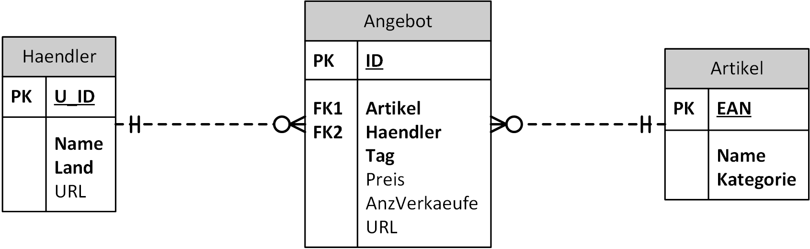

# Eine kleine Händlerdatenbank

Themenbereich: JOIN Operationen (ohne Gruppierung)

## Hinweise zur Bearbeitung der Aufgaben

- Kopieren Sie den untenstehenden SQL Code mit den Angaben in das
  Abfragefenster in DBeaver und fügen Sie Ihre Lösung unter das jeweilige Beispiel ein. 
- Ihre Ausgabe darf von der korrekten Ausgabe bezüglich der Formatierung und
  Sortierung abweichen (außer es ist eine spezielle Sortierung in der Angabe verlangt).

## Datenmodell



## Generieren der Datenbank

Öffne in Docker Desktop eine Shell des Oracle oder SQL Server Containers. Kopiere danach die
folgenden Befehle in das Fenster. Sie laden die .NET 6 SDK und den Generator der Datenbank.
Am Ende wirst du nach dem Admin Passwort der Datenbank gefragt. Hast du den Container mit den
Standardpasswörtern (*oracle* für Oracle bzw. *SqlServer2019* für Sql Server 2019) erstellt,
musst du nur *Enter* drücken.

```bash
if [ -d "/opt/oracle" ]; then DOWNLOADER="curl -s"; else DOWNLOADER="wget -q -O /dev/stdout"; fi
$DOWNLOADER https://raw.githubusercontent.com/schletz/Dbi1Sem/master/start_dotnet.sh > /tmp/start_dotnet.sh
chmod a+x /tmp/start_dotnet.sh
/tmp/start_dotnet.sh https://raw.githubusercontent.com/schletz/Dbi1Sem/master/01_SQL%20Basics/Uebungen/HaendlerDb/HaendlerDb.tar

```

Alternativ kann die Datenbank als SQLite Datei [HaendlerDb.db](HaendlerDb.db) geladen werden.

## Abfragen

**(1)** Welche Händler haben keine URL eingetragen?

| U_ID | Name      | Land | URL |
| ---- | --------- | ---- | --- |
| 1003 | Alternate | GER  |     |

**(2)** Bei welchen Angeboten liegt der Nettopreis (das ist der eingetragene Preis vor der MWSt, also 
Preis / 1.2 ermitteln)
über 11740 Euro?

| ID   | Artikel | Haendler | Tag        | Preis    | AnzVerkaeufe | URL                            |
| ---- | ------- | -------- | ---------- | -------- | ------------ | ------------------------------ |
| 1029 | 1006    | 1001     | 2018-12-14 | 14088.13 |              | www.mediamarkt.at/product/1006 |
| 1030 | 1006    | 1001     | 2018-12-15 | 14369.89 | 6            | www.mediamarkt.at/product/1006 |

**(3)** Geben Sie den Umsatz aus, den der Händler 1003 an diesem Tag bei einem Angebot machte. Der Umsatz
ermittelt sich aus Preis x AnzVerkaeufe.

| Haendler | Tag        | Preis  | AnzVerkaeufe | Umsatz  |
| -------- | ---------- | ------ | ------------ | ------- |
| 1003     | 2018-12-10 | 81.6   | 27           | 2203.2  |
| 1003     | 2018-12-11 | 82.42  | 4            | 329.68  |
| 1003     | 2018-12-12 | 81.59  | 19           | 1550.21 |
| 1003     | 2018-12-13 | 82.41  |              |         |
| 1003     | 2018-12-14 | 82.41  | 28           | 2307.48 |
| 1003     | 2018-12-15 |        | 4            |         |
| 1003     | 2018-12-10 | 231.8  |              |         |
| 1003     | 2018-12-11 | 229.48 | 27           | 6195.96 |
| 1003     | 2018-12-12 | 229.48 | 7            | 1606.36 |
| 1003     | 2018-12-13 | 224.89 | 19           | 4272.91 |
| 1003     | 2018-12-14 | 222.64 | 16           | 3562.24 |
| 1003     | 2018-12-15 |        | 6            |         |
| 1003     | 2018-12-10 | 800    |              |         |
| 1003     | 2018-12-11 | 800    | 29           | 23200   |
| 1003     | 2018-12-12 | 792    | 23           | 18216   |
| 1003     | 2018-12-13 | 799.92 |              |         |
| 1003     | 2018-12-14 | 815.92 |              |         |
| 1003     | 2018-12-15 | 832.24 |              |         |

**(4)** An welchen Tagen gab es Angebote ohne Preis? Der Tag ist nur 1x auszugeben. Sortieren
Sie die Ausgabe aufsteigend nach dem Tag.

| Tag        |
| ---------- |
| 2018-12-10 |
| 2018-12-13 |
| 2018-12-15 |

**(5)** Welche Händler haben Angebote im Programm, dessen Preis über 10000 Euro ist?

| U_ID | Name        | Tag        | Preis    |
| ---- | ----------- | ---------- | -------- |
| 1001 | Media Markt | 2018-12-11 | 13675.14 |
| 1001 | Media Markt | 2018-12-12 | 13948.64 |
| 1001 | Media Markt | 2018-12-14 | 14088.13 |
| 1001 | Media Markt | 2018-12-15 | 14369.89 |

**(6)** Geben Sie eine Liste aller Artikel aus, die von einem österreichischen Händler angeboten werden. Der Artikel 
soll nur 1x erscheinen. Hinweis: Da die Spalte Name mehrmals vorkommt wird, müssen Sie einen Tabellenalias verwenden.

| EAN  | NAME         |
| ---- | ------------ |
| 1001 | Raspberry Pi |
| 1006 | Sony KD-77A1 |

**(7)** Von welchen Händlern (U_ID und Name) gibt es Angebote, die mindestens einmal keinen Preis (Wert NULL) in der 
Angebotstabelle enthalten?

 | U_ID | NAME        | ARTIKEL |
 | ---- | ----------- | ------- |
 | 1001 | Media Markt | 1001    |
 | 1001 | Media Markt | 1006    |
 | 1001 | Media Markt | 1006    |
 | 1003 | Alternate   | 1001    |
 | 1003 | Alternate   | 1002    |

**(8)** Welche Kategorien von Artikel verkaufen die Händler? 

 | U_ID | Name        | Kategorie |
 | ---- | ----------- | --------- |
 | 1001 | Media Markt | Fernseher |
 | 1001 | Media Markt | Hardware  |
 | 1003 | Alternate   | Hardware  |
 | 1003 | Alternate   | Haushalt  |

## SQL Datei

```sql
-- *************************************************************************************************
-- BEISPIEL 1: Welche Händler haben keine URL eingetragen?
--
-- *************************************************************************************************


-- *************************************************************************************************
-- BEISPIEL 2: 
-- Bei welchen Angeboten liegt der Nettopreis (das ist der eingetragene Preis vor der MWSt, also 
-- Preis / 1.2 ermitteln)
-- über 11740 Euro?
--
-- *************************************************************************************************


-- *************************************************************************************************
-- Beispiel 3:
-- Geben Sie den Umsatz aus, den der Händler 1003 an diesem Tag bei einem Angebot machte. Der Umsatz
-- ermittelt sich aus Preis x AnzVerkaeufe.
--
-- *************************************************************************************************

-- *************************************************************************************************
-- Beispiel 4: An welchen Tagen gab es Angebote ohne Preis? Der Tag ist nur 1x auszugeben. Sortieren
-- Sie die Ausgabe aufsteigend nach dem Tag.
--
-- *************************************************************************************************


-- *************************************************************************************************
-- Beispiel 5
-- Welche Händler haben Angebote im Programm, dessen Preis über 10000 Euro ist?
--
-- *************************************************************************************************

-- *************************************************************************************************
-- Beispiel 6: Geben Sie eine Liste aller Artikel aus, die von einem österreichischen Händler angeboten werden. Der Artikel 
-- soll nur 1x erscheinen. Hinweis: Da die Spalte Name mehrmals vorkommt wird, müssen Sie einen Tabellenalias verwenden.
--
-- *************************************************************************************************

-- *****************************************************************************************************************************
-- Beispiel 7: Von welchen Händlern (U_ID und Name) gibt es Angebote, die mindestens einmal keinen Preis (Wert NULL) in der 
-- Angebotstabelle enthalten?
--
-- *************************************************************************************************

-- *************************************************************************************************
-- BEISPIEL 8: Welche Kategorien von Artikel verkaufen die Händler? 
--  
-- *************************************************************************************************
```
