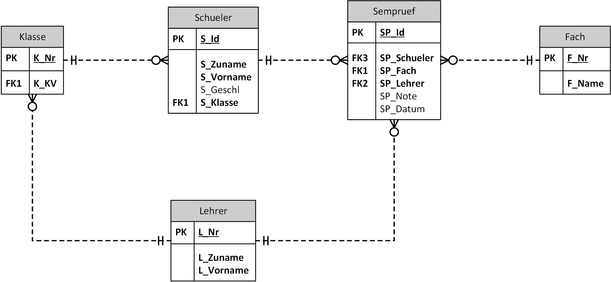

# Übungen zu SQL: Eine Prüfungsdatenbank

Inhalte: Joins und Gruppierungen

Führen Sie danach die folgenden Abfragebeispiele aus. Schreiben Sie in Ihrer SQL Datei die Angabe
als Kommentar über jedes Ihrer gelösten Beispiele. Die korrekten Lösungen sind hier angegeben.

In der Datenbank sind Semesterprüfungen abgebildet. Das Datenmodell sieht so aus:



## Generieren der Datenbank

Öffne in Docker Desktop eine Shell des Oracle oder SQL Server Containers. Kopiere danach die
folgenden Befehle in das Fenster. Sie laden die .NET 6 SDK und den Generator der Datenbank.
Am Ende wirst du nach dem Admin Passwort der Datenbank gefragt. Hast du den Container mit den
Standardpasswörtern (*oracle* für Oracle bzw. *SqlServer2019* für Sql Server 2019) erstellt,
musst du nur *Enter* drücken.

```bash
if [ -d "/opt/oracle" ]; then DOWNLOADER="curl -s"; else DOWNLOADER="wget -q -O /dev/stdout"; fi
$DOWNLOADER https://raw.githubusercontent.com/schletz/Dbi1Sem/master/start_dotnet.sh > /tmp/start_dotnet.sh
chmod a+x /tmp/start_dotnet.sh
/tmp/start_dotnet.sh https://raw.githubusercontent.com/schletz/Dbi1Sem/master/01_SQL%20Basics/Uebungen/SemesterpruefungDb/SemesterpruefungDb.tar

```

Alternativ kann die Datenbank als SQLite Datei [SempruefDb.db](SempruefDb.db) geladen werden.

## Abfragen

**(1)** Geben Sie eine Liste aller eingetragenen Semesterprüfungen aus. Verwenden Sie nur Prüfungen,
   die auch eine Note haben. Ordnen Sie nach *L_Nr* und *S_Id*.

| L_Nr	| L_Zuname	| S_Id	| S_Zuname	| S_Vorname	| S_Klasse	| SP_Fach	| SP_Note	| 
| ----	| --------	| ----	| --------	| ---------	| --------	| -------	| -------	| 
| BAK 	| Bakesef 	| 1001	| Viney   	| Liè      	| 3AHIF   	| D      	| 3      	| 
| BAK 	| Bakesef 	| 1010	| Gaffney 	| Magdalène	| 3CHIF   	| D      	| 2      	| 
| BAK 	| Bakesef 	| 1010	| Gaffney 	| Magdalène	| 3CHIF   	| D      	| 5      	| 
| MEA 	| Measures	| 1003	| Allmann 	| Edmée    	| 3AHIF   	| AM     	| 2      	| 
| MEA 	| Measures	| 1006	| McGeever	| Mélinda  	| 3BHIF   	| D      	| 3      	| 
| MEA 	| Measures	| 1006	| McGeever	| Mélinda  	| 3BHIF   	| AM     	| 4      	| 
| ZIE 	| Ziemecki	| 1003	| Allmann 	| Edmée    	| 3AHIF   	| POS    	| 3      	| 
| ZIE 	| Ziemecki	| 1006	| McGeever	| Mélinda  	| 3BHIF   	| POS    	| 2      	| 

**(2)** In welchen Fächern hat die 3AHIF Semesterprüfungen? Geben Sie jedes Fach nur 1x aus.

| K_Nr 	| F_Nr	| F_Name       	| 
| -----	| ----	| -------------	| 
| 3AHIF	| AM  	| Mathematik   	| 
| 3AHIF	| D   	| Deutsch      	| 
| 3AHIF	| POS 	| Programmieren	| 

**(3)** Wie viele Semesterprüfungen sind pro Klasse im System eingetragen?

| K_Nr 	| Anzahl	| 
| -----	| ---------	| 
| 3AHIF	| 5        	| 
| 3BHIF	| 3        	| 
| 3CHIF	| 4        	| 

**(4)** Gibt es Lehrer ohne Semesterprüfungen?

| L_Nr	| L_Zuname     	| L_Vorname	| 
| ----	| -------------	| ---------	| 
| LIC 	| Licciardiello	| Östen    	| 
| DAI 	| Daice        	| Cloé     	| 

**(5)** Wann fand pro Lehrer die erste und letzte Semesterprüfung statt?

| L_Nr	| L_Zuname	| Erste	            | Letzte	        | 
| ----	| --------	| --------------	| --------------	| 
| BAK 	| Bakesef 	| 08.11.2019    	| 26.11.2019    	| 
| MEA 	| Measures	| 02.11.2019    	| 17.11.2019    	| 
| ZIE 	| Ziemecki	| 03.11.2019    	| 10.11.2019    	| 

**(6)** Wie viele Prüfungen hat ein Lehrer gesamt, und wie viele sind davon schon beurteilt? Geben Sie auch
   Lehrer ohne Semesterprüfung mit der Anzahl 0 aus.

| L_Nr	| L_Zuname     	| Gesamt	| Beurteilt	| 
| ----	| -------------	| ------	| ---------	| 
| BAK 	| Bakesef      	| 4     	| 3        	| 
| DAI 	| Daice        	| 0     	| 0        	| 
| LIC 	| Licciardiello	| 0     	| 0        	| 
| MEA 	| Measures     	| 5     	| 3        	| 
| ZIE 	| Ziemecki     	| 3     	| 2        	| 

**(7)** Welche Semesterprüfungen haben keine Note oder kein Prüfungsdatum?

| S_Id	| S_Zuname	| S_Klasse	| SP_Fach	| SP_Lehrer	| SP_Note	| SP_Datum  	| 
| ----	| --------	| --------	| -------	| ---------	| -------	| ----------	| 
| 1002	| Mudie   	| 3AHIF   	| POS    	| ZIE      	|        	|           	| 
| 1004	| Inch    	| 3AHIF   	| D      	| MEA      	|        	|           	| 
| 1008	| Dongall 	| 3CHIF   	| D      	| BAK      	|        	| 11.11.2019	| 
| 1009	| Mougeot 	| 3CHIF   	| AM     	| MEA      	|        	| 15.11.2019	| 

**(8)** Für jede Klasse sind alle Schüler und alle Semesterprüfungen auszugeben. Schüler, die keine
  Prüfung haben, sollen auch aufgelistet werden.

| K_Nr 	| K_KV	| S_Zuname	| SP_Fach	| SP_Lehrer	| 
| -----	| ----	| --------	| -------	| ---------	| 
| 3AHIF	| MEA 	| Allmann 	| POS    	| ZIE      	| 
| 3AHIF	| MEA 	| Allmann 	| AM     	| MEA      	| 
| 3AHIF	| MEA 	| Inch    	| D      	| MEA      	| 
| 3AHIF	| MEA 	| Mudie   	| POS    	| ZIE      	| 
| 3AHIF	| MEA 	| Viney   	| D      	| BAK      	| 
| 3BHIF	| LIC 	| Foye    	|        	|          	| 
| 3BHIF	| LIC 	| McGeever	| POS    	| ZIE      	| 
| 3BHIF	| LIC 	| McGeever	| D      	| MEA      	| 
| 3BHIF	| LIC 	| McGeever	| AM     	| MEA      	| 
| 3BHIF	| LIC 	| Webland 	|        	|          	| 
| 3CHIF	| ZIE 	| Dongall 	| D      	| BAK      	| 
| 3CHIF	| ZIE 	| Gaffney 	| D      	| BAK      	| 
| 3CHIF	| ZIE 	| Gaffney 	| D      	| BAK      	| 
| 3CHIF	| ZIE 	| Mougeot 	| AM     	| MEA      	| 

