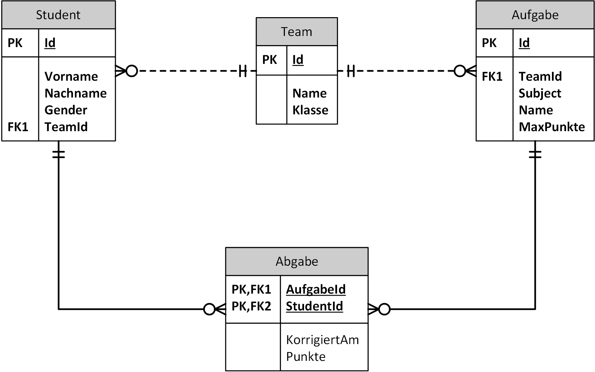

# Praktische Überprüfung in DBI
Datum: 1. Dezember 2021  
Zeit: 10:45 - 12:35  
Klasse: 3CAIF  
Thema: SQL Abfragen mit JOIN und GROUP BY  

Gerade in der aktuellen Zeit werden viele Abgaben über Microsoft Teams eingefordert. Eine kleine
Datenbank soll helfen, den Überblick zu behalten.



Wie Sie erkennen können gibt es eine Tabelle *Team* mit allen Klassenteams. In jedem Team sind
Studierende eingeschrieben. Es können pro Team Aufgaben definiert werden. Diese sind einem
Team zugeordnet. Die Studierenden können dann zu einer Aufgabe ihre Abgaben einreichen.
Die Abgaben sind in der entsprechenden Tabelle gespeichert. Pro Aufgabe kann ein Studierender
nur eine Abgabe einreichen.

## Generieren der Datenbank

Öffne in Docker Desktop eine Shell des Oracle oder SQL Server Containers. Kopiere danach die
folgenden Befehle in das Fenster. Sie laden die .NET 6 SDK und den Generator der Datenbank.
Am Ende wirst du nach dem Admin Passwort der Datenbank gefragt. Hast du den Container mit den
Standardpasswörtern (*oracle* für Oracle bzw. *SqlServer2019* für Sql Server 2019) erstellt,
musst du nur *Enter* drücken.

```bash
if [ -d "/opt/oracle" ]; then DOWNLOADER="curl -s"; else DOWNLOADER="wget -q -O /dev/stdout"; fi
$DOWNLOADER https://raw.githubusercontent.com/schletz/Dbi1Sem/master/start_dotnet.sh > /tmp/start_dotnet.sh
chmod a+x /tmp/start_dotnet.sh
/tmp/start_dotnet.sh https://raw.githubusercontent.com/schletz/Dbi1Sem/master/01_SQL%20Basics/Uebungen/TeamsDb/TeamsDb.tar

```

Alternativ kann die Datenbank als SQLite Datei [TeamsDb.db](TeamsDb.db) geladen werden.

## Abfragen

Die Ausgaben müssen den angegebenen Musterausgaben entsprechen. Die Sortierung muss aber - wenn
dies nicht angegeben ist - nicht übereinstimmen. Formatierungen von Nummern oder Datumswerten
können entsprechend der lokalen Einstellung des Rechners abweichen.

**(1)** Welche Teams wurden für die AIF Klassen (Klasse endet mit AIF) angelegt?
Sortieren Sie nach der Klasse. Geben Sie alle Spalten der Teamtabelle aus.

| Id  | Name          | Klasse |
| --- | ------------- | ------ |
| 1   | SJ21/22_1AAIF | 1AAIF  |
| 5   | SJ21/22_5BAIF | 5BAIF  |
| 3   | SJ21/22_5CAIF | 5CAIF  |

**(2)** Listen Sie alle Teams und die Anzahl der eingeschriebenen Studierenden auf.
Hinweis: Es gibt keine Teams ohne Studierenden. Achten Sie auf den Aliasnamen
der Spalte für die Anzahl.

| Id  | Name          | Klasse | Students |
| --- | ------------- | ------ | -------- |
| 1   | SJ21/22_1AAIF | 1AAIF  | 12       |
| 2   | SJ21/22_1CKIF | 1CKIF  | 10       |
| 3   | SJ21/22_5CAIF | 5CAIF  | 14       |
| 4   | SJ21/22_1CKIF | 1CKIF  | 18       |
| 5   | SJ21/22_5BAIF | 5BAIF  | 12       |

**(3)** Welche Abgaben in POS haben weniger als 50% der maximalen Punkte erreicht?
Benennen Sie die Spalten wie in der Ausgabe.

| Aufgabe                                                                                                                    | Vorname | Nachname    | Maximal | Erreicht |
| -------------------------------------------------------------------------------------------------------------------------- | ------- | ----------- | ------- | -------- |
| Andy shoes are designed to keeping in mind durability as well as trends, the most stylish range of shoes & sandals         | Smilla  | Dahm        | 26      | 0        |
| Andy shoes are designed to keeping in mind durability as well as trends, the most stylish range of shoes & sandals         | Ylvi    | Rose        | 26      | 12       |
| Andy shoes are designed to keeping in mind durability as well as trends, the most stylish range of shoes & sandals         | Helin   | Rentz       | 26      | 12       |
| Andy shoes are designed to keeping in mind durability as well as trends, the most stylish range of shoes & sandals         | Joyce   | Borgschulze | 26      | 11       |
| Ergonomic executive chair upholstered in bonded black leather and PVC padded seat and back for all-day comfort and support | Stella  | Filsinger   | 21      | 4        |
| Ergonomic executive chair upholstered in bonded black leather and PVC padded seat and back for all-day comfort and support | Kathrin | Neimke      | 21      | 3        |
| Ergonomic executive chair upholstered in bonded black leather and PVC padded seat and back for all-day comfort and support | Jared   | Pfeiffer    | 21      | 8        |
| Ergonomic executive chair upholstered in bonded black leather and PVC padded seat and back for all-day comfort and support | Denise  | Stürmer     | 21      | 0        |
| Carbonite web goalkeeper gloves are ergonomically designed to give easy fit                                                | Mirja   | Lott        | 21      | 0        |
| Carbonite web goalkeeper gloves are ergonomically designed to give easy fit                                                | Cora    | Viellehner  | 21      | 5        |


**(4)** Welche Aufgaben haben keinerlei Abgaben? Geben Sie alle Spalten der
Tabelle Aufgabe aus.

| Id  | TeamId | Subject | Name                                                                                                                      | MaxPunkte |
| --- | ------ | ------- | ------------------------------------------------------------------------------------------------------------------------- | --------- |
| 9   | 2      | DBI     | The Nagasaki Lander is the trademarked name of several series of Nagasaki sport bikes, that started with the 1984 ABC800J | 44        |
| 10  | 1      | AM      | New range of formal shirts are designed keeping you in mind. With fits and styling that will make you stand apart         | 30        |


**(5)** Welche Studierenden der 5BAIF haben keinerlei Abgaben eingereicht?
Geben Sie die angeführten Felder mit genau diesen Aliasnamen aus.
Hinweis: Verwenden Sie 2 JOIN Operationen. Überlegen Sie die Art des Joins.

| StudentId | Vorname | Nachname  | Teamname      | Klasse |
| --------- | ------- | --------- | ------------- | ------ |
| 55        | Sandy   | De        | SJ21/22_5BAIF | 5BAIF  |
| 56        | Fabien  | Karsten   | SJ21/22_5BAIF | 5BAIF  |
| 57        | Zoe     | Fink      | SJ21/22_5BAIF | 5BAIF  |
| 58        | Amon    | Saumweber | SJ21/22_5BAIF | 5BAIF  |
| 59        | Talea   | Schönfeld | SJ21/22_5BAIF | 5BAIF  |
| 60        | Rosa    | Rangen    | SJ21/22_5BAIF | 5BAIF  |
| 61        | Marieke | Uliczka   | SJ21/22_5BAIF | 5BAIF  |
| 62        | Wiebke  | Margis    | SJ21/22_5BAIF | 5BAIF  |
| 63        | Lewis   | Stein     | SJ21/22_5BAIF | 5BAIF  |
| 64        | Lana    | Dieckmann | SJ21/22_5BAIF | 5BAIF  |
| 65        | Jannes  | Ryzih     | SJ21/22_5BAIF | 5BAIF  |
| 66        | Laurens | Huebel    | SJ21/22_5BAIF | 5BAIF  |


**(6)** Wie viele Punkte erreichten die Studierenden bei den Abgaben im besten und im schlechtesten
Fall? Beachten Sie, dass Aufgaben ohne Abgabe ebenfalls gelistet werden sollen.
Überlegen Sie sich die JOIN Operation.

| Id  | Name                                                                                                                       | Subject | MaxPunkte | MinPunkte | MaxPunkte |
| --- | -------------------------------------------------------------------------------------------------------------------------- | ------- | --------- | --------- | --------- |
| 1   | Andy shoes are designed to keeping in mind durability as well as trends, the most stylish range of shoes & sandals         | POS     | 26        | 0         | 18        |
| 2   | The Nagasaki Lander is the trademarked name of several series of Nagasaki sport bikes, that started with the 1984 ABC800J  | DBI     | 36        | 12        | 36        |
| 3   | Boston's most advanced compression wear technology increases muscle oxygenation, stabilizes active muscles                 | DBI     | 34        | 2         | 28        |
| 4   | Ergonomic executive chair upholstered in bonded black leather and PVC padded seat and back for all-day comfort and support | POS     | 21        | 0         | 20        |
| 5   | New ABC 13 9370, 13.3, 5th Gen CoreA5-8250U, 8GB RAM, 256GB SSD, power UHD Graphics, OS 10 Home, OS Office A & J 2016      | DBI     | 47        | 4         | 40        |
| 6   | The Football Is Good For Training And Recreational Purposes                                                                | AM      | 38        | 1         | 31        |
| 7   | New range of formal shirts are designed keeping you in mind. With fits and styling that will make you stand apart          | DBI     | 17        | 0         | 17        |
| 8   | Carbonite web goalkeeper gloves are ergonomically designed to give easy fit                                                | POS     | 21        | 0         | 19        |
| 9   | The Nagasaki Lander is the trademarked name of several series of Nagasaki sport bikes, that started with the 1984 ABC800J  | DBI     | 44        |           |           |
| 10  | New range of formal shirts are designed keeping you in mind. With fits and styling that will make you stand apart          | AM      | 30        |           |           |


**(7)** Welche Studierenden haben bei den Abgaben in AM (Feld Subject)
noch keine Korrektur, d. h. *KorrigiertAm* hat den Wert NULL?
Geben Sie die angegebenen Spalten aus der Tabelle Abgabe aus.

| Id  | Name                                                        | Subject | MaxPunkte |
| --- | ----------------------------------------------------------- | ------- | --------- |
| 6   | The Football Is Good For Training And Recreational Purposes | AM      | 38        |
| 6   | The Football Is Good For Training And Recreational Purposes | AM      | 38        |
| 6   | The Football Is Good For Training And Recreational Purposes | AM      | 38        |


**(8)** Erstellen Sie eine Liste von allen Aufgaben und wie viele Abgaben eingelangt und
wie viele Abgaben korrigiert wurden. Hinweis: Korrigierte Abgaben haben einen
Wert in *KorrigiertAm*. Verwenden Sie 2 Arten von Count.
Es müssen nur Aufgaben, die auch Abgaben haben, ausgegeben werden (INNER JOIN).

| Id  | Name                                                                                                                       | Subject | Abgaben | Korrigiert | Unkorrigiert |
| --- | -------------------------------------------------------------------------------------------------------------------------- | ------- | ------- | ---------- | ------------ |
| 1   | Andy shoes are designed to keeping in mind durability as well as trends, the most stylish range of shoes & sandals         | POS     | 10      | 6          | 4            |
| 2   | The Nagasaki Lander is the trademarked name of several series of Nagasaki sport bikes, that started with the 1984 ABC800J  | DBI     | 8       | 4          | 4            |
| 3   | Boston's most advanced compression wear technology increases muscle oxygenation, stabilizes active muscles                 | DBI     | 12      | 9          | 3            |
| 4   | Ergonomic executive chair upholstered in bonded black leather and PVC padded seat and back for all-day comfort and support | POS     | 12      | 6          | 6            |
| 5   | New ABC 13 9370, 13.3, 5th Gen CoreA5-8250U, 8GB RAM, 256GB SSD, power UHD Graphics, OS 10 Home, OS Office A & J 2016      | DBI     | 9       | 6          | 3            |
| 6   | The Football Is Good For Training And Recreational Purposes                                                                | AM      | 7       | 4          | 3            |
| 7   | New range of formal shirts are designed keeping you in mind. With fits and styling that will make you stand apart          | DBI     | 11      | 7          | 4            |
| 8   | Carbonite web goalkeeper gloves are ergonomically designed to give easy fit                                                | POS     | 9       | 6          | 3            |

## Vorlage

```sql
-- *************************************************************************************************
-- Praktische Überprüfung in DBI
-- 1. Dezember 2021, 3CAIF
-- Name:
-- *************************************************************************************************

-- *************************************************************************************************
-- (1) Welche Teams wurden für die AIF Klassen (Klasse endet mit AIF) angelegt?
-- Sortieren Sie nach der Klasse. Geben Sie alle Spalten der Teamtabelle aus.

-- *************************************************************************************************
-- (2) Listen Sie alle Teams und die Anzahl der eingeschriebenen Studierenden auf.
-- Hinweis: Es gibt keine Teams ohne Studierenden. Achten Sie auf den Aliasnamen
-- der Spalte für die Anzahl.

-- *************************************************************************************************
-- (3) Welche Abgaben in POS haben weniger als 50% der maximalen Punkte erreicht?
-- Benennen Sie die Spalten wie in der Ausgabe.

-- *************************************************************************************************
-- (4) Welche Aufgaben haben keinerlei Abgaben? Geben Sie alle Spalten der
-- Tabelle Aufgabe aus.

-- *************************************************************************************************
-- (5) Welche Studierenden der 5BAIF haben keinerlei Abgaben eingereicht?
-- Geben Sie die angeführten Felder mit genau diesen Aliasnamen aus.
-- Hinweis: Verwenden Sie 2 JOIN Operationen. Überlegen Sie die Art des Joins.

-- *************************************************************************************************
-- (6) Wieviel Punkte erreichten die Studierenden bei den Abgaben im besten Fall, im schlechtesten
-- Fall? Beachten Sie, dass Aufgaben ohne Abgabe ebenfalls gelistet werden sollen.
-- Überlegen Sie sich die JOIN Operation.

-- *************************************************************************************************
-- (7) Welche Studierenden haben bei den Abgaben in AM (Feld Subject)
-- noch keine Korrektur, d. h. KorrigiertAm hat den Wert NULL?
-- Geben Sie die angegebenen Spalten aus der Tabelle Abgabe aus.

-- *************************************************************************************************
-- (8) Erstellen Sie eine Liste von allen Aufgaben und wie viele Abgaben eingelangt und
-- wie viele Abgaben korrigiert wurden. Hinweis: Korrigierte Abgaben haben einen
-- Wert in KorrigiertAm. Verwenden Sie 2 Arten von Count.
-- Es müssen nur Aufgaben, die auch Abgaben haben, ausgegeben werden (INNER JOIN).
```