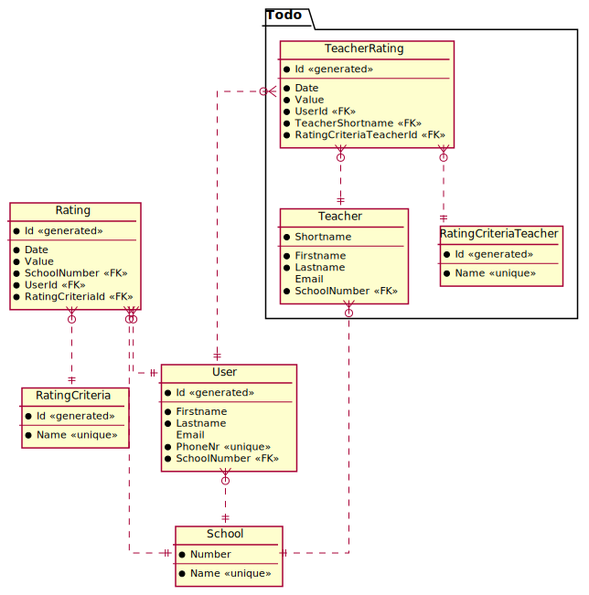

# Das CREATE TABLE Kommando

In der neuen (und nicht mehr existierenden) App Lernsieg konnten User Schulen und Lehrer anhand von
verschiedenen Kriterien bewerten. 

Ein Datenmodell, welches diese Anforderungen (minimal) abdeckt, könnte so aussehen:


<sup>
https://www.plantuml.com/plantuml/uml/dLB1JiCm33qlN-4RqgJj0z0qJG8c8T10R73tMjD6IvEIkeTfwx-Jfjb6ese8UagUxVVyNhge62tNXH8taCkKW7E2gZGi_2sHDb7aQYybIwDHtG9ft2g2JsF1MCvDriAWfAPgAggTr2LQB3p0-vAw9Y58i-Gzh9FS60K70UuRh-fYIzQV9vD9mB0WcCrgBRzgciz5SvvzGvOwkxEIoKfq7AFnO-fQCz9aaIbrtQEMPtI5vBqYUvAFfptQ4IobhLXZGUxyZAVZGu5IEUGrDvfM5dv8EBJprdc2jhPyyj9UiZ7JwV4O_4UMhbgvHswN-41LKoGI91pQIdY2SEz7TQaq8YZsred0bYo2-dn2b9ZiC2FOcDJ0uMndGvZaPBsVTMviYEttI8TzDK84nk7uehL2xpz_Z33zznU9imz4P_-Noi2wOJIosmy_W0F5qsiDpmtAEPK5wRGkr3S0
</sup>

## CREATE TABLE Statements

### Datentypen

Im Gegensatz zu Java oder C# sind Datentypen abhängig von der Datenbank. Nicht alle Datenbanken
"verstehen" alle Datentypen. Es gibt aber in Ansi SQL eine Grundmenge, die jede Datenbank
zumindest versteht. SQLite deckt nicht jeden Datentyp ab, versteht aber zumindest die Definition.

Eine Auswahl ist in der folgenden Tabelle:

| ANSI SQL              | SQL Server                     | SQLite  |
|-----------------------|--------------------------------|---------|
| INTEGER               | INTEGER                        | INTEGER |
| CHAR(n), VARCHAR(n)   | CHAR, VARCHAR, NCHAR, NVARCHAR | TEXT    |
| DECIMAL(p, s)         | DECIMAL(p, s)                  | NUMERIC |
| REAL                  | REAL                           | REAL    |
| DATE, TIME, TIMESTAMP | DATETIME                       | NUMERIC |

<sup>Vgl. https://support.microsoft.com/en-us/office/equivalent-ansi-sql-data-types-7a0a6bef-ef25-45f9-8a9a-3c5f21b5c65d
und https://www.sqlite.org/datatype3.html
</sup>

#### DECIMAL(p, s)

*p* bezeichnet die *gesamten Stellen* und *s* den Nachkommaanteil (scale).
*DECIMAL(6,2)* kann also Werte von -9999.99 bis +9999.99 speichern. Der Speicherbedarf "springt"
jedoch und verläuft nicht kontinuierlich. Deswegen ist *DECIMAL(9,s)* häufig anzutreffen.

| Precision | Storage bytes |
|-----------|---------------|
| 1 - 9     | 5             |
| 10-19     | 9             |
| 20-28     | 13            |
| 29-38     | 17            |

<sup>Vgl. https://docs.microsoft.com/en-us/sql/t-sql/data-types/decimal-and-numeric-transact-sql?view=sql-server-ver15</sup>

### Primärschlüssel

Primärschlüssel können - wenn sie nur aus einer Spalte bestehen - mit dem Constraint
*PRIMARY KEY* angelegt werden:

```sql
CREATE TABLE School (
    Number       INTEGER      PRIMARY KEY,
    -- ...
)
```

### Auto Increment Keys

Im Modell sind manche Schlüssel mit *generated* gekennzeichnet. Das Anlegen von Auto Increment
Werten unterscheidet sich je nach Datenbank. In SQLIte können wir mittels *AUTOINCREMENT* einen
Primärschlüssel zu einem Auto Increment Wert machen. Der Datentyp muss natürlich *INTEGER* sein.

```sql
CREATE TABLE RatingCriteria (
    Number       INTEGER      PRIMARY KEY AUTOINCREMENT,
    -- ...
)
```

### Unique Constraints

Darf ein Wert nur 1x pro Tabelle vorkommen, so können wir das UNIQUE Constraint verwenden.
Vorsicht: Die Spalte sollte auch das NOT NULL Constraint besitzen. Wird NULL erlaubt, kollidiert
dies mit Unique: Der NULL Wert darf dann auch nur 1x vorkommen.

```sql
CREATE TABLE User (
	-- ...
	PhoneNr   VARCHAR(20)   NOT NULL UNIQUE,
	-- ...
);
```

### Fremdschlüssel

Der Fremdschlüssel wird auf der "N Seite" definiert und verweist auf die "1er Seite". Im Modell
hat eine Schule mehrere User (1 : n). Daher wird in der Tabelle *User* der Fremdschlüssel zur
Schule definiert.

Die Syntax lautet *FOREIGN KEY (FK Spalte) REFERENCES OtherTable(Pk Spalte)*:

```sql
CREATE TABLE User (
	--- ...
	SchoolNumber  INTEGER   NOT NULL,
	FOREIGN KEY (SchoolNumber) REFERENCES School(Number)
);
```

### Häufige Fehler

- Fremdschlüssel referenzieren auf (noch) nicht vorhandene Tabellen, wenn sie
  im Skript an falscher Stelle stehen.
- Eine Definition innerhalb von CRATE TABLE endet nicht mit einem Komma (,).
- Die letzte Zeile innerhalb von CREATE TABLE darf nicht mit Komma (,) enden.
- DBeaver aktualisiert nicht automatisch die Tabellenansicht. Drücken Sie F5 wenn Sie
  auf Tables geklickt haben, um die Datenbank neu zu lesen.
- Innerhalb der CREATE TABLE Definition ist eine Leerzeile.
  Dies kann DBeaver nicht verarbeiten.

### Das SQL Skript

```sql
-- Für SQLite aktivieren wir den Foreigen Key Check. Je nach Datenbankeditor wird die Datenbank
-- eventuell ohne diese Einstellung angelegt.
PRAGMA foreign_keys = ON;

-- SQL Script für DBeaver und SQLite

-- Umgekehrte Reihenfolge wie bei CREATE TABLE!
-- In ORACLE ist 
-- DROP TABLE School CASCADE CONSTRAINTS;
-- möglich, um Tabellen trotz Fremdschlüsselreferenzen zu löschen.
DROP TABLE IF EXISTS Rating;
DROP TABLE IF EXISTS User;
DROP TABLE IF EXISTS RatingCriteria;
DROP TABLE IF EXISTS School;

CREATE TABLE School (
--  SPALTENNAME  DATENTYP     CONSTRAINT/S
	Number       INTEGER      PRIMARY KEY,
	Name         VARCHAR(100) NOT NULL UNIQUE
);

CREATE TABLE RatingCriteria (
	Id        INTEGER      PRIMARY KEY AUTOINCREMENT,   -- PK mit Autowert
	Name      VARCHAR(100) NOT NULL UNIQUE              -- Der Name darf nicht mehrmals vorkommen.
);

CREATE TABLE User (
	Id        INTEGER       PRIMARY KEY AUTOINCREMENT,
	Firstname VARCHAR(255)  NOT NULL,
	Lastname  VARCHAR(255)  NOT NULL,
	PhoneNr   VARCHAR(20)   NOT NULL UNIQUE,
	Email     VARCHAR(100),                   -- Vorsicht bei Unique: NULL darf dann nur 1x vorkommen!
	SchoolNumber  INTEGER   NOT NULL,         -- SchoolId ist ein FK, daher auch ein INTEGER!
	-- SchoolId zum FK machen. References verweist auf die "1er Seite"
	-- FOREIGN KEY (FK Columns) REFERENCES PKTable(PK Columns)
	FOREIGN KEY (SchoolNumber) REFERENCES School(Number)
);

CREATE TABLE Rating (
	Id           INTEGER  PRIMARY KEY AUTOINCREMENT,
	SchoolNumber INTEGER  NOT NULL,
	UserId       INTEGER  NOT NULL,
	CriteriaId   INTEGER  NOT NULL, 
	Date         DATETIME NOT NULL,
	Value        INTEGER  NOT NULL,
	FOREIGN KEY (SchoolNumber)   REFERENCES School(Number),
	FOREIGN KEY (UserId)     REFERENCES User(Id),
	FOREIGN KEY (CriteriaId) REFERENCES RatingCriteria(Id)
);
```

## Übung

Das nachfolgende Modell zeigt eine kleine Datenbank, mit deren Hilfe Abgaben
in Teams verwaltet werden können. In einem Team können Tasks (Abgaben) definiert werden.
Für einen Task können Studierende Abgaben (HandIn) einreichen.

Die Datentypen sind UML Datentypen sowie DateTime für Datums- und Zeitangaben und
Number für Dezimalzahlen. Die Punkte sollen mit 1 Nachkommastelle gespeichert werden.
Das unterstützte Maximum für Punkteangaben sind 1000 Punkte.

Erforderliche Felder werden mit einem schwarzen Punkt gekennzeichnet. Alle anderen
Felder dürfen den Wert NULL enthalten.

Für String Felder verwenden Sie für *Shortname* und *TeacherShortname* von Teacher und 
*Schoolclass* in Team 8 Stellen. Ansonsten definieren Sie die maximale Länge mit 255 Zeichen.


<sup>
https://www.plantuml.com/plantuml/uml/hP71Ji9048RFx5FipOG47e0Gma69H4LZ-m93ExOZszswEwiGuTtTnK9gou63fpR__9bl_ltdZi6ohvGeAKUPaSqKYXlvN3CP3MeYKSDQeNmpLXhBfIcYB1LfT6FXDgHhi50T1TxL-6iI0ZKJxsIAOVOj1iDbBYTogHaBj78wBL2Z1SPyDXE3qMWK72keC7WIjgIBOF6QFZp6UPALngXCWNDdWpYq6Lc9zeX9oi3NxKsdzGkohZiPFa9Vkwk0rAL3MiY4VHv-hqZsx-WKtEPARkBNxvXncv0Igx_8RKqMOjctm74IFobLA0PFi7qnfDa5TUMhDThWZuLso8k7Y1msDVGRE5b2XkFn1pCUx_SoRkeASS4vwJteVAclp1eNNRwhwUhoi1Vw5Jy9ltfozo4EehdkT7l0TwI6A-QeSr-f7m00
<sup>

**(1)** Öffnen Sie DBeaver und verbinden Sie sich zu einer SQLite Datenbank. Diese muss nicht
   vorhanden sein, wenn Sie den Namen *Teams.db* eingeben wird sie angelegt.

**(2)** Vervollständigen Sie das nachfolgende CREATE TABLE Skript. Hinweis: Vermeiden Sie Leerzeilen innerhalb des CREATE TABLE Statements. Dies führt zu Fehlern bei der Ausführung in DBeaver.


```sql
-- SQL SKRIPT FÜR DIE TEAMS DATENBANK
-- Führen Sie dieses Skript mit "Execute SQL Script" (ALT+X) in DBeaver aus.
-- Es muss fehlerfrei durchlaufen.

PRAGMA foreign_keys = ON;

-- *************************************************************************************************
-- DROP TABLE Anweisungen
-- Fügen Sie hier die DROP TABLE Anweisungen in der richigen Reihenfolge ein.

-- *************************************************************************************************

-- *************************************************************************************************
-- CREATE TABLE Anweisungen
-- Fügen Sie hier die CREATE TABLE Anweisungen in der richtigen Reihenfolge ein.


-- *************************************************************************************************
-- Kontrollanweisungen. Diese Statements befüllen die Datenbank.
-- Sie sollen alle erfolgreich durchlaufen.
INSERT INTO Student (Id, Firstname, Lastname, Email) VALUES (1,'Max','Mustermann','muster@max.at');
INSERT INTO Teacher (Shortname, Firstname, Lastname, Email) VALUES ('FLE','Stefanie','Fleißig','fleissig@spengergasse.at');
INSERT INTO Team (Id, Name, Schoolclass) VALUES (1, 'SJ21/22_3CAIF', NULL);
INSERT INTO Task (Id, Subject, Title, ExpirationDate, MaxPoints, TeamId, TeacherShortname) VALUES (1, 'POS', 'Stringmethoden', '2021-10-02T22:00', NULL, 1, 'FLE');
INSERT INTO HandIn (Id, TaskId, StudentId, Date, ReviewDate, Points) VALUES (1, 1, 1, '2021-10-02T21:00', NULL, NULL);
```

**(3)** Führen Sie das vollständige Skript mehrmals aus. Was müssen Sie bei den DROP
TABLE Anweisungen beachten, damit diese trotz eingefügter Daten funktionieren?

**(4)** Klicken Sie in DBeaver doppelt auf Tables und sehen sich das ER Diagramm an.
Es muss folgendes Aussehen haben:


**(5)** Versuchen Sie, die nachfolgenden Anweisungen einzeln auszuführen. Sie müssen alle
einen Fehler verursachen, denn sie verletzten definierte Contraints.

```sql
-- A foreign key constraint failed (FOREIGN KEY constraint failed)
INSERT INTO Task (Id, Subject, Title, ExpirationDate, MaxPoints, TeamId, TeacherShortname) VALUES (2, 'POS', 'Stringmethoden', '2021-10-02T22:00', NULL, 1, 'X');
INSERT INTO Task (Id, Subject, Title, ExpirationDate, MaxPoints, TeamId, TeacherShortname) VALUES (3, 'POS', 'Stringmethoden', '2021-10-02T22:00', NULL, 2, 'FLE');

-- A UNIQUE constraint failed (UNIQUE constraint failed: Teacher.Email)
INSERT INTO Teacher (Shortname, Firstname, Lastname, Email) VALUES ('NEU','Neuer','Lehrer','fleissig@spengergasse.at');
-- A UNIQUE constraint failed (UNIQUE constraint failed: Student.Email)
INSERT INTO Student (Id, Firstname, Lastname, Email) VALUES (2,'Neuer','Student','muster@max.at');
-- A UNIQUE constraint failed (UNIQUE constraint failed: Team.Name)
INSERT INTO Team (Id, Name, Schoolclass) VALUES (2, 'SJ21/22_3CAIF', NULL);
```

