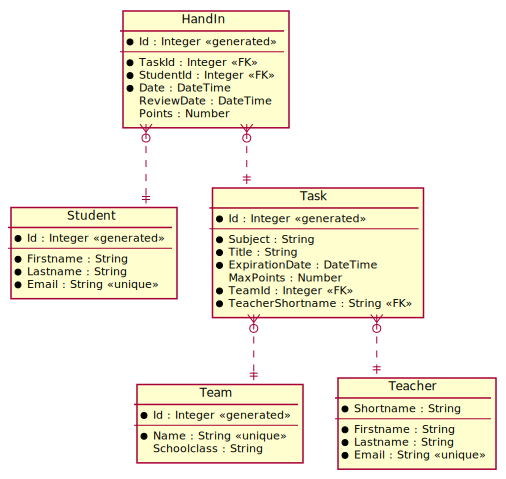
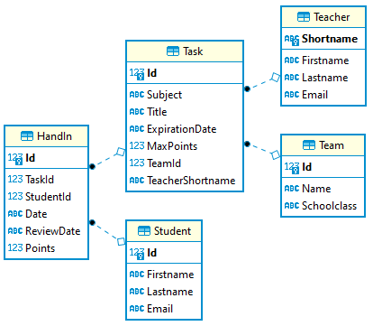

# Das CREATE TABLE Kommando

In der neuen (und nicht mehr existierenden) App Lernsieg konnten User Schulen und Lehrer anhand von
verschiedenen Kriterien bewerten. 

Ein Datenmodell, welches diese Anforderungen (minimal) abdeckt, könnte so aussehen:


<sup>
[PlantUML Source](https://www.plantuml.com/plantuml/uml/dLB1JiCm33qlNv4RqgJj0z0qJG8c8T10CBYRrZJHqgIaxc5Y-tUSDjregGfYboNFzdj-BrsL19wgt8WBgNIAaXJAid0awbkYVMAGQmy5QMV1N4gqy6PGlZildIVbiW1BeosMSr7kj2t0Gru3j2-mQH82BMdQo-T4EMVafv3ycsvy_J-RpU8TSfIBHMNrHuNBfJYUvfw0jCskl2Rq6dX-ChrDkJL3Ynu8K-wU19x92CbBYJvA_vmEQ4EmrhuaoonyleVsU9E3DemyAcTnu-Kt2KORNm5cV7rNozPoHpUV7mxHTy_Eg8scvPf1lho2gN18Xh4WmoIdUpUgS-KecaftfHuOo7fGbq-80f8TP2YtBdNieBMqHKXKo3UigPoFiVqUwN1u8lAD1jWk5Nl_-Ld4wJ-yIUyr-ib7efFxSsLWtJZQizkDFe83nVQjXkS6vLXbXJQjSlC5)
</sup>

## Anlegen einer leeren Datenbank

### SQL Server (HIF)

Um eine Datenbank in SQL Server über die Shell anzulegen, öffne Docker Desktop und öffne die Shell
des SQL Server Containers. Danach kann mit folgendem Befehl die Datenbank *Lernsieg* angelegt werden:

```bash
/opt/mssql-tools/bin/sqlcmd -U sa -P SqlServer2019 -Q "DROP DATABASE IF EXISTS Lernsieg; CREATE DATABASE Lernsieg;"

```

Dabei wird angenommen, dass *SqlServer2019* das sa Passwort ist, das beim Erstellen des Containers
mit *docker run* angegeben wurde.

### Oracle User (Kolleg)

Um einen User in Oracle über die Shell anzulegen, öffne Docker Desktop und öffne die Shell
des Oracle Containers. Danach kann mit folgendem Befehl der User *Lernsieg* mit dem
Passwort *oracle* angelegt werden:

```bash
sqlplus system/oracle@//localhost/XEPDB1 <<< "
    DROP USER Lernsieg CASCADE;
    CREATE USER Lernsieg IDENTIFIED BY oracle;
    GRANT CONNECT, RESOURCE, CREATE VIEW TO Lernsieg;
    GRANT UNLIMITED TABLESPACE TO Lernsieg;
"

```

Dabei wird angenommen, dass *oracle* das system Passwort ist, das beim Erstellen des Containers
mit *docker run* angegeben wurde.


## CREATE TABLE Statements

### Datentypen

Im Gegensatz zu Java oder C# sind Datentypen abhängig von der Datenbank. Nicht alle Datenbanken
"verstehen" alle Datentypen. Es gibt aber in Ansi SQL eine Grundmenge, die jede Datenbank
zumindest versteht. SQLite z. B. deckt nicht jeden Datentyp ab, versteht aber zumindest die Definition.

Eine Auswahl ist in der folgenden Tabelle:

| ANSI SQL              | SQL Server                     | SQLite  | Oracle   |
|-----------------------|--------------------------------|---------|----------|
| INTEGER               | INTEGER                        | INTEGER | INTEGER  |
| CHAR(n), VARCHAR(n)   | CHAR, VARCHAR, NCHAR, NVARCHAR | TEXT    | VARCHAR2 |
| DECIMAL(p, s)         | DECIMAL(p, s)                  | NUMERIC | DECIMAL  |
| REAL                  | REAL                           | REAL    | REAL     |
| DATE, TIME, TIMESTAMP | DATETIME                       | NUMERIC | DATE (alt, speichert auch die Zeit), TIMESTAMP (neuer), TIMESTAMP WITH TIME ZONE |

<sup>Vgl. https://support.microsoft.com/en-us/office/equivalent-ansi-sql-data-types-7a0a6bef-ef25-45f9-8a9a-3c5f21b5c65d
und https://www.sqlite.org/datatype3.html
</sup>

#### DECIMAL(p, s)

*p* bezeichnet die *gesamten Stellen* und *s* den Nachkommaanteil (scale).
*DECIMAL(6,2)* kann also Werte von -9999.99 bis +9999.99 speichern. Der Speicherbedarf "springt"
jedoch und verläuft nicht kontinuierlich. Deswegen ist *DECIMAL(9,s)* häufig anzutreffen.

| Precision | Storage bytes |
|-----------|---------------|
| 1 - 9     | 5             |
| 10-19     | 9             |
| 20-28     | 13            |
| 29-38     | 17            |

<sup>Vgl. https://docs.microsoft.com/en-us/sql/t-sql/data-types/decimal-and-numeric-transact-sql?view=sql-server-ver15</sup>

### Primärschlüssel

Primärschlüssel können - wenn sie nur aus einer Spalte bestehen - mit dem Constraint
*PRIMARY KEY* angelegt werden:

```sql
CREATE TABLE School (
    Nr       INTEGER      PRIMARY KEY,
    -- ...
)
```

### Auto Increment Keys

Im Modell sind manche Schlüssel mit *generated* gekennzeichnet. Das Anlegen von Auto Increment
Werten unterscheidet sich je nach Datenbank. In SQL Server wir mittels *AUTOINCREMENT* einen
Primärschlüssel zu einem Auto Increment Wert machen. In Oracle (ab 12c) schreiben wir
*GENERATED BY DEFAULT AS IDENTITY*. Der Datentyp muss natürlich *INTEGER* sein.

**SQL Server**
```sql
CREATE TABLE RatingCriteria (
    Id       INTEGER IDENTITY(1,1) PRIMARY KEY,
    -- ...
)
```

**Oracle**
```sql
CREATE TABLE RatingCriteria (
	Id INTEGER GENERATED BY DEFAULT AS IDENTITY PRIMARY KEY,
	-- ...
)
```

#### Hinweis zu IDENTITY in SQL Server

In SQL Server ist es ohne das Setzen einer speziellen Option nicht möglich, einen Wert für eine
IDENTITY Spalte mittels INSERT anzugeben. Durch das Statement *SET IDENTITY_INSERT Tablename ON*
kann dies aktiviert werden.
 
#### Hinweis zu GENERATED BY DEFAULT AS IDENTITY in Oracle

Die Option *GENERATED BY DEFAULT AS IDENTITY* bedeutet, dass ein ID Wert generiert wird, wenn
dieser nicht im INSERT Statement angegeben wird. Das hat aber Seiteneffekte, wie folgende
Statements zeigen:

```sql
CREATE TABLE Student (
	Id        INTEGER GENERATED BY DEFAULT AS IDENTITY PRIMARY KEY,
	Firstname VARCHAR2(200) NOT NULL,
	Lastname  VARCHAR2(200) NOT NULL
);

-- OK, fügt 1 als Id ein
INSERT INTO STUDENT (Id, Firstname, Lastname) VALUES (1, 'First1', 'Last1');
-- unique constraint violated
INSERT INTO STUDENT (Firstname, Lastname)     VALUES ('First2', 'Last2');
```

Das erste INSERT fügt den Wert 1 als ID ein. **Das 2. INSERT schlägt aber fehl**, denn die interne
sequence steht noch bei 1 und würde 1 als ID einfügen. Erst wenn wir das INSERT **ein 2. Mal**
ausführen, wird der Wert 2 generiert. Es wird also nicht mit *MAX(Id)+1* gearbeitet.

Die Option *GENERATED ALWAYS* ist sicherer, da es das Angeben von ID Werten verbietet. Somit läuft
die Sequence und die ID Werte in der Tabelle nicht auseinander. In den Übungen wird *BY DEFAULT*
verwendet, da zur Kontrolle definierte ID Werte eingefügt und später abgefragt werden.


### Unique Constraints

Darf ein Wert nur 1x pro Tabelle vorkommen, so können wir das UNIQUE Constraint verwenden.
Vorsicht: Die Spalte sollte auch das NOT NULL Constraint besitzen. Wird NULL erlaubt, kollidiert
dies mit Unique: Der NULL Wert darf in SQL Server auch nur 1x vorkommen. Oracle erlaubt das mehrmalige
einfügen von NULL Werten in einer UNIQUE Spalte.

```sql
CREATE TABLE User (
	-- ...
	PhoneNr   VARCHAR(20)   NOT NULL UNIQUE,
	-- ...
);
```

### Fremdschlüssel

Der Fremdschlüssel wird auf der "N Seite" definiert und verweist auf die "1er Seite". Im Modell
hat eine Schule mehrere User (1 : n). Daher wird in der Tabelle *User* der Fremdschlüssel zur
Schule definiert.

Die Syntax lautet *FOREIGN KEY (FK Spalte) REFERENCES OtherTable(Pk Spalte)*.

> Reservierte Wörter wie *User* müssen in SQL Server in eckigen Klammern geschrieben werden. In
> Oracle können reservierte Wörter mit Anführungszeichen (") gekennzeichnet werden. Allerdings
> sind diese Namen dann in Oracle case-sensitive (Standard: case-insensitive). Generell sollten
> solche Namen - vor allem in Oracle - vermieden werden.

**SQL Server**
```sql
CREATE TABLE [User] (
	--- ...
	SchoolNr  INTEGER   NOT NULL,
	FOREIGN KEY (SchoolNr) REFERENCES School(Nr)
);

-- Besser: wir wählen einen anderen Namen
CREATE TABLE AppUser (
	--- ...
	SchoolNr  INTEGER   NOT NULL,
	FOREIGN KEY (SchoolNr) REFERENCES School(Nr)
);
```

**Oracle**
```sql
CREATE TABLE "User" (
	--- ...
	SchoolNr  INTEGER   NOT NULL,
	FOREIGN KEY (SchoolNr) REFERENCES School(Nr)
);

-- Besser: wir wählen einen anderen Namen
CREATE TABLE AppUser (
	--- ...
	SchoolNr  INTEGER   NOT NULL,
	FOREIGN KEY (SchoolNr) REFERENCES School(Nr)
);
```

### Häufige Fehler

- Fremdschlüssel referenzieren auf (noch) nicht vorhandene Tabellen, wenn sie
  im Skript an falscher Stelle stehen.
- Eine Definition innerhalb von CRATE TABLE endet nicht mit einem Komma (,).
- Die letzte Zeile innerhalb von CREATE TABLE darf nicht mit Komma (,) enden.
- DBeaver aktualisiert nicht automatisch die Tabellenansicht. Drücken Sie F5 wenn Sie
  auf Tables geklickt haben, um die Datenbank neu zu lesen.
- Innerhalb der CREATE TABLE Definition ist eine Leerzeile.
  Dies kann DBeaver nicht verarbeiten.

### Das SQL Skript

<details>
	<summary>Skript für SQL Server anzeigen (HIF)</summary>

```sql
-- Umgekehrte Reihenfolge wie bei CREATE TABLE!
DROP TABLE IF EXISTS Rating;
DROP TABLE IF EXISTS AppUser;
DROP TABLE IF EXISTS RatingCriteria;
DROP TABLE IF EXISTS School;

CREATE TABLE School (
--  SPALTENNAME  DATENTYP     CONSTRAINT/S
	Nr       INTEGER      PRIMARY KEY,
	Name     VARCHAR(100) NOT NULL UNIQUE
);

CREATE TABLE RatingCriteria (
	Id        INTEGER IDENTITY(1,1) PRIMARY KEY,   -- PK mit Autowert
	Name      VARCHAR(100) NOT NULL UNIQUE         -- Der Wert von Name darf nicht mehrmals vorkommen.
);

CREATE TABLE AppUser (
	Id        INTEGER IDENTITY(1,1) PRIMARY KEY,
	Firstname VARCHAR(255)  NOT NULL,
	Lastname  VARCHAR(255)  NOT NULL,
	PhoneNr   VARCHAR(20)   NOT NULL UNIQUE,
	Email     VARCHAR(100),                   -- Vorsicht bei Unique: NULL darf dann nur 1x vorkommen!
	SchoolNr  INTEGER   NOT NULL,             -- SchoolNr ist ein FK, daher auch ein INTEGER!
	-- SchoolId zum FK machen. References verweist auf die "1er Seite"
	-- FOREIGN KEY (FK Columns) REFERENCES PKTable(PK Columns)
	FOREIGN KEY (SchoolNr) REFERENCES School(Nr)
);

CREATE TABLE Rating (
	Id           INTEGER IDENTITY(1,1) PRIMARY KEY,
	SchoolNr     INTEGER  NOT NULL,
	AppUserId    INTEGER  NOT NULL,
	CriteriaId   INTEGER  NOT NULL, 
	RatingDate   DATETIME NOT NULL,
	Value        INTEGER  NOT NULL,
	FOREIGN KEY (SchoolNr)    REFERENCES School(Nr),
	FOREIGN KEY (AppUserId)   REFERENCES AppUser(Id),
	FOREIGN KEY (CriteriaId)  REFERENCES RatingCriteria(Id)
);
```
</details>

<details>
	<summary>Skript für Oracle anzeigen (Kolleg)</summary>

```sql
-- In ORACLE ist CASCADE CONSTRAINTS möglich,
-- um Tabellen trotz Fremdschlüsselreferenzen zu löschen.
DROP TABLE IF EXISTS Rating CASCADE CONSTRAINTS;
DROP TABLE IF EXISTS AppUser CASCADE CONSTRAINTS;
DROP TABLE IF EXISTS RatingCriteria CASCADE CONSTRAINTS;
DROP TABLE IF EXISTS School CASCADE CONSTRAINTS;

CREATE TABLE School (
--  SPALTENNAME  DATENTYP      CONSTRAINT/S
	Nr           INTEGER       PRIMARY KEY,
	Name         VARCHAR2(100) NOT NULL UNIQUE
);

CREATE TABLE RatingCriteria (
	Id        INTEGER GENERATED BY DEFAULT AS IDENTITY PRIMARY KEY,   -- PK mit Autowert
	Name      VARCHAR2(100) NOT NULL UNIQUE       -- Der Wert von Name darf nicht mehrmals vorkommen.
);

CREATE TABLE AppUser (
	Id        INTEGER GENERATED BY DEFAULT AS IDENTITY PRIMARY KEY,
	Firstname VARCHAR2(255)  NOT NULL,
	Lastname  VARCHAR2(255)  NOT NULL,
	PhoneNr   VARCHAR2(20)   NOT NULL UNIQUE,
	Email     VARCHAR2(100),                   -- Vorsicht bei Unique: NULL darf dann nur 1x vorkommen!
	SchoolNr  INTEGER   NOT NULL,              -- SchoolNr ist ein FK, daher auch ein INTEGER!
	-- SchoolId zum FK machen. References verweist auf die "1er Seite"
	-- FOREIGN KEY (FK Columns) REFERENCES PKTable(PK Columns)
	FOREIGN KEY (SchoolNr) REFERENCES School(Nr)
);

CREATE TABLE Rating (
	Id           INTEGER GENERATED BY DEFAULT AS IDENTITY PRIMARY KEY,
	SchoolNr     INTEGER  NOT NULL,
	AppUserId    INTEGER  NOT NULL,
	CriteriaId   INTEGER  NOT NULL, 
	RatingDate   TIMESTAMP NOT NULL,
	Value        INTEGER  NOT NULL,
	FOREIGN KEY (SchoolNr)   REFERENCES School(Nr),
	FOREIGN KEY (AppUserId)  REFERENCES AppUser(Id),
	FOREIGN KEY (CriteriaId) REFERENCES RatingCriteria(Id)
);

```
</details>

## Übung

Das nachfolgende Modell zeigt eine kleine Datenbank, mit deren Hilfe Abgaben
in Teams verwaltet werden können. In einem Team können Tasks (Abgaben) definiert werden.
Für einen Task können Studierende Abgaben (HandIn) einreichen.

Die Datentypen sind UML Datentypen sowie DateTime für Datums- und Zeitangaben und
Number für Dezimalzahlen. Die Punkte sollen mit 1 Nachkommastelle gespeichert werden.
Das unterstützte Maximum für Punkteangaben sind 1000 Punkte.

Erforderliche Felder werden mit einem schwarzen Punkt gekennzeichnet. Alle anderen
Felder dürfen den Wert NULL enthalten.

Für String Felder verwenden Sie für *Shortname* und *TeacherShortname* von Teacher und 
*Schoolclass* in Team 8 Stellen. Ansonsten definieren Sie die maximale Länge mit 255 Zeichen.


<sup>
https://www.plantuml.com/plantuml/uml/hP71Ji9048RFx5FipOG47e0Gma69H4LZ-m93ExOZszswEwiGuTtTnK9gou63fpR__9bl_ltdZi6ohvGeAKUPaSqKYXlvN3CP3MeYKSDQeNmpLXhBfIcYB1LfT6FXDgHhi50T1TxL-6iI0ZKJxsIAOVOj1iDbBYTogHaBj78wBL2Z1SPyDXE3qMWK72keC7WIjgIBOF6QFZp6UPALngXCWNDdWpYq6Lc9zeX9oi3NxKsdzGkohZiPFa9Vkwk0rAL3MiY4VHv-hqZsx-WKtEPARkBNxvXncv0Igx_8RKqMOjctm74IFobLA0PFi7qnfDa5TUMhDThWZuLso8k7Y1msDVGRE5b2XkFn1pCUx_SoRkeASS4vwJteVAclp1eNNRwhwUhoi1Vw5Jy9ltfozo4EehdkT7l0TwI6A-QeSr-f7m00
<sup>

**(1)** Wenn du mit SQL Server arbeitest (HIF), lege in der Shell des SQL Server Containers eine
leere Datenbank *TeamsDb* an:

```bash
/opt/mssql-tools/bin/sqlcmd -U sa -P SqlServer2019 -Q "DROP DATABASE IF EXISTS TeamsDb; CREATE DATABASE TeamsDb;"

```

Wenn du mit Oracle arbeitest (Kolleg), lege in der Shell des Oracle Containers einen
User *TeamsDb* mit dem Passwort *oracle* an:

```bash
sqlplus system/oracle@//localhost/XEPDB1 <<< "
    DROP USER TeamsDb CASCADE;
    CREATE USER TeamsDb IDENTIFIED BY oracle;
    GRANT CONNECT, RESOURCE, CREATE VIEW TO TeamsDb;
    GRANT UNLIMITED TABLESPACE TO TeamsDb;
"


```

Verbinde dich danach in DBeaver zur SQL Server bzw. Oracle Datenbank. Achte darauf, dass du
die CREATE TABLE Befehle in der richtigen Datenbank ausführst ausfuhren und nicht in der Datenbank
*master* bzw. *system*.

**(2)** Vervollständige das nachfolgende CREATE TABLE Skript. Hinweis: Vermeide Leerzeilen
innerhalb des CREATE TABLE Statements. Dies führt zu Fehlern bei der Ausführung in DBeaver.

<details>
<summary>Skript für SQL Server (HIF)</summary>

```sql
-- SQL SKRIPT FÜR DIE TEAMS DATENBANK
-- Führen Sie dieses Skript mit "Execute SQL Script" (ALT+X) in DBeaver aus.
-- Es muss fehlerfrei durchlaufen.

-- *************************************************************************************************
-- DROP TABLE Anweisungen
-- Fügen Sie hier die DROP TABLE Anweisungen in der richtigen Reihenfolge ein.

-- *************************************************************************************************

-- *************************************************************************************************
-- CREATE TABLE Anweisungen
-- Fügen Sie hier die CREATE TABLE Anweisungen in der richtigen Reihenfolge ein.


-- *************************************************************************************************
-- Kontrollanweisungen. Diese Statements befüllen die Datenbank.
-- Sie sollen alle erfolgreich durchlaufen.
-- Damit wir auto increment Werte einfügen dürfen, setzen wir diesen Parameter auf ON.
SET IDENTITY_INSERT Student ON;
SET IDENTITY_INSERT Teacher ON;
SET IDENTITY_INSERT Team ON;
SET IDENTITY_INSERT Task ON;
SET IDENTITY_INSERT HandIn ON;

INSERT INTO Student (Id, Firstname, Lastname, Email) VALUES (1,'Max','Mustermann','muster@max.at');
INSERT INTO Teacher (Shortname, Firstname, Lastname, Email) VALUES ('FLE','Stefanie','Fleißig','fleissig@spengergasse.at');
INSERT INTO Team (Id, Name, Schoolclass) VALUES (1, 'SJ21/22_3CAIF', NULL);
INSERT INTO Task (Id, Subject, Title, ExpirationDate, MaxPoints, TeamId, TeacherShortname) VALUES (1, 'POS', 'Stringmethoden', '2021-10-02T22:00', NULL, 1, 'FLE');
INSERT INTO HandIn (Id, TaskId, StudentId, Date, ReviewDate, Points) VALUES (1, 1, 1, '2021-10-02T21:00', NULL, NULL);

-- *************************************************************************************************
-- Die nachfolgenden Anweisungen müssen jeweils FEHLSCHLAGEN. Prüfe sie einzeln.
-- A foreign key constraint failed (FOREIGN KEY constraint failed)
INSERT INTO Task (Id, Subject, Title, ExpirationDate, MaxPoints, TeamId, TeacherShortname) VALUES (2, 'POS', 'Stringmethoden', '2021-10-02T22:00', NULL, 1, 'X');
INSERT INTO Task (Id, Subject, Title, ExpirationDate, MaxPoints, TeamId, TeacherShortname) VALUES (3, 'POS', 'Stringmethoden', '2021-10-02T22:00', NULL, 2, 'FLE');

-- A UNIQUE constraint failed (UNIQUE constraint failed: Teacher.Email)
INSERT INTO Teacher (Shortname, Firstname, Lastname, Email) VALUES ('NEU','Neuer','Lehrer','fleissig@spengergasse.at');
-- A UNIQUE constraint failed (UNIQUE constraint failed: Student.Email)
INSERT INTO Student (Id, Firstname, Lastname, Email) VALUES (2,'Neuer','Student','muster@max.at');
-- A UNIQUE constraint failed (UNIQUE constraint failed: Team.Name)
INSERT INTO Team (Id, Name, Schoolclass) VALUES (2, 'SJ21/22_3CAIF', NULL);
```
</details>

<details>
<summary>Skript für Oracle (Kolleg)</summary>

```sql
-- SQL SKRIPT FÜR DIE TEAMS DATENBANK
-- Führen Sie dieses Skript mit "Execute SQL Script" (ALT+X) in DBeaver aus.
-- Es muss fehlerfrei durchlaufen.

-- *************************************************************************************************
-- DROP TABLE Anweisungen
-- Fügen Sie hier die DROP TABLE Anweisungen in der richtigen Reihenfolge ein.

-- *************************************************************************************************

-- *************************************************************************************************
-- CREATE TABLE Anweisungen
-- Fügen Sie hier die CREATE TABLE Anweisungen in der richtigen Reihenfolge ein.


-- *************************************************************************************************
-- Kontrollanweisungen. Diese Statements befüllen die Datenbank.
-- Sie sollen alle erfolgreich durchlaufen.
-- Damit wir auto increment Werte einfügen dürfen, setzen wir diesen Parameter auf ON.
INSERT INTO Student (Id, Firstname, Lastname, Email) VALUES (1,'Max','Mustermann','muster@max.at');
INSERT INTO Teacher (Shortname, Firstname, Lastname, Email) VALUES ('FLE','Stefanie','Fleißig','fleissig@spengergasse.at');
INSERT INTO Team (Id, Name, Schoolclass) VALUES (1, 'SJ21/22_3CAIF', NULL);
INSERT INTO Task (Id, Subject, Title, ExpirationDate, MaxPoints, TeamId, TeacherShortname)
	VALUES (1, 'POS', 'Stringmethoden', TO_TIMESTAMP('2021-10-02T22:00:00', 'YYYY-MM-DD"T"HH24:MI:SS'), NULL, 1, 'FLE');
INSERT INTO HandIn (Id, TaskId, StudentId, Date, ReviewDate, Points)
	VALUES (1, 1, 1, TO_TIMESTAMP('2021-10-02T21:00:00', 'YYYY-MM-DD"T"HH24:MI:SS'), NULL, NULL);

-- *************************************************************************************************
-- Die nachfolgenden Anweisungen müssen jeweils FEHLSCHLAGEN. Prüfe sie einzeln.
-- A foreign key constraint failed (FOREIGN KEY constraint failed)
INSERT INTO Task (Id, Subject, Title, ExpirationDate, MaxPoints, TeamId, TeacherShortname)
	VALUES (2, 'POS', 'Stringmethoden',  TO_TIMESTAMP('2021-10-02T22:00:00', 'YYYY-MM-DD"T"HH24:MI:SS'), NULL, 1, 'X');
INSERT INTO Task (Id, Subject, Title, ExpirationDate, MaxPoints, TeamId, TeacherShortname)
	VALUES (3, 'POS', 'Stringmethoden',  TO_TIMESTAMP('2021-10-02T22:00:00', 'YYYY-MM-DD"T"HH24:MI:SS'), NULL, 2, 'FLE');

-- A UNIQUE constraint failed (UNIQUE constraint failed: Teacher.Email)
INSERT INTO Teacher (Shortname, Firstname, Lastname, Email) VALUES ('NEU','Neuer','Lehrer','fleissig@spengergasse.at');
-- A UNIQUE constraint failed (UNIQUE constraint failed: Student.Email)
INSERT INTO Student (Id, Firstname, Lastname, Email) VALUES (2,'Neuer','Student','muster@max.at');
-- A UNIQUE constraint failed (UNIQUE constraint failed: Team.Name)
INSERT INTO Team (Id, Name, Schoolclass) VALUES (2, 'SJ21/22_3CAIF', NULL);
```
</details>


**(3)** Führe das vollständige Skript mehrmals aus. Was musst du bei den DROP
TABLE Anweisungen beachten, damit diese trotz eingefügter Daten funktionieren?

**(4)** Klicke in DBeaver doppelt auf Tables und siehe dir das ER Diagramm an.
Es muss folgendes Aussehen haben:


