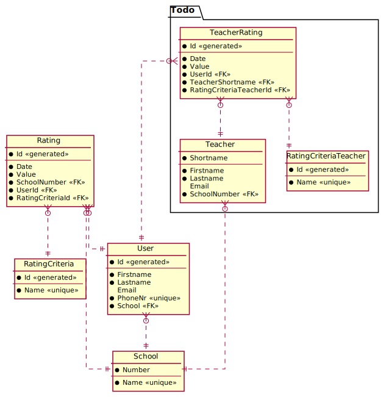

# Übung 1: Kleines Datenmodell für die Lernsieg App

In der neuen (und nicht mehr existierenden) App Lernsieg konnten User Schulen und Lehrer anhand von
verschiedenen Kriterien bewerten.

Ein Datenmodell, welches diese Anforderungen (minimal) abdeckt, könnte so aussehen:


<sup>
https://www.plantuml.com/plantuml/uml/dL9HJy8m47wcl-BUJ4ZW1nX2I5GIeq6ZwFkndMj3rywkUo2m_-vrbE5mcL5UQB-x-xxxlcvHUdI-ohMu0gbI0Yy9oi9wqTmIvH9DN7iglB86zJMGmOqc-B0EhFFIPW46hGoLKr5kbIdGOTu0VbVGiKa8Cbxv7RmcqbeDUm7y6w-gV4EkEKycauXXJZ2RLKPzLZIVYxgTVK6lJ7RZb2Uda3b6u_kKMpCovD1JojsZm3CQ87ahoKNvdzC1FH8ibIkzOHO-F-BfU9UZqemyIsjevU2R1AFHMq2N3ure8rRRwVHmYCulp0oQkEKh_xsZhgYbFqOM9HWD4apGthiXdIkrY8hTTRfW8Bk0kdn259XiCIDOszJ2lhMp9anaI3OiAgsBWVqUPh-lMeZ8E1ZVQQtO-yzF8ax__KKkiuz4hVzpfNVTEDgnsmq_WZt5zhLwvthbM6L19gro_GK0
</sup>

## CREATE TABLE Statements

### Primärschlüssel

Primärschlüssel können - wenn sie nur aus einer Spalte bestehen - mit dem Constraint
*PRIMARY KEY* angelegt werden:

```sql
CREATE TABLE School (
    Number       INTEGER      PRIMARY KEY,
    -- ...
)
```

### Auto Increment Keys

Im Modell sind manche Schlüssel mit *generated* gekennzeichnet. Das Anlegen von Auto Increment
Werten unterscheidet sich je nach Datenbank. In SQLIte können wir mittels *AUTOINCREMENT* einen
Primärschlüssel zu einem Auto Increment Wert machen. Der Datentyp muss natürlich *INTEGER* sein.

```sql
CREATE TABLE RatingCriteria (
    Number       INTEGER      PRIMARY KEY AUTOINCREMENT,
    -- ...
)
```

### Unique Constraints

Darf ein Wert nur 1x pro Tabelle vorkommen, so können wir das UNIQUE Constraint verwenden.
Vorsicht: Die Spalte sollte auch das NOT NULL Constraint besitzen. Wird NULL erlaubt, kollidiert
dies mit Unique: Der NULL Wert darf dann auch nur 1x vorkommen.

```sql
CREATE TABLE User (
	-- ...
	PhoneNr   VARCHAR(20)   NOT NULL UNIQUE,
	-- ...
);
```

### Fremdschlüssel

Der Fremdschlüssel wird auf der "N Seite" definiert und verweist auf die "1er Seite". Im Modell
hat eine Schule mehrere User (1 : n). Daher wird in der Tabelle *User* der Fremdschlüssel zur
Schule definiert.

Die Syntax lautet *FOREIGN KEY (FK Spalte) REFERENCES OtherTable(Pk Spalte)*:

```sql
CREATE TABLE User (
	--- ...
	SchoolNumber  INTEGER   NOT NULL,
	FOREIGN KEY (SchoolNumber) REFERENCES School(Number)
);
```

### Das SQL Skript

```sql
-- Für SQLite aktivieren wir den Foreigen Key Check. Je nach Datenbankeditor wird die Datenbank
-- eventuell ohne diese Einstellung angelegt.
PRAGMA foreign_keys = ON;

-- SQL Script für DBeaver und SQLite

-- Umgekehrte Reihenfolge wie bei CREATE TABLE!
-- In ORACLE ist 
-- DROP TABLE School CASCADE CONSTRAINTS;
-- möglich, um Tabellen trotz Fremdschlüsselreferenzen zu löschen.
DROP TABLE Rating;
DROP TABLE User;
DROP TABLE RatingCriteria;
DROP TABLE School;

CREATE TABLE School (
--  SPALTENNAME  DATENTYP     CONSTRAINT/S
	Number       INTEGER      PRIMARY KEY,
	Name         VARCHAR(100) NOT NULL UNIQUE
);

CREATE TABLE RatingCriteria (
	Id        INTEGER      PRIMARY KEY AUTOINCREMENT,   -- PK mit Autowert
	Name      VARCHAR(100) NOT NULL UNIQUE              -- Der Name darf nicht mehrmals vorkommen.
);

CREATE TABLE User (
	Id        INTEGER       PRIMARY KEY AUTOINCREMENT,
	Firstname VARCHAR(255)  NOT NULL,
	Lastname  VARCHAR(255)  NOT NULL,
	PhoneNr   VARCHAR(20)   NOT NULL UNIQUE,
	Email     VARCHAR(100),                   -- Vorsicht bei Unique: NULL darf dann nur 1x vorkommen!
	SchoolNumber  INTEGER   NOT NULL,         -- SchoolId ist ein FK, daher auch ein INTEGER!
	-- SchoolId zum FK machen. References verweist auf die "1er Seite"
	-- FOREIGN KEY (FK Columns) REFERENCES PKTable(PK Columns)
	FOREIGN KEY (SchoolNumber) REFERENCES School(Number)
);

CREATE TABLE Rating (
	Id           INTEGER  PRIMARY KEY AUTOINCREMENT,
	SchoolNumber INTEGER  NOT NULL,
	UserId       INTEGER  NOT NULL,
	CriteriaId   INTEGER  NOT NULL, 
	Date         DATETIME NOT NULL,
	Value        INTEGER  NOT NULL,
	FOREIGN KEY (SchoolNumber)   REFERENCES School(Number),
	FOREIGN KEY (UserId)     REFERENCES User(Id),
	FOREIGN KEY (CriteriaId) REFERENCES RatingCriteria(Id)
);
```

## Übung

1. Öffnen Sie DBeaver und verbinden Sie sich zu einer SQLite Datenbank. Diese muss nicht
   vorhanden sein, wenn Sie den Namen *Lernsieg.db* eingeben wird sie angelegt.
2. Vervollständigen Sie dieses CREATE TABLE Skript, sodass auch die im Bereich "ToDo" umrandeten
   Tabellen im Modell erstellt werden.
   Hinweis: Vermeiten Sie leerzeilen innerhalb des CREATE TABLE Statements. Dies führt zu
   Fehlern bei der Ausführung in DBeaver.
3. Legen Sie die Tabellen mit *Execute SQL Script* an. Stellen Sie durch *DROP TABLE* Anweisungen
   sicher, dass das Skript auch mehrmals ausgeführt werden kann.
4. Prüfen Sie durch Doppelklick auf *Tables*, ob alle Tabellen im ER Diagramm sichtbar sind.
   Vorsicht: Sie müssen vorher mit F5 die Tabellen in DBeaver aktualisieren.
5. UNIQUE Constraints können auch mehrere Spalten besitzen. So sagt. z. B. aus, dass
   bei *UNIQUE(Email, PhoneNr)* das Wertepaar aus Mail und Telefonnummer nicht doppelt
   vorkommen kann. Die selbe Email kann mit unterschiedlichen Telefonnummern sehr wohl
   verwendet werden. Erkennen Sie im Modell sinnvolle Paare, die eindeutig sein müssen?
6. Schreiben Sie folgende SELECT Statements für dieses Modell:
   1. Geben Sie pro Schule die durchschnittlichen Werte jedes Ratingkriteriums aus.
   2. Geben Sie pro Lehrer die durchschnittlichen Werte jedes Ratingkriteriums aus.
   3. Geben Sie pro Schule die durchschnittlichen Werte jedes Ratingkriteriums aus, allerdings nur
      wenn mehr als 3 Ratings eingetragen wurden (HAVING verwenden).
   4. Geben Sie die Anzahl der 5 Sterne Bewertungen (*Value* ist 5) pro Schule und Kriterium aus.