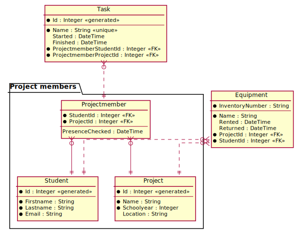

# CREATE TABLE 2: Mehrteilige Schlüssel und CHECK

Beim Infotag zeigen SchülerInnen oft Projekte her. Jedes Projektmitglied hat eine Aufgabe (Task),
die es in einer gewissen Zeit ausführt. Somit können die Mitglieder im Team die Anwesenheit einteilen.

Zum Herzeigen der Projekte sit oft Equipment nötig. SchülerInnen können unter Nennung
des Projektes aus dem ZID Hardware holen und zurückbringen.


<sup>https://www.plantuml.com/plantuml/uml/dPBTQi9048Mliq-nU2d41oWYGgiW5H7Z2smtGx9DTZPEPWkX-kvDsX3h-aFfxPcpEUURpBncHUnjANAJWjI6T0cYBWnMYfILfK7WfWBfY7CdHALqeJAGeosvTz0iBTWte7eaFuK0PCEDJDYdWDmgqNYLoYUvGeOCI4wd6I2GOaXdCn75STmwbePgHcMXDIPC1hDMNAjhRM6LAS_2QSZhg_mnRnDyDj6vSsK3YiulHRHsMh5n-23lX_mxjISEmfUlNUgujryDXqfRWXfGmtCEke3Ezg8OziP25tgPTd9nV3pAFl3si1T_DTwhklZFUbgBHtFmqCqJLiINzQAbGLFdWJY-QFLWDu7pmQ9Qb8wX9PnCUiBXsK2vE7XJsU7oy0EG7JKRtxa6fZjti0CCuNR0dl0Et6sU03P060e67E7W_7_5733rjlm2
</sup>

Zudem sollen noch folgende Punkte berücksichtigt werden:

- *Projectmember* ist eine Auflösungstabelle, da SchülerInnen in mehreren Projekten Mitglied
  sein konnten und bei Projekten natürlich mehrere SchülerInnen mitarbeiten,
- Die Tabelle *Task* ist mit *Projectmember* verbunden. Dadurch werden 2 Schlüsselteile
  als Fremdschlüssel in *Task* gespeichert.
- Die Projekte bleiben in der Datenbank über mehrere Jahre gespeichert. Der Projektname
  sollte pro Jahr eindeutig sein. Dieses UNIQUE Constraint ist nicht abgebildet, da es
  2 Spalten umfasst.
- Equipment darf von beliebigen SchülerInnen unter Nennung des Projekts ausgeborgt
  werden. Sie müssen nicht notwendigerweise im Projektteam sein. So kann z. B. der
  Klassensprecher auch Hardware holen. Deswegen ist die Tabelle nicht mit
  *Projectmember* verbunden. Es handelt sich also um keinen zusammengesetzten
  Fremdschlüssel!
- Die Mailadresse muss eine Schuladresse sein (endet mit @spengergasse.at).
- Das Ende des Tasks darf natürlich nur nach dem Anfang sein, und der Anfangszeitpunkt
  muss einen Wert haben. Tasks, die nie begonnen haben, können schließlich nicht abgeschlossen
  werden.
- Beim Ausborgen von Equipment gilt der selbe Sachverhalt beim Zeitpunkt der Rückgabe.

## Anlegen einer leeren Datenbank

### SQL Server (HIF)

Um eine Datenbank in SQL Server über die Shell anzulegen, öffne Docker Desktop und öffne die Shell
des SQL Server Containers. Danach kann mit folgendem Befehl die Datenbank *InfotagDb* angelegt werden:

```bash
/opt/mssql-tools/bin/sqlcmd -U sa -P SqlServer2019 -Q "DROP DATABASE IF EXISTS InfotagDb; CREATE DATABASE InfotagDb;"

```

Dabei wird angenommen, dass *SqlServer2019* das sa Passwort ist, das beim Erstellen des Containers
mit *docker run* angegeben wurde.

### Oracle User (Kolleg)

Um einen User in Oracle über die Shell anzulegen, öffne Docker Desktop und öffne die Shell
des Oracle Containers. Danach kann mit folgendem Befehl der User *InfotagDb* mit dem
Passwort *oracle* angelegt werden:

```bash
sqlplus system/oracle@//localhost/XEPDB1 <<< "
    DROP USER InfotagDb CASCADE;
    CREATE USER InfotagDb IDENTIFIED BY oracle;
    GRANT CONNECT, RESOURCE, CREATE VIEW TO InfotagDb;
    GRANT UNLIMITED TABLESPACE TO InfotagDb;
"

```

Dabei wird angenommen, dass *oracle* das system Passwort ist, das beim Erstellen des Containers
mit *docker run* angegeben wurde.


## CREATE TABLE Statements

**SQL Server**
```sql
DROP TABLE IF EXISTS Task;
DROP TABLE IF EXISTS Equipment;
DROP TABLE IF EXISTS Projectmember;
DROP TABLE IF EXISTS Project;
DROP TABLE IF EXISTS Student;

CREATE TABLE Student (
	Id        INTEGER      IDENTITY(1,1) PRIMARY KEY,
	Firstname VARCHAR(200) NOT NULL,
	Lastname  VARCHAR(200) NOT NULL,
	Email     VARCHAR(100) NOT NULL UNIQUE,
	CHECK (LEN(Email) > 20 AND Email LIKE '%@spengergasse.at')
);

CREATE TABLE Project (
	Id         INTEGER      IDENTITY(1,1) PRIMARY KEY,
	Name       VARCHAR(100) NOT NULL,
	Schoolyear INTEGER      NOT NULL,
	Location   VARCHAR(16),
	UNIQUE(Name, Schoolyear)
);

CREATE TABLE Projectmember (
	StudentId       INTEGER,
	ProjectId       INTEGER,
	PresenceChecked DATETIME,
	PRIMARY KEY (StudentId, ProjectId),
	FOREIGN KEY (StudentId) REFERENCES Student(Id),
	FOREIGN KEY (ProjectId) REFERENCES Project(Id) 
);

CREATE TABLE Task (
	Id        INTEGER      IDENTITY(1,1) PRIMARY KEY,
	Name      VARCHAR(200) NOT NULL,
	Started   DATETIME,
	Finished  DATETIME,
	ProjectmemberStudentId  INTEGER NOT NULL,
	ProjectmemberProjectId  INTEGER NOT NULL,
	FOREIGN KEY (ProjectmemberStudentId, ProjectmemberProjectId) REFERENCES Projectmember(StudentId, ProjectId),
	CHECK(Finished IS NULL OR Finished > Started)
);

CREATE TABLE Equipment (
	InventoryNumber VARCHAR(16)  PRIMARY KEY,
	Name      VARCHAR(200) NOT NULL,
	Rented    DATETIME,
	Returned  DATETIME,
	ProjectId   INTEGER NOT NULL,
	StudentId   INTEGER NOT NULL,	
	FOREIGN KEY (ProjectId) REFERENCES Project(Id),
	FOREIGN KEY (StudentId) REFERENCES Student(Id),
	CHECK(Returned IS NULL OR Returned > Rented)
);

```

**Oracle**
```sql
DROP TABLE Task CASCADE CONSTRAINTS;
DROP TABLE Equipment  CASCADE CONSTRAINTS;
DROP TABLE Projectmember  CASCADE CONSTRAINTS;
DROP TABLE Project  CASCADE CONSTRAINTS;
DROP TABLE Student  CASCADE CONSTRAINTS;

CREATE TABLE Student (
	Id        INTEGER GENERATED BY DEFAULT AS IDENTITY PRIMARY KEY,
	Firstname VARCHAR2(200) NOT NULL,
	Lastname  VARCHAR2(200) NOT NULL,
	Email     VARCHAR2(100) NOT NULL UNIQUE,
	CHECK (LENGTH(Email) > 20 AND Email LIKE '%@spengergasse.at')
);

CREATE TABLE Project (
	Id         INTEGER GENERATED BY DEFAULT AS IDENTITY PRIMARY KEY,
	Name       VARCHAR2(100) NOT NULL,
	Schoolyear INTEGER      NOT NULL,
	Location   VARCHAR2(16),
	UNIQUE(Name, Schoolyear)
);

CREATE TABLE Projectmember (
	StudentId       INTEGER,
	ProjectId       INTEGER,
	PresenceChecked TIMESTAMP,
	PRIMARY KEY (StudentId, ProjectId),
	FOREIGN KEY (StudentId) REFERENCES Student(Id),
	FOREIGN KEY (ProjectId) REFERENCES Project(Id) 
);

CREATE TABLE Task (
	Id        INTEGER GENERATED BY DEFAULT AS IDENTITY PRIMARY KEY,
	Name      VARCHAR2(200) NOT NULL,
	Started   TIMESTAMP,
	Finished  TIMESTAMP,
	ProjectmemberStudentId  INTEGER NOT NULL,
	ProjectmemberProjectId  INTEGER NOT NULL,
	FOREIGN KEY (ProjectmemberStudentId, ProjectmemberProjectId) REFERENCES Projectmember(StudentId, ProjectId),
	CHECK(Finished IS NULL OR Finished > Started)
);

CREATE TABLE Equipment (
	InventoryNumber VARCHAR2(16)  PRIMARY KEY,
	Name      VARCHAR2(200) NOT NULL,
	Rented    TIMESTAMP,
	Returned  TIMESTAMP,
	ProjectId   INTEGER NOT NULL,
	StudentId   INTEGER NOT NULL,
	FOREIGN KEY (ProjectId) REFERENCES Project(Id),
	FOREIGN KEY (StudentId) REFERENCES Student(Id),
	CHECK(Returned IS NULL OR Returned > Rented)
);

```