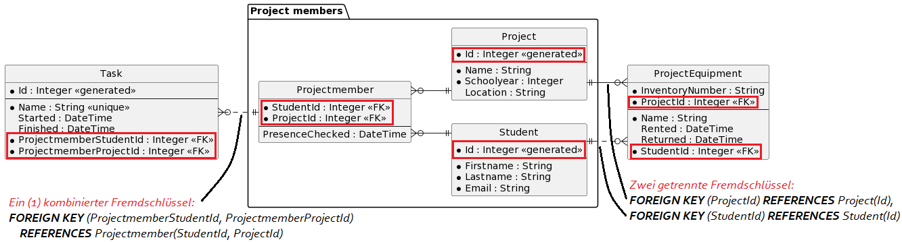
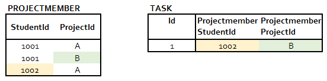
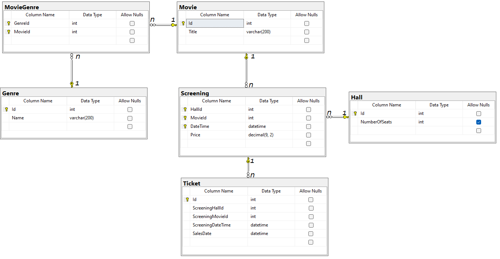

# CREATE TABLE 2: Constraints mit mehreren Spalten und CHECK

Beim Infotag zeigen SchülerInnen oft Projekte her. Jedes Projektmitglied hat eine Aufgabe (Task),
die es in einer gewissen Zeit ausführt. Somit können die Mitglieder im Team die Anwesenheit einteilen.

Zum Herzeigen der Projekte sit oft Equipment nötig. SchülerInnen können unter Nennung
des Projektes aus dem ZID Hardware holen und zurückbringen.


<sup>[PlantUML Source](https://www.plantuml.com/plantuml/uml/dPBTQi9048Mliq-nU2d41oWYGgiW5H7Z2smtGx9DTZPEPWkX-kvDsX3h-aFfxPcpEUURpBncHUnjANAJWjI6T0cYBWnMYfILfK7WfWBfY7CdHALqeJAGeosvTz0iBTWte7eaFuK0PCEDJDYdWDmgqNYLoYUvGeOCI4wd6I2GOaXdCn75STmwbePgHcMXDIPC1hDMNAjhRM6LAS_2QSZhg_mnRnDyDj6vSsK3YiulHRHsMh5n-23lX_mxjISEmfUlNUgujryDXqfRWXfGmtCEke3Ezg8OziP25tgPTd9nV3pAFl3si1T_DTwhklZFUbgBHtFmqCqJLiINzQAbGLFdWJY-QFLWDu7pmQ9Qb8wX9PnCUiBXsK2vE7XJsU7oy0EG7JKRtxa6fZjti0CCuNR0dl0Et6sU03P060e67E7W_7_5733rjlm2)</sup>

Zudem sollen noch folgende Punkte berücksichtigt werden:

- *Projectmember* ist eine Auflösungstabelle, da SchülerInnen in mehreren Projekten Mitglied
  sein konnten und bei Projekten natürlich mehrere SchülerInnen mitarbeiten,
- Die Tabelle *Task* ist mit *Projectmember* verbunden. Dadurch werden 2 Schlüsselteile
  als Fremdschlüssel in *Task* gespeichert.
- Die Projekte bleiben in der Datenbank über mehrere Jahre gespeichert. Der Projektname
  sollte pro Jahr eindeutig sein. Dieses UNIQUE Constraint ist nicht abgebildet, da es
  2 Spalten umfasst.
- Equipment darf von beliebigen SchülerInnen unter Nennung des Projekts ausgeborgt
  werden. Sie müssen nicht notwendigerweise im Projektteam sein. So kann z. B. der
  Klassensprecher auch Hardware holen. Deswegen ist die Tabelle nicht mit
  *Projectmember* verbunden. Es handelt sich also um keinen zusammengesetzten
  Fremdschlüssel!
- Die Mailadresse muss eine Schuladresse sein (endet mit @spengergasse.at).
- Das Ende des Tasks darf natürlich nur nach dem Anfang sein, und der Anfangszeitpunkt
  muss einen Wert haben. Tasks, die nie begonnen haben, können schließlich nicht abgeschlossen
  werden.
- Beim Ausborgen von Equipment gilt der selbe Sachverhalt beim Zeitpunkt der Rückgabe.


## PRIMARY KEY mit mehreren Spalten

Bis jetzt haben wir den Primary Key als Constraint direkt in der Spaltendefinition festgelegt.
Wenn wir einen Primary Key, der aus mehreren Spalten besteht, anlegen möchten, müssen wir das
nachträglich mit der *PRIMARY KEY (Col1, Col2, ...)* Anweisung machen:

```sql
CREATE TABLE Projectmember (
	StudentId       INTEGER,
	ProjectId       INTEGER,
	PresenceChecked DATETIME,
	PRIMARY KEY (StudentId, ProjectId),
	FOREIGN KEY (StudentId) REFERENCES Student(Id),
	FOREIGN KEY (ProjectId) REFERENCES Project(Id) 
);
```

## FOREIGN KEY mit mehreren Spalten

Die Tabelle *Task* besitzt einen Fremdschlüssel der Tabelle *Projectmember*,
da eine 1:n Beziehung vorliegt (**1** Projectmember hat **n** Tasks). Der
Primärschlüssel der Tabelle *Projectmember* besteht aus 2 Teilen (*StudentId* und
*ProjectId*), die beide in die Tabelle Task als Fremdschlüssel übertragen werden.

Daher brauchen wir eine *FOREIGN KEY* Constraint, das beide Spalten umfasst:

```sql
CREATE TABLE Task (
	Id        INTEGER      IDENTITY(1,1) PRIMARY KEY,
	Name      VARCHAR(200) NOT NULL,
	Started   DATETIME,
	Finished  DATETIME,
	ProjectmemberStudentId  INTEGER NOT NULL,
	ProjectmemberProjectId  INTEGER NOT NULL,
	FOREIGN KEY (ProjectmemberStudentId, ProjectmemberProjectId)
	    REFERENCES Projectmember(StudentId, ProjectId)
);
```




### Falsche Lösung: Getrenntes Anlegen

Das folgende Create Table Skript zeigt einen **falsch angelegten Fremdschlüssel**:
```sql
CREATE TABLE Task (
	Id        INTEGER      IDENTITY(1,1) PRIMARY KEY,
	Name      VARCHAR(200) NOT NULL,
	Started   DATETIME,
	Finished  DATETIME,
	ProjectmemberStudentId  INTEGER NOT NULL,
	ProjectmemberProjectId  INTEGER NOT NULL,
	FOREIGN KEY (ProjectmemberStudentId) REFERENCES Projectmember(StudentId)
	FOREIGN KEY (ProjectmemberProjectId) REFERENCES Projectmember(ProjectId)
);
```

Das *CREATE TABLE* Statement ist syntaktisch korrekt und lässt sich daher auch
ausführen. Es bedeutet aber folgendes:

- Der Wert von *ProjectmemberStudentId* muss in Projectmember als *StudentId* vorkommen.
- Der Wert von *ProjectmemberProjectId* muss in Projectmember als *ProjectId* vorkommen.

Beachte die **getrennten** Aussagen. Somit kann folgende Situation erzeugt werden:



Der Student 1002 ist nicht im Projekt B, es kann jedoch trotzdem ein Task
mit der Zuordnung *StudentId* 1002 und *ProjectId* B angelegt werden, da beide
Werte - getrennt gesehen - in Projectmember vorkommen.

## UNIQUE mit mehreren Spalten

Wir wollen sicherstellen, dass ein Projektname pro Schuljahr eindeutig ist. Würden wir getrennte
UNIQUE Constraints definieren, hat dies zur Folge dass der Projektname tabellenweit nur 1x
verwendet werden kann. Wir wollen aber definieren, dass die **Kombination aus Projektname und Schuljahr**
eindeutig sein muss. Somit darf das Projekt "Buffet" im Jahr 2021, 2022, ... angelegt werden.

Somit müssen wir nach der Spaltendefinition das UNIQUE Constraint extra definieren:

```sql
CREATE TABLE Project (
	Id         INTEGER      IDENTITY(1,1) PRIMARY KEY,
	Name       VARCHAR(100) NOT NULL,
	Schoolyear INTEGER      NOT NULL,
	Location   VARCHAR(16),
	UNIQUE(Name, Schoolyear)
);
```

## Das CHECK Constraint

In der Tabelle *Task* gibt es zwei Zeitstempel: *Started* und *Finished*. Wir wollen nun
sicherstellen, dass ein Wert für *Finished* nur gesetzt werden kann, wenn er größer als
Start ist.

Ein *CHECK* Constraint wird wie die WHERE Bedingung einer SQL Abfrage formuliert. Wir können
Ausdrücke, die wir auch in die *WHERE* Klausel so schreiben würden, hier einfügen. Der Zugriff
ist aber nur auf Spalten der eigenen Tabelle möglich. Manche Datenbanksysteme wie SQL Server
bieten hier Erweiterungen an, diese sind dann in der Doku des Datenbanksystems nachzulesen.

Konkret wird *CHECK* in das *CREATE TABLE* Statement geschrieben:

```sql
CREATE TABLE Task (
	Id        INTEGER      IDENTITY(1,1) PRIMARY KEY,
	Name      VARCHAR(200) NOT NULL,
	Started   DATETIME,
	Finished  DATETIME,
	ProjectmemberStudentId  INTEGER NOT NULL,
	ProjectmemberProjectId  INTEGER NOT NULL,
	FOREIGN KEY (ProjectmemberStudentId, ProjectmemberProjectId) REFERENCES Projectmember(StudentId, ProjectId),
	CHECK(Finished IS NULL OR Finished > Started)
);
```

Beachte den Ausdruck *Finished IS NULL OR...*. Die Spalte *Finished* ist nullable. Wenn wir nur 
*Finished > Started* schreiben würden, würde der NULL Wert nicht dieser Bedingung entsprechen
(NULL ist weder größer oder kleiner als ein Wert). Achte daher immer darauf, wie mit NULL Werten
umgegangen werden soll.

## Beispiel: CREATE TABLE Skript der Infotage Datenbank

### Anlegen einer leeren Datenbank

#### SQL Server (HIF)

Um eine Datenbank in SQL Server über die Shell anzulegen, öffne Docker Desktop und öffne die Shell
des SQL Server Containers. Danach kann mit folgendem Befehl die Datenbank *InfotagDb* angelegt werden:

```bash
/opt/mssql-tools/bin/sqlcmd -U sa -P SqlServer2019 -Q "DROP DATABASE IF EXISTS InfotagDb; CREATE DATABASE InfotagDb;"

```

Dabei wird angenommen, dass *SqlServer2019* das sa Passwort ist, das beim Erstellen des Containers
mit *docker run* angegeben wurde.

#### Oracle User (Kolleg)

Um einen User in Oracle über die Shell anzulegen, öffne Docker Desktop und öffne die Shell
des Oracle Containers. Danach kann mit folgendem Befehl der User *InfotagDb* mit dem
Passwort *oracle* angelegt werden:

```bash
sqlplus system/oracle@//localhost/XEPDB1 <<< "
    DROP USER InfotagDb CASCADE;
    CREATE USER InfotagDb IDENTIFIED BY oracle;
    GRANT CONNECT, RESOURCE, CREATE VIEW TO InfotagDb;
    GRANT UNLIMITED TABLESPACE TO InfotagDb;
"

```

Dabei wird angenommen, dass *oracle* das system Passwort ist, das beim Erstellen des Containers
mit *docker run* angegeben wurde.


### CREATE TABLE Statements

<details>
<summary>Skript für SQL Server anzeigen</summary>

```sql
DROP TABLE IF EXISTS Task;
DROP TABLE IF EXISTS Equipment;
DROP TABLE IF EXISTS Projectmember;
DROP TABLE IF EXISTS Project;
DROP TABLE IF EXISTS Student;

CREATE TABLE Student (
	Id        INTEGER      IDENTITY(1,1) PRIMARY KEY,
	Firstname VARCHAR(200) NOT NULL,
	Lastname  VARCHAR(200) NOT NULL,
	Email     VARCHAR(100) NOT NULL UNIQUE,
	CHECK (LEN(Email) > 20 AND Email LIKE '%@spengergasse.at')
);

CREATE TABLE Project (
	Id         INTEGER      IDENTITY(1,1) PRIMARY KEY,
	Name       VARCHAR(100) NOT NULL,
	Schoolyear INTEGER      NOT NULL,
	Location   VARCHAR(16),
	UNIQUE(Name, Schoolyear)
);

CREATE TABLE Projectmember (
	StudentId       INTEGER,
	ProjectId       INTEGER,
	PresenceChecked DATETIME,
	PRIMARY KEY (StudentId, ProjectId),
	FOREIGN KEY (StudentId) REFERENCES Student(Id),
	FOREIGN KEY (ProjectId) REFERENCES Project(Id) 
);

CREATE TABLE Task (
	Id        INTEGER      IDENTITY(1,1) PRIMARY KEY,
	Name      VARCHAR(200) NOT NULL,
	Started   DATETIME,
	Finished  DATETIME,
	ProjectmemberStudentId  INTEGER NOT NULL,
	ProjectmemberProjectId  INTEGER NOT NULL,
	FOREIGN KEY (ProjectmemberStudentId, ProjectmemberProjectId) 
	    REFERENCES Projectmember(StudentId, ProjectId),
	CHECK(Finished IS NULL OR Finished > Started)
);

CREATE TABLE Equipment (
	InventoryNumber VARCHAR(16),
	ProjectId   INTEGER,
	Name        VARCHAR(200) NOT NULL,
	Rented      DATETIME,
	Returned    DATETIME,
	StudentId   INTEGER NOT NULL,	
	PRIMARY KEY (InventoryNumber, ProjectId),
	FOREIGN KEY (ProjectId) REFERENCES Project(Id),
	FOREIGN KEY (StudentId) REFERENCES Student(Id),
	CHECK(Returned IS NULL OR Returned > Rented)
);

```
</details>

<details>
<summary>Skript für Oracle anzeigen</summary>

```sql
DROP TABLE Task CASCADE CONSTRAINTS;
DROP TABLE Equipment  CASCADE CONSTRAINTS;
DROP TABLE Projectmember  CASCADE CONSTRAINTS;
DROP TABLE Project  CASCADE CONSTRAINTS;
DROP TABLE Student  CASCADE CONSTRAINTS;

CREATE TABLE Student (
	Id        INTEGER GENERATED BY DEFAULT AS IDENTITY PRIMARY KEY,
	Firstname VARCHAR2(200) NOT NULL,
	Lastname  VARCHAR2(200) NOT NULL,
	Email     VARCHAR2(100) NOT NULL UNIQUE,
	CHECK (LENGTH(Email) > 20 AND Email LIKE '%@spengergasse.at')
);

CREATE TABLE Project (
	Id         INTEGER GENERATED BY DEFAULT AS IDENTITY PRIMARY KEY,
	Name       VARCHAR2(100) NOT NULL,
	Schoolyear INTEGER      NOT NULL,
	Location   VARCHAR2(16),
	UNIQUE(Name, Schoolyear)
);

CREATE TABLE Projectmember (
	StudentId       INTEGER,
	ProjectId       INTEGER,
	PresenceChecked TIMESTAMP,
	PRIMARY KEY (StudentId, ProjectId),
	FOREIGN KEY (StudentId) REFERENCES Student(Id),
	FOREIGN KEY (ProjectId) REFERENCES Project(Id) 
);

CREATE TABLE Task (
	Id        INTEGER GENERATED BY DEFAULT AS IDENTITY PRIMARY KEY,
	Name      VARCHAR2(200) NOT NULL,
	Started   TIMESTAMP,
	Finished  TIMESTAMP,
	ProjectmemberStudentId  INTEGER NOT NULL,
	ProjectmemberProjectId  INTEGER NOT NULL,
	FOREIGN KEY (ProjectmemberStudentId, ProjectmemberProjectId) REFERENCES Projectmember(StudentId, ProjectId),
	CHECK(Finished IS NULL OR Finished > Started)
);

CREATE TABLE Equipment (
	InventoryNumber VARCHAR2(16),
	ProjectId   INTEGER,
	Name        VARCHAR2(200) NOT NULL,
	Rented      TIMESTAMP,
	Returned    TIMESTAMP,
	StudentId   INTEGER NOT NULL,	
	PRIMARY KEY (InventoryNumber, ProjectId),
	FOREIGN KEY (ProjectId) REFERENCES Project(Id),
	FOREIGN KEY (StudentId) REFERENCES Student(Id),
	CHECK(Returned IS NULL OR Returned > Rented)
);

```
</details>

## Übung

Es soll folgende Datenbank mittels *CREATE TABLE* Statements umgesetzt werden. Sie speichert
Filme, die mehrere Genres haben können. Die Filme werden in Kinosälen (Hall) vorgeführt.
Zu einer Vorführung (Screening) werden die verkauften Tickets gespeichert.



### Arbeitsauftrag

Stelle in deinem SQL Editor eine Verbindung zum SQL Server oder Oracle Container her. Arbeitest du
in *Oracle* (Kolleg), erstelle zuerst einen User *ScreeningDb* in der Shell des Containers:

```bash
sqlplus system/oracle@//localhost/XEPDB1 <<< "
    DROP USER ScreeningDb CASCADE;
    CREATE USER ScreeningDb IDENTIFIED BY oracle;
    GRANT CONNECT, RESOURCE, CREATE VIEW TO ScreeningDb;
    GRANT UNLIMITED TABLESPACE TO ScreeningDb;
"

```

Kopiere danach die entsprechende Vorlage in deinen SQL Editor und erstelle die erforderlichen
CREATE TABLE Statements. Die nachfolgenden *INSERT* Anweisungen müssen alle funktionieren.
Erstelle zusätzliche Constraints:

- Ein Ticket darf nur vor Beginn der Vorführung verkauft werden (*SalesDate*)
- Der Name des Genres muss eindeutig sein (UNIQUE)
- Der Titel des Movies muss eindeutig sein (UNIQUE)
- *NumberOfSeats* in Hall muss größer als 0 sein. Beachte, dass dieses Feld auch NULL sein darf.

Prüfe diese Constraints, indem du ein jeweils INSERT schreibst, dass diese Kriterien nicht erfüllt.

<details>
<summary>Vorlage für SQL Server anzeigen</summary>

```sql
USE master
GO
-- Prevent 'database is in use' error when deleting.
IF EXISTS (SELECT 1 FROM sys.databases WHERE [name] = N'ScreeningDb')
BEGIN
    ALTER DATABASE ScreeningDb SET SINGLE_USER WITH ROLLBACK IMMEDIATE;
    DROP DATABASE ScreeningDb;
END;
GO
CREATE DATABASE ScreeningDb
GO
USE ScreeningDb
GO

CREATE TABLE Hall (
	-- TODO: Your definition
);

CREATE TABLE Genre (
	-- TODO: Your definition
);

CREATE TABLE Movie (
	-- TODO: Your definition
);

CREATE TABLE MovieGenre (
	-- TODO: Your definition
);

CREATE TABLE Screening (
	-- TODO: Your definition
);

CREATE TABLE Ticket (
	-- TODO: Your definition
);

INSERT INTO Hall (Id, NumberOfSeats) VALUES (1, 200);
INSERT INTO Hall (Id, NumberOfSeats) VALUES (2, NULL);
INSERT INTO Movie (Id, Title) VALUES (1, 'Barbaria');
INSERT INTO Movie (Id, Title) VALUES (2, 'All Quiet on the Western Front');
INSERT INTO Movie (Id, Title) VALUES (3, 'Terrifier 2');
INSERT INTO Screening (HallId, MovieId, DateTime, Price) VALUES (1, 1, '2020-11-13T20:00:00', 14);
INSERT INTO Screening (HallId, MovieId, DateTime, Price) VALUES (1, 2, '2020-11-14T20:00:00', 12);
INSERT INTO Screening (HallId, MovieId, DateTime, Price) VALUES (2, 1, '2020-11-13T20:00:00', 14);
INSERT INTO Genre (Id, Name) VALUES (1, 'Action');
INSERT INTO Genre (Id, Name) VALUES (2, 'Horror');
INSERT INTO Genre (Id, Name) VALUES (3, 'Thriller');
INSERT INTO Genre (Id, Name) VALUES (4, 'Drama');
INSERT INTO Genre (Id, Name) VALUES (5, 'War');
INSERT INTO MovieGenre (GenreId, MovieId) VALUES (1, 2);
INSERT INTO MovieGenre (GenreId, MovieId) VALUES (2, 1);
INSERT INTO MovieGenre (GenreId, MovieId) VALUES (2, 3);
INSERT INTO MovieGenre (GenreId, MovieId) VALUES (3, 1);
INSERT INTO MovieGenre (GenreId, MovieId) VALUES (4, 2);
INSERT INTO MovieGenre (GenreId, MovieId) VALUES (5, 2);
INSERT INTO Ticket (Id, ScreeningHallId, ScreeningMovieId, ScreeningDateTime, SalesDate) VALUES (1, 1, 1, '2020-11-13T20:00:00', '2020-11-13T18:55:00');
INSERT INTO Ticket (Id, ScreeningHallId, ScreeningMovieId, ScreeningDateTime, SalesDate) VALUES (2, 2, 1, '2020-11-13T20:00:00', '2020-11-13T18:25:00');
INSERT INTO Ticket (Id, ScreeningHallId, ScreeningMovieId, ScreeningDateTime, SalesDate) VALUES (3, 1, 2, '2020-11-14T20:00:00', '2020-11-14T18:02:00');
INSERT INTO Ticket (Id, ScreeningHallId, ScreeningMovieId, ScreeningDateTime, SalesDate) VALUES (4, 1, 1, '2020-11-13T20:00:00', '2020-11-13T18:59:00');
INSERT INTO Ticket (Id, ScreeningHallId, ScreeningMovieId, ScreeningDateTime, SalesDate) VALUES (5, 2, 1, '2020-11-13T20:00:00', '2020-11-13T18:25:00');
INSERT INTO Ticket (Id, ScreeningHallId, ScreeningMovieId, ScreeningDateTime, SalesDate) VALUES (6, 1, 2, '2020-11-14T20:00:00', '2020-11-14T18:12:00');

```
</details>

<details>
<summary>Vorlage für Oracle anzeigen</summary>

```sql
DROP TABLE Ticket CASCADE CONSTRAINTS;
DROP TABLE MovieGenre CASCADE CONSTRAINTS;
DROP TABLE Genre CASCADE CONSTRAINTS;
DROP TABLE Screening CASCADE CONSTRAINTS;
DROP TABLE Movie CASCADE CONSTRAINTS;
DROP TABLE Hall CASCADE CONSTRAINTS;

CREATE TABLE Hall (
	-- TODO: Your definition
);

CREATE TABLE Genre (
	-- TODO: Your definition
);

CREATE TABLE Movie (
	-- TODO: Your definition
);

CREATE TABLE MovieGenre (
	-- TODO: Your definition
);

CREATE TABLE Screening (
	-- TODO: Your definition
);

CREATE TABLE Ticket (
	-- TODO: Your definition
);

INSERT INTO Hall (Id, NumberOfSeats) VALUES (1, 200);
INSERT INTO Hall (Id, NumberOfSeats) VALUES (2, NULL);
INSERT INTO Movie (Id, Title) VALUES (1, 'Barbaria');
INSERT INTO Movie (Id, Title) VALUES (2, 'All Quiet on the Western Front');
INSERT INTO Movie (Id, Title) VALUES (3, 'Terrifier 2');
INSERT INTO Screening (HallId, MovieId, DateTime, Price) VALUES (1, 1, TO_TIMESTAMP('2020-11-13T20:00:00', 'YYYY-MM-DD"T"HH24:MI:SS'), 14);
INSERT INTO Screening (HallId, MovieId, DateTime, Price) VALUES (1, 2, TO_TIMESTAMP('2020-11-14T20:00:00', 'YYYY-MM-DD"T"HH24:MI:SS'), 12);
INSERT INTO Screening (HallId, MovieId, DateTime, Price) VALUES (2, 1, TO_TIMESTAMP('2020-11-13T20:00:00', 'YYYY-MM-DD"T"HH24:MI:SS'), 14);
INSERT INTO Genre (Id, Name) VALUES (1, 'Action');
INSERT INTO Genre (Id, Name) VALUES (2, 'Horror');
INSERT INTO Genre (Id, Name) VALUES (3, 'Thriller');
INSERT INTO Genre (Id, Name) VALUES (4, 'Drama');
INSERT INTO Genre (Id, Name) VALUES (5, 'War');
INSERT INTO MovieGenre (GenreId, MovieId) VALUES (1, 2);
INSERT INTO MovieGenre (GenreId, MovieId) VALUES (2, 1);
INSERT INTO MovieGenre (GenreId, MovieId) VALUES (2, 3);
INSERT INTO MovieGenre (GenreId, MovieId) VALUES (3, 1);
INSERT INTO MovieGenre (GenreId, MovieId) VALUES (4, 2);
INSERT INTO MovieGenre (GenreId, MovieId) VALUES (5, 2);
INSERT INTO Ticket (Id, ScreeningHallId, ScreeningMovieId, ScreeningDateTime, SalesDate)
    VALUES (1, 1, 1, TO_TIMESTAMP('2020-11-13T20:00:00', 'YYYY-MM-DD"T"HH24:MI:SS'), TO_TIMESTAMP('2020-11-13T18:55:00', 'YYYY-MM-DD"T"HH24:MI:SS'));
INSERT INTO Ticket (Id, ScreeningHallId, ScreeningMovieId, ScreeningDateTime, SalesDate)
    VALUES (2, 2, 1, TO_TIMESTAMP('2020-11-13T20:00:00', 'YYYY-MM-DD"T"HH24:MI:SS'), TO_TIMESTAMP('2020-11-13T18:25:00', 'YYYY-MM-DD"T"HH24:MI:SS'));
INSERT INTO Ticket (Id, ScreeningHallId, ScreeningMovieId, ScreeningDateTime, SalesDate)
    VALUES (3, 1, 2, TO_TIMESTAMP('2020-11-14T20:00:00', 'YYYY-MM-DD"T"HH24:MI:SS'), TO_TIMESTAMP('2020-11-14T18:02:00', 'YYYY-MM-DD"T"HH24:MI:SS'));
INSERT INTO Ticket (Id, ScreeningHallId, ScreeningMovieId, ScreeningDateTime, SalesDate)
    VALUES (4, 1, 1, TO_TIMESTAMP('2020-11-13T20:00:00', 'YYYY-MM-DD"T"HH24:MI:SS'), TO_TIMESTAMP('2020-11-13T18:59:00', 'YYYY-MM-DD"T"HH24:MI:SS'));
INSERT INTO Ticket (Id, ScreeningHallId, ScreeningMovieId, ScreeningDateTime, SalesDate)
    VALUES (5, 2, 1, TO_TIMESTAMP('2020-11-13T20:00:00', 'YYYY-MM-DD"T"HH24:MI:SS'), TO_TIMESTAMP('2020-11-13T18:25:00', 'YYYY-MM-DD"T"HH24:MI:SS'));
INSERT INTO Ticket (Id, ScreeningHallId, ScreeningMovieId, ScreeningDateTime, SalesDate)
    VALUES (6, 1, 2, TO_TIMESTAMP('2020-11-14T20:00:00', 'YYYY-MM-DD"T"HH24:MI:SS'), TO_TIMESTAMP('2020-11-14T18:12:00', 'YYYY-MM-DD"T"HH24:MI:SS'));

```
</details>