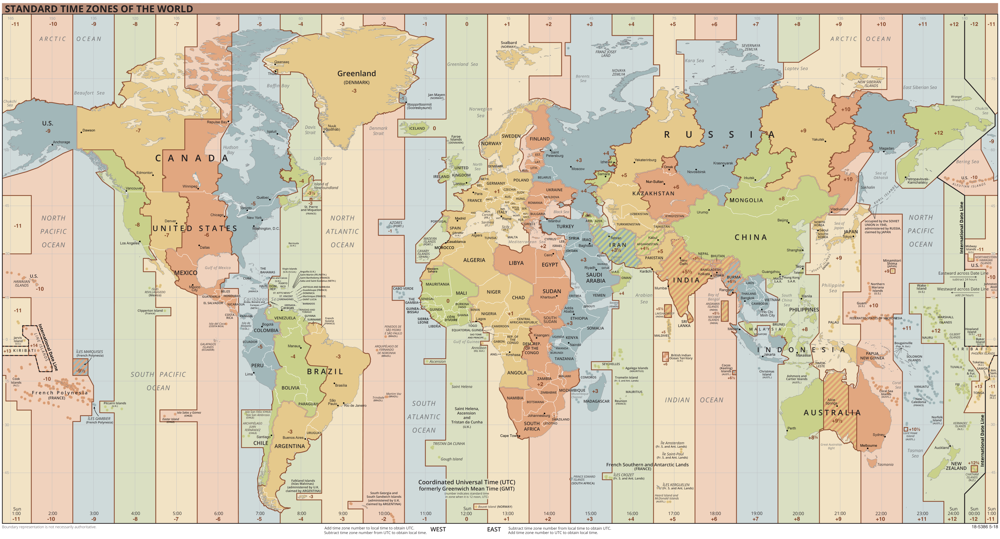

# Datum und Zeit

Wir haben im *CRETE TABLE* Statement Spalten angelegt, die Datums- und Zeitangaben speichern
können. Das Thema Datum und Zeit ist allerdings komplexer als es auf den ersten Blick scheint.

## Die Sekunde als normierte Grundeinheit

Bevor wir uns mit der Speicherung von Datums- und Zeitwerten beschäftigen, müssen wir uns einmal
Gedanken machen, was Zeit im technischen Sinne ist und wie sie gemessen wird. Dafür sehen wir
uns das SI Einheitensystem an, das die Grundeinheiten definiert. Dort findet man eine Definition
der Sekunde:

> Die Sekunde, Einheitenzeichen s, ist die SI-Einheit der Zeit. Sie ist definiert, indem für die
> Cäsiumfrequenz Δν, der Frequenz des ungestörten Hyperfeinübergangs des Grundzustands des
> Cäsiumatoms 133, der Zahlenwert **9&#8239;192&#8239;631&#8239;770** festgelegt wird, ausgedrückt in der Einheit
>  Hz, die gleich s<sup>−1</sup> ist.
> <sup>https://www.ptb.de/cms/ptb/fachabteilungen/abt4/fb-44/fragenzurzeit/fragenzurzeit14.html</sup>

Diese etwas komplizierte Definition sagt aber nur Folgendes aus: Eine Atomuhr zählt einfach,
wie oft das Cäsiumatom geschwungen hat. Nach 9&#8239;192&#8239;631&#8239;770 Schwingungen wird
einfach der Sekundenzähler um 1 hochgezählt.

Eine normale Wanduhr arbeitet auch so, allerdings ohne Cäsiumatome. Im Uhrwerk schwingt ein
Quarzkristall. Nach 32&#8239;768 Schwingungen (2<sup>15</sup>) wird der Sekundenzeiger um 1
weitergeschoben. Ein PC besitzt mit der "Real Time Clock" auch eine kleine Uhr, die durch eine
Batterie immer die Sekunden weiter zählt. Auch sie ist nur ein Zähler.

> Die Zeit, die vergeht, wird technisch als Zählerschaltung realisiert. Es braucht nur eine stabile
> Grundschwingung durch einen Quarz oder ein Atom und einen Frequenzteiler.

Die anderen Einheiten, die wir im Umgang mit Datumswerten brauchen, leiten sich davon ab.

> **1 Minute hat 60 Sekunden, 1 Stunde hat 3600 Sekunden, 1 Tag hat 86&#8239;400 Sekunden.**

Die Umrechnung in Monate und Jahre lässt sich nicht aus einem Sekundenwert ableiten, da sie nicht
immer gleich lang sind (30 oder 31 Tage, Schaltjahre).

## Aus dem Sekundenzähler wird ein Datum: Epoch

Nachdem die Sekunde also durch einen Zählvorgang gewonnen wird, brauchen wir - um ein Datum oder
die Zeit anzeigen zu können - einen Bezugspunkt. Der bekannteste Bezugspunkt kommt aus der frühen
Unix Welt und ist der **1. Jänner 1970 um 0:00 UTC**. Es entspricht dem Zählerwert 0. Der Unix
Timestamp sind einfach die Sekunden, die seit dem vergangen sind. Der Basiswert der Zählung wird
auch *Epoch* genannt.

Das Datum 1.1.1970 wirkt etwas seltsam, und ist nicht das Jahr, wo der erste Computer erfunden wurde.
Ein Unix Timestamp war eine Integer Zahl mit 32 Bit. Daher konnte ein Wertebereich
von -2&#8239;147&#8239;483&#8239;648 bis 2&#8239;147&#8239;483&#8239;647 gespeichert werden.
Durch die negativen Werte kam man dann ungefähr auf den Beginn des 20. Jahrhunderts.

| Zeitpunkt                | UNIX Timestamp |
| ------------------------ | -------------- |
| 13.12.1901 20:45 UTC     | -2147483648    |
| 31.12.1969 00:00 UTC     | -86400         |
| 31.12.1969 23:00 UTC     | -3600          |
| 31.12.1969 23:59 UTC     | -60            |
| **01.01.1970 00:00 UTC** | 0              |
| 01.01.1970 00:01 UTC     | 60             |
| 01.01.1970 01:00 UTC     | 3600           |
| 02.01.1970 00:00 UTC     | 86400          |
| 14.11.2022 00:00 UTC     | 1668380400     |
| 19.01.2038 03:14 UTC     | 2147483647     |

Wie du am letzten Eintrag erkennen kannst, würde am 19.1.2038 der Zeitstempel überlaufen. Daher
verwenden heutige Systeme einen 64&#8239;bit Zeitstempel, das entspricht ±3·10<sup>11</sup> Jahre.
Er deckt somit das Alter des Universums ab

Andere Frameworks verwenden für ihre DateTime Datentypen andere Zählweisen. So arbeitet JavaScript
mit den **Millisekunden** seit dem 1.1.1970 um 0:00 UTC. Der JavaScript Timestamp entspricht also
*1000·Unix Timestamp*. In .NET werden *Ticks* verwendet. 1 Tick entspricht 100 Nanosekunden,
der Ticks Wert die Anzahl der Ticks seit dem 1. Jänner im Jahr 1 um 0:00.

Eine Übersicht über die verwendeten Epoch Werte ist auf
https://en.wikipedia.org/wiki/Epoch_(computing)#Notable_epoch_dates_in_computing
abrufbar.

Um aus diesem internen Zahlenwert ein für uns lesbares Datum zu generieren, gibt es in den
Frameworks Methoden, die dann das Jahr, das Monat und den Tag bestimmen. Sie sind in
maschinenoptimiertem C Code geschrieben, da sie sehr schnell arbeiten müssen, wie das Beispiel
von https://www.oryx-embedded.com/doc/date__time_8c_source.html zeigt.

<details>
<summary>Code anzeigen</summary>

```c
 void convertUnixTimeToDate(time_t t, DateTime *date)
 {
    uint32_t a;
    uint32_t b;
    uint32_t c;
    uint32_t d;
    uint32_t e;
    uint32_t f;
  
    //Negative Unix time values are not supported
    if(t < 1)
       t = 0;
  
    //Clear milliseconds
    date->milliseconds = 0;
  
    //Retrieve hours, minutes and seconds
    date->seconds = t % 60;
    t /= 60;
    date->minutes = t % 60;
    t /= 60;
    date->hours = t % 24;
    t /= 24;
  
    //Convert Unix time to date
    a = (uint32_t) ((4 * t + 102032) / 146097 + 15);
    b = (uint32_t) (t + 2442113 + a - (a / 4));
    c = (20 * b - 2442) / 7305;
    d = b - 365 * c - (c / 4);
    e = d * 1000 / 30601;
    f = d - e * 30 - e * 601 / 1000;
  
    //January and February are counted as months 13 and 14 of the previous year
    if(e <= 13)
    {
       c -= 4716;
       e -= 1;
    }
    else
    {
       c -= 4715;
       e -= 13;
    }
  
    //Retrieve year, month and day
    date->year = c;
    date->month = e;
    date->day = f;
  
    //Calculate day of week
    date->dayOfWeek = computeDayOfWeek(c, e, f);
 }
 ```
</details>

Die Speicherung eines Datums als fortlaufende Nummer scheint zwar umständlich, hat aber viele
Vorteile. So können arithmetische Operationen wie Vergleiche oder Differenzen sehr schnell
ausgeführt werden. Die Berechnung deines Alters in Sekunden ist dann eine einfache Subtraktion.

## Ein Zeitwert und 26 Zeiten: Die Zeitzonen

Die ersten Uhren waren Sonnenuhren, und 12:00 ist der Zeitpunkt wo die Sonne am höchsten steht.
Da die Erde rund ist, ist es immer an einem Ort Mittag und an einem anderen Ort Mitternacht. Das
führe - mit dem Aufkommen der Eisenbahn - zu den Zeitzonen. In Greenwich (Stadtteil von London)
gibt es den *Nullmeridian*. Die Zeit dort definiert die
*koordinierte Weltzeit (coordinated universal time) UTC*. Ist es also
in Greenwich 12:00, sagen wir es ist 12:00 UTC. Wien liegt östlicher, durch die Erddrehung ist
es bei uns schon 1 Stunde später. Die alte Bezeichnung *Greenwich Mean Time (GMT)* wird nicht mehr
verwendet, da die Zeit durch Atomuhren bestimmt wird und nicht mehr aus dem Sonnenstand abgeleitet
wird.

> Orte östlich des Nullmeridians haben positive Abweichungen von der UTC, Orte westlich davon
> negative Abweichungen.


<sup>https://en.wikipedia.org/wiki/Time_zone</sup>

Wir befinden uns mit einem Großteil von Europa in der Zeitzone *Mitteleuropäische Zeit (MEZ)*.
Sie berechnet sich mit UTC + 1 Stunde. Ist es also 12:00 UTC, so ist es bei uns 13:00 MEZ.
New York liegt in der Zeitzone *Eastern Time*. Sie berechnet sich mit UTC&#8239;-&#8239;5 Stunden oder
MEZ&#8239;-&#8239;6 Stunden. Los Angeles liegt in der Zeitzone *Pacific Time*. Sie berechnet sich mit
UTC&#8239;-&#8239;8 Stunden oder MEZ&#8239;-&#8239;9 Stunden.

### Sommer- und Winterzeit

Damit aber noch nicht genug. 2x im Jahr stellen wir die Uhren um. Ende März - Ende Oktober
(z. B. 26.3.2023 - 29.10.2023) ist bei uns *Sommerzeit*. Diese ist der UTC Zeit um 2h Voraus.
Wir sagen also *MESZ = UTC&#8239;+&#8239;2 Stunden*.

### Darstellung eines Zeitwertes: ISO 8601

Zusätzlich können Datums- und Zeitangaben noch je nach Region unterschiedlich geschrieben werden.
Wir schreiben ein Datum in der Form TT.MM.JJJJ (also z. B. *2.11.2022*). In Amerika ist die
Schreibweise *11/2/2022* (MM/TT/JJJJ), während in Großbritannien die Schreibweise *2/11/2022*
(TT/MM/JJJJ) verwendet wird. Dadurch entstehen mehrdeutige Angaben. Das genannte Datum in
britischer Schreibweise kann - wenn es amerikanisch interpretiert wird - 11. Februar 2022 bedeuten.

Die ISO 8601 definiert ein einheitliches Format:

- **YYYY-MM-DD"T"hh:mm:ss** für Datums/Zeitwerte ohne Zeitzone. Das T trennt Datum und Zeit.
  Beispiel: *2022-11-02T09:31:32*
- **YYYY-MM-DD"T"hh:mm:ss"Z"** für Datums/Zeitwerte in UTC. Beispiel: *2022-11-02T09:31:32Z*
- **YYYY-MM-DD"T"hh:mm:ss±hh:mm** für Datums/Zeitwerte mit Offset der Zeitzone.
  Beispiele: *2022-11-02T09:31:32+01:00* für 9:31:32 in MEZ (UTC+1h),
  *2022-08-02T09:31:32+02:00* für 9:31:32 in MESZ (UTC+2h)

Diese Strings haben den Vorteil, dass sie sortierbar sind. Da das Jahr vorne steht, entsteht
bei einer Sortierung eine chronologische Reihenfolge.

Eine genaue Beschreibung ist auf https://de.wikipedia.org/wiki/ISO_8601 abrufbar.

## Datum und Zeit in Datenbanken

Warum diese ganze Theorie? Gerade der Umgang mit Datum und Zeit ist oft eine große Fehlerquelle.
Das Wort "Y2K-Bug" war bei der Jahrtausendwende sehr bekannt, da Jahreszahlen aus
Einsparungsgründen nur mit 2 Stellen gespeichert wurden (89 für 1989). Heute besteht zwar keine
Gefahr mehr durch Speichermangel, aber eine Vermischung von Lokalzeit und UTC Zeit kann zu
falschen Darstellungen oder Berechnungen führen.

Folgendes Beispiel zeigt eine Logtabelle in SQL Server. Sie wird z. B. von einem Programm
einfach mit *DateTime.Now* in .NET als Zeitwert befüllt.

```sql
-- SQL Server
CREATE TABLE EventLog (
	Id       INTEGER IDENTITY(1,1) PRIMARY KEY,
	Text     VARCHAR(200)          NOT NULL,
	DateTime DATETIME              NOT NULL  -- Oracle: TIMESTAMP
);
```

Bei einer Analyse stellen wir seltsame Werte am 30. Oktober 2022 fest:

```
| Id   | Text                     | DateTime            |
| ---- | ------------------------ | ------------------- |
| 1002 | Request GET /            | 2022-10-30T02:59:58 |
| 1003 | Request GET /favicon.ico | 2022-10-30T02:00:03 |
```

Der 1. Request wurde um 2:59:58 gesendet, der zweite Request um 2:00:03. Der Grund:
Am 30. Oktober 2022 um 3 Uhr Sommerzeit wurden die Uhren auf 2 Uhr Normalzeit zurückgestellt.
Auch in Software, die nicht international verwendet wird, müssen wir uns wegen der
Umstellung von Sommer- auf Winterzeit auch um das Thema Zeitzone kümmern.
Besser wäre es gewesen, die Software würde alle Zeitwerte in UTC abrufen
(z. B. *DateTime.UtcNow* in .NET) und zum Speichern an die Datenbank senden.
Dann würde unsere Tabelle so aussehen:

```
| Id   | Text                     | DateTimeUtc         |
| ---- | ------------------------ | ------------------- |
| 1002 | Request GET /            | 2022-10-30T00:59:58 |
| 1003 | Request GET /favicon.ico | 2022-10-30T01:00:03 |
```

> Merke: Speichere vergangene oder aktuelle Zeitpunkte (z. B. in Logfiles, Ereignisse, ...)
> immer in UTC. Die Umrechnung in Lokalzeit erledigt die Clientsoftware wie der Browser mittels
> JavaScript. Achte auf eine durchgängige UTC Verarbeitungskette.

Der Typ *DATETIME* (SQL Server) oder *TIMESTAMP* (Oracle) speichert **keine Zeitzoneninfo**.
Die Interpretation wird von der Clientsoftware durchgeführt. Ein Spaltenname wie *DateTimeUtc*
kann für Klarheit sorgen, wie der Zeitwert zu interpretieren ist.

Das folgende Insert wird zurückgewiesen, da es eine Zeitzone beinhaltet und der Typ *DATETIME*
keine Zoneninformation speichern kann:

```sql
-- SQL Server:
-- Conversion failed when converting date and/or time from character string.
INSERT INTO EventLog (Text, DateTime) VALUES ('Request GET /', '2022-10-30T02:59:58+02:00');
```

### Datums- und Zeittypen mit Zeitzoneninfo

Bestehen wir darauf, dass die Zeitzone des Users ebenfalls gespeichert werden soll, gibt es
die Datentypen *DATETIMEOFFSET* (SQL Server) bzw. *TIMESTAMP WITH TIME ZONE* (Oracle). Sie
erlauben das Einfügen eines Zeitwertes samt Zeitzone und können diese auch in einer Abfrage
liefern. Wenn du aber nur UTC Zeiten speichern möchtest, verwende die Typen ohne Zeitzone da
die Speicherung auch Platz benötigt.

```sql
CREATE TABLE EventLog (
	Id       INTEGER IDENTITY(1,1) PRIMARY KEY,
	Text     VARCHAR(200)          NOT NULL,
	DateTime DATETIMEOFFSET        NOT NULL  -- Oracle: TIMESTAMP WITH TIME ZONE
);

INSERT INTO EventLog (Text, DateTime) VALUES ('Request GET /', '2022-10-30T02:59:58+02:00');
INSERT INTO EventLog (Text, DateTime) VALUES ('Request GET/favicon.ico', '2022-10-30T02:00:03+01:00');
SELECT * FROM EventLog;
```

```
| Id  | Text                    | DateTime                   |
| --- | ----------------------- | -------------------------- |
| 1   | Request GET /           | 2022-10-30 02:59:58 +02:00 |
| 2   | Request GET/favicon.ico | 2022-10-30 02:00:03 +01:00 |
```

### Speicherung in Lokalzeit

Wir können allerdings nicht alles als UTC Zeitwert speichern. Wir wollen einen Terminkalender
für eine Klasse speichern. Der DBI Test ist z. B. am 30. November 2022 um 10:45 geplant.
Bei einem Test (oder anderen zukünftigen Ereignissen) ist die lokale Uhr maßgebend. Die KandidatInnen
werden zum Test gehen, wenn ihre Uhr 10:45 anzeigt. Wir haben daher 2 Möglichkeiten

- Der Client konvertiert 10:45 MEZ auf 9:45 UTC und speichert diesen Wert in der Datenbank. Beim
  Auslesen muss in die lokale Zeit konvertiert werden. Das hat aber den Nachteil, dass ein Rechner,
  der auf UTC konfiguriert ist, 9:45 anzeigen würde.
- Wir speichern den Wert 10:45 ohne Zeitzone. Der Client zeigt diesen Wert 1:1 ohne Konvertierung an.

Bei einem Test, wo alle KandidatInnen in der selben Zeitzone sind, wird die letzte Lösung wohl die
Beste sein. Bei einem online Meeting über Teams, wo auch internationale Kollegen teilnehmen,
werden wir die erste Variante oder den Typ *DATETIMEOFFSET* wählen und die Zeitzone des Meetings
sowie die lokale Zeit am Client extra ausgeben.

### Datumswerte ohne Zeitkomponente

Ein weiteres Problem ist Angeben von "nur Datums" Werten. Der bekannteste Fall
ist sicher das Geburtsdatum. In der Datenbank wird immer indirekt 0:00 angenommen.
Das kann aber zu Problemen führen. Wir wollen z. B. alle Prüfungen bis inklusive 17. November 2022
ausgeben. Die Prüfung besitzt eine Spalte *DateTime* mit einer Zeitkomponente, da die Prüfung
zu einer bestimmten Zeit am Tag statt findet. Die Umsetzung erfolgt mit folgendem SELECT:

```sql
SELECT * FROM Exam WHERE DateTime <= '2022-11-17'
```

Allerdings werden wir die Prüfungen am 17.11.2022 *nicht im Ergebnis haben!* *2022-11-17*
bedeutet indirekt *2022-11-17 um 0 Uhr*. Auch das kleiner oder gleich hilft hier nicht, da die
Prüfung am 17.11. um 9:00 größer als der Vergleichswert ist. Korrekt ist die Verwendung von
kleiner mit dem darauffolgendem Tag:

```sql
-- Alle Prüfungen, die vor 2022-11-18T00:00:00 sind.
SELECT * FROM Exam WHERE DateTime < '2022-11-18'
```

Auch bei einem *Geburtsdatum* wird indirekt 0:00 gespeichert. Das kann in Zusammenspiel mit
Zeitzonen auch problematisch werden. Nimmt der Client für das Geburtsdatum *2002-11-14*
die UTC Zeitzone an, und ruft ein User in New York die Liste auf, wird daraus
*2022-11-13T19:00:00*. Zeigt der Client dann nur den Datumsteil an, wird nun der falsche Tag
angezeigt!

SQL Server bietet mit dem Typ *DATE* einen eigenen Datentyp, der nur die Datumskomponente
speichern kann. Daher ist dieser Typ für Geburtsdaten zu bevorzugen. Vorsicht in Oracle:
der Typ *DATE* ist eine Variante von *TIMESTAMP* ohne Sekundenbruchteilen und speichert - auch wenn
der Name anderes vermuten lässt - auch eine Zeitkomponente.

### Zeitwerte ohne Datumskomponente

Die Speicherung von Werten, die nur eine Zeitkomponente haben, ist sicher am schwierigsten.
Wir wollen z. B. die Öffnungszeiten von Shops speichern. In SQL Server gibt es mit *TIME*
einen Typ, der hierfür verwendet werden kann:

```sql
-- SQL Server
CREATE TABLE OpeningHours (
	Weekday VARCHAR(2) NOT NULL,
	Time    TIME       NOT NULL
);

INSERT INTO OPENINGHOURS VALUES ('MO', '08:00');
SELECT * FROM OpeningHours;
```

```
| Weekday | Time     |
| ------- | -------- |
| MO      | 08:00:00 |
```

In Oracle ist die Sache anders. Es gibt keinen Typ für Werte, die nur eine Zeitkomponente
haben. Es gibt aber einen Typ für Zeitintervalle: *INTERVAL*. Er ist dafür gedacht, eine Zeitdauer
in Tagen und Sekunden zu speichern. Wir können daher ein Intervall definieren, und die Zeitkomponente
als Dauer nach 0 Uhr auffassen. Die Genauigkeit setzen wir auf 0 (keine Kommastellen) bei der
Tages- und Sekundenkomponente.

```sql
-- Oracle
CREATE TABLE OpeningHours (
	Weekday VARCHAR(2) NOT NULL,
	Time    INTERVAL DAY (0) TO SECOND (0) NOT NULL
);

INSERT INTO OPENINGHOURS VALUES ('MO', TO_DSINTERVAL('0 08:00:00'));
SELECT * FROM OPENINGHOURS;
```

```
| WEEKDAY | TIME      |
| ------- | --------- |
| MO      | 0 8:0:0.0 |
```

## Übersicht der Datums- und Zeittypen

| Plattform           | Ohne Zeitzone                              | Mit Zeitzone             |
| ------------------- | ------------------------------------------ | ------------------------ |
| SQL Server          | DATETIME (DATE: nur Datum, TIME: nur Zeit) | DATETIMEOFFSET           |
| Oracle              | TIMESTAMP   (INTERVAL für Zeitintervalle)  | TIMESTAMP WITH TIME ZONE |
| Java (ab Version 8) | LocalDateTime                              | ZonedDateTime            |
| .NET                | DateTime (mit Flags für Local oder UTC)    | DateTimeOffset           |

## Rechnen mit Datum und Zeit: Funktionen

Wir können auch mit gespeicherten Datums- und Zeitwerten Berechnungen durchführen. Dafür stellen
die Datenbankhersteller verschiedene Funktionen bereit. Wir legen dafür eine Tabelle *Exam* an und
fügen ein paar Werte ein:

<details>
<summary>Skript für SQL Server anzeigen</summary>

```sql
CREATE TABLE Exam (
	Id                INTEGER        PRIMARY KEY,
	Subject           VARCHAR(8)     NOT NULL,
	DatePlanned       DATETIMEOFFSET NOT NULL,
	Duration          TIME           NOT NULL,
	DateGradedUtc     DATETIME
);

INSERT INTO Exam (Id, Subject, DatePlanned, Duration, DateGradedUtc) VALUES (1, 'POS', '2022-11-16T10:00:00+01:00', '00:50:00', '2022-11-16T11:54:00Z');
INSERT INTO Exam (Id, Subject, DatePlanned, Duration, DateGradedUtc) VALUES (2, 'DBI', '2022-11-17T08:50:00+01:00', '01:40:00', '2022-11-17T08:31:14Z');
INSERT INTO Exam (Id, Subject, DatePlanned, Duration, DateGradedUtc) VALUES (3, 'POS', '2022-12-04T14:25:00+01:00', '02:00:00', NULL);
INSERT INTO Exam (Id, Subject, DatePlanned, Duration, DateGradedUtc) VALUES (4, 'AM', '2022-10-31T16:05:00+02:00', '01:00:00', '2022-12-05T13:32:28Z');
INSERT INTO Exam (Id, Subject, DatePlanned, Duration, DateGradedUtc) VALUES (5, 'POS', '2022-10-28T09:55:00+02:00', '03:00:00', '2022-10-31T08:07:54Z');
```
</details>

<details>
<summary>Skript für Oracle anzeigen</summary>

```sql
CREATE TABLE Exam (
	Id                INTEGER     PRIMARY KEY,
	Subject           VARCHAR(8)  NOT NULL,
	DatePlanned       TIMESTAMP WITH TIME ZONE        NOT NULL,
	Duration          INTERVAL DAY (0) TO SECOND (0)  NOT NULL,
	DateGradedUtc     TIMESTAMP
);

INSERT INTO Exam (Id, Subject, DatePlanned, Duration, DateGradedUtc) VALUES (1, 'POS', 
	TO_TIMESTAMP_TZ('2022-11-16T10:00:00+01:00', 'YYYY-MM-DD"T"HH24:MI:SSTZH:TZM'),
	TO_DSINTERVAL('0 00:50:00'),
	TO_TIMESTAMP('2022-12-16T09:30:00Z', 'YYYY-MM-DD"T"HH24:MI:SS"Z"'));
INSERT INTO Exam (Id, Subject, DatePlanned, Duration, DateGradedUtc) VALUES (2, 'DBI',
	TO_TIMESTAMP_TZ('2022-11-17T08:50:00+01:00', 'YYYY-MM-DD"T"HH24:MI:SSTZH:TZM'),
	TO_DSINTERVAL('0 01:40:00'),
	TO_TIMESTAMP('2022-11-17T08:31:14Z', 'YYYY-MM-DD"T"HH24:MI:SS"Z"'));
INSERT INTO Exam (Id, Subject, DatePlanned, Duration, DateGradedUtc) VALUES (3, 'POS',
	TO_TIMESTAMP_TZ('2022-12-04T14:25:00+01:00', 'YYYY-MM-DD"T"HH24:MI:SSTZH:TZM'),
	TO_DSINTERVAL('0 02:00:00'),
	NULL);
INSERT INTO Exam (Id, Subject, DatePlanned, Duration, DateGradedUtc) VALUES (4, 'AM',
	TO_TIMESTAMP_TZ('2022-10-31T16:05:00+02:00', 'YYYY-MM-DD"T"HH24:MI:SSTZH:TZM'),
	TO_DSINTERVAL('0 01:00:00'),
	TO_TIMESTAMP('2022-12-05T13:32:28Z', 'YYYY-MM-DD"T"HH24:MI:SS"Z"'));
INSERT INTO Exam (Id, Subject, DatePlanned, Duration, DateGradedUtc) VALUES (5, 'POS',
	TO_TIMESTAMP_TZ('2022-10-28T09:55:00+02:00', 'YYYY-MM-DD"T"HH24:MI:SSTZH:TZM'),
	TO_DSINTERVAL('0 03:00:00'),
	TO_TIMESTAMP('2022-10-31T08:07:54Z', 'YYYY-MM-DD"T"HH24:MI:SS"Z"'));
```
</details>

Die Tabelle *Exam* zeigt ein paar Besonderheiten:

- Die Spalte *DatePlanned* verwendet einen Datentyp mit Zeitzone (*DATETIMEOFFSET* oder
  *TIMESTAMP WITH TIME ZONE*). Es ist das geplante Datum samt Zeit der Prüfung.
- Die *Duration* gibt die Dauer der Prüfung an. Dabei verwenden wir in SQL Server den Typ
  *TIME*, in Oracle den Typ *INTERVAL*. Wir könnten auch die Dauer in Minuten als *INTEGER*
  speichern, vor allem in Oracle ist aber *INTERVAL* zu bevorzugen, denn dafür wurde es
  ja gemacht.
- Die Spalte *DateGrededUtc* ist ein Datums/Zeitwert ohne Zeitzone. Wie im Spaltennamen
  schon angegeben, wird dort der Zeitstempel in UTC gespeichert. Er entsteht, wann der Lehrer
  die Note eingegeben und auf Speichern gedrückt hat. Es ist ein vergangenes oder aktuell gemessenes
  Ereignis, deswegen ist UTC zu verwenden.

### Extrahieren von Teilen eines Datums

Oft wollen wir den Jahres- Monats oder Tagesteil aus einem Datum extrahieren, um z. B. danach zu
gruppieren. Achtung beim Wochentag: In Amerika ist der Sonntag der erste Tag,
bei uns ist es der Montag. Das Bestimmen des Wochentages erfordert in den Datenbanksystemen also
ein Festlegen des ersten Wochentages. Die Funktion zur Bestimmung des Wochentages ist
der Vollständigkeit halber angeführt, für die Darstellung sollte der Client die Bestimmung des
Wochentages vornehmen. Datenbankseitig wird sie manchmal für Gruppierungen verwendet.

#### SQL Server

In SQL Server gibt es die Funktion *DATEPART()*. Sie liefert einen Integer Wert, der den
entsprechenden Datumsteil darstellt. Mit *SET DATEFIRST* kann der erste Wochentag für die
Session eingestellt werden. Hier ist es der Montag (1).

```sql
SET DATEFIRST 1  -- 1: MO, 7: SO
SELECT e.Id, e.Subject, e.DatePlanned,
	DATEPART(year, e.DatePlanned) AS ExamYear,
	DATEPART(month, e.DatePlanned) AS ExamMonth,
	DATEPART(day, e.DatePlanned) AS ExamDay,
	DATEPART(hour, e.DatePlanned) AS ExamHour,
	DATEPART(minute, e.DatePlanned) AS ExamMinute,
	DATEPART(second, e.DatePlanned) AS ExamSecond,
	DATEPART(weekday, e.DatePlanned) AS ExamWeekday
FROM Exam e;
```

#### Oracle

In Oracle gibt es die Funktion *EXTRACT()*, die Datumsteile zurückgeben kann. Auch hier müssen
wir eine Einstellung für den ersten Wochentag festlegen. In Oracle geben wir das Land an, und
das Ergebnis richtet sich dann nach der dortigen Zählweise.

```sql
	
ALTER SESSION SET NLS_TERRITORY = 'AUSTRIA';
SELECT e.Id, e.Subject, e.DatePlanned,
	EXTRACT(YEAR FROM e.DatePlanned) AS ExamYear,
	EXTRACT(MONTH FROM e.DatePlanned) AS ExamMonth,
	EXTRACT(DAY FROM e.DatePlanned) AS ExamDay,
	EXTRACT(HOUR FROM e.DatePlanned) AS ExamHour,
	EXTRACT(MINUTE FROM e.DatePlanned) AS ExamMinute,
	EXTRACT(SECOND FROM e.DatePlanned) AS ExamSecond,
	TO_CHAR(e.DatePlanned, 'D') AS ExamWeekday
FROM Exam e;
```

```
| Id  | Subject | DatePlanned                | ExamYear | ExamMonth | ExamDay | ExamHour | ExamMinute | ExamSecond | ExamWeekday |
| --- | ------- | -------------------------- | -------- | --------- | ------- | -------- | ---------- | ---------- | ----------- |
| 1   | POS     | 2022-11-16 10:00:00 +01:00 | 2022     | 11        | 16      | 10       | 0          | 0          | 3           |
| 2   | DBI     | 2022-11-17 08:50:00 +01:00 | 2022     | 11        | 17      | 8        | 50         | 0          | 4           |
| 3   | POS     | 2022-12-04 14:25:00 +01:00 | 2022     | 12        | 4       | 14       | 25         | 0          | 7           |
| 4   | AM      | 2022-10-31 16:05:00 +02:00 | 2022     | 10        | 31      | 16       | 5          | 0          | 1           |
| 5   | POS     | 2022-10-28 09:55:00 +02:00 | 2022     | 10        | 28      | 9        | 55         | 0          | 5           |

```

### Differenzen von Datumswerten


#### SQL Server

In SQL Server liefert die Funktion *DATEDIFF(unit, start, end)* die Differenz in der angegebenen
Einheit. Vorsicht: Die Funktion liefert einen Integer Wert. Möchte man die Differenz mit Kommastellen
ermitteln, berechnet man am Besten die Differenz in Sekunden und dividiert dann durch die entsprechende
Grundeinheit. Auch in SQL Server ergibt *int : int* den Typ int, somit schreiben wir *3600.0*.

Beachte den impliziten Cast der Spalte *DateGradedUtc* von DATETIME nach DATETIMEOFFSET. Es wird
automatisch die Zeitzone +0:00 (also UTC) gesetzt. Daher muss im Feld *DateGradedUtc* ein UTC
Wert stehen, sonst wäre das Ergebnis falsch!

```sql
SELECT e.Id, e.Subject, e.DatePlanned, e.DateGradedUtc,
	DATEDIFF(day, e.DatePlanned, e.DateGradedUtc) AS DiffDays,
	DATEDIFF(second, e.DatePlanned, e.DateGradedUtc) AS DiffSeconds,
	DATEDIFF(second, e.DatePlanned, e.DateGradedUtc)/3600.0 AS DiffHours
FROM Exam e;
```

#### Oracle

In Oracle können wir durch eine Subtraktion die Differenz von Datumswerten gewinnen. Verwenden
wir zwei Werte vom Typ *TIMESTAMP* wird der Typ *INTERVAL* zurückgegeben. Wandeln wir aber
den Typ *TIMESTAMP* mit einer *CAST* Anweisung in den Typ *DATE* um, so wird die Anzahl der Tage
mit Kommastellen zurückgegeben.

Da ein Tag 24 Stunden oder 86400 Sekunden hat, gewinnen wir durch eine Multiplikation die gewünschte
Einheit. Achte auf die Klausel *AT TIME ZONE 'UTC'* bei der Spalte *DatePlanned*. Zuerst müssen wir
nämlich in UTC konvertieren, da *DateGradedUtc* einen UTC Zeitwert beinhaltet. *TRUNC()* schneidet
das Ergebnis auf eine ganze Zahl ab.

```sql
SELECT e.Id, e.Subject, e.DatePlanned, e.DateGradedUtc,
	TRUNC(CAST (e.DatePlanned AT TIME ZONE 'UTC' AS DATE) - CAST(e.DateGradedUtc AS DATE)) AS DiffDays,
	TRUNC(86400*(CAST (e.DatePlanned AT TIME ZONE 'UTC' AS DATE) - CAST(e.DateGradedUtc AS DATE))) AS DiffSeconds,
	24*(CAST (e.DatePlanned AT TIME ZONE 'UTC' AS DATE) - CAST(e.DateGradedUtc AS DATE)) AS DiffHours	
FROM Exam e;
```

```
| Id  | Subject | DatePlanned                | DateGradedUtc           | DiffDays | DiffSeconds | DiffHours  |
| --- | ------- | -------------------------- | ----------------------- | -------- | ----------- | ---------- |
| 1   | POS     | 2022-11-16 10:00:00 +01:00 | 2022-12-16 09:30:00.000 | 30       | 2593800     | 720.500000 |
| 2   | DBI     | 2022-11-17 08:50:00 +01:00 | 2022-11-17 08:31:14.000 | 0        | 2474        | 0.687222   |
| 3   | POS     | 2022-12-04 14:25:00 +01:00 |                         |          |             |            |
| 4   | AM      | 2022-10-31 16:05:00 +02:00 | 2022-12-05 13:32:28.000 | 35       | 3022048     | 839.457777 |
| 5   | POS     | 2022-10-28 09:55:00 +02:00 | 2022-10-31 08:07:54.000 | 3        | 259974      | 72.215000  |

```

### Addieren von Datummswerten

Manchmal möchten wir zu einem Datum einen Wert dazuaddieren. Vor allem bei Monaten oder Jahren
brauchen wir spezielle Funktionen, da ein Monat nicht immer die gleiche Anzahl an Sekunden hat.
1 Monat bedeutet,
dass der selbe Tag nur eben 1 Monat später gemeint ist. Ob der Monat 28, 30 oder 31 Tage hat ist
egal. Das klingt allerdings einfacher als es ist. Stellen wir uns den 31.10.2022 vor. Was ist
"1 Monat später"? Den 31.11. gibt es nämlich nicht. Auch beim Addieren von Jahren können
Probleme entstehen. Der 29.2.2004 existiert (Schaltjahr), zählen wir 1 Jahr dazu bekommen wir aber
den ungültigen Wert 29.2.2005.

Das folgende Beispiel prüft, ob die Prüfung innerhalb von 1 Monat beurteilt wurde.

#### SQL Server

Wir müssen zum Feld *DatePlanned* 1 Monat dazuaddieren. Achte auf die erste Prüfung.
Sie hat am 16.11.2022 um 10 Uhr MEZ (UTC+1h) statt gefunden. Die Beurteilung wurde am 16.12.2022
um 9:30 UTC eingetragen. Das entspricht 10:30 UTC und ist somit schon zu spät!

Zählen wir zum 31.10. ein Monat dazu, gibt SQL Server den letzten Tag des Monats (also den 30.11.)
zurück.

#### SQL Server

```sql
SELECT e.Id, e.Subject, e.DateGradedUtc,
	DATEADD(month, 1, e.DatePlanned) AS MaxGradingDate,
	CASE WHEN e.DateGradedUtc IS NULL
	THEN NULL
	ELSE
		CASE WHEN e.DateGradedUtc <= DATEADD(month, 1, e.DatePlanned)
			THEN 1
			ELSE 0
		END
	END AS GradedInTime
FROM Exam e;

```

#### Oracle

Wollen wir das selbe Verhalten von SQL Server (also 31.10. + 1 Monat = 30.11.) haben, wählen
wir die alte *ADD_MONTH()* Funktion. Da sie für den älteren *DATE* Typ geschrieben wurde, wandeln
wir zuerst das Datum in UTC um, damit wir ein korrektes Ergebnis bei allen Prüfungen haben.

```sql
SELECT e.Id, e.Subject, e.DateGradedUtc,
	ADD_MONTHS(e.DatePlanned AT TIME ZONE 'UTC', 1) AS MaxGradingDate,
	CASE WHEN e.DateGradedUtc IS NULL
	THEN NULL
	ELSE
		CASE WHEN e.DateGradedUtc <= ADD_MONTHS(e.DatePlanned AT TIME ZONE 'UTC', 1)
			THEN 1
			ELSE 0
		END
	END AS GradedInTime
FROM Exam e;
```

Die modernere Herangehensweise sind Intervalle. Oracle liefert aber einen Fehler, wenn wir zum
31.10. ein Intervall von 1 Monat addieren wollen. Dieser Code würde also einen Fehler liefern.

```sql
SELECT e.Id, e.Subject, e.DateGradedUtc,
	e.DatePlanned + INTERVAL '1' MONTH AS MaxDate,
	CASE WHEN e.DateGradedUtc IS NULL
	THEN NULL
	ELSE
		CASE WHEN e.DateGradedUtc <= e.DatePlanned + INTERVAL '1' MONTH
			THEN 1
			ELSE 0
		END
	END AS GradedInTime
FROM Exam e;
```

```
| Id  | Subject | DatePlanned                | DateGradedUtc           | MaxGradingDate             | GradedInTime |
| --- | ------- | -------------------------- | ----------------------- | -------------------------- | ------------ |
| 1   | POS     | 2022-11-16 10:00:00 +01:00 | 2022-12-16 09:30:00.000 | 2022-12-16 10:00:00 +01:00 | 0            |
| 2   | DBI     | 2022-11-17 08:50:00 +01:00 | 2022-11-17 08:31:14.000 | 2022-12-17 08:50:00 +01:00 | 1            |
| 3   | POS     | 2022-12-04 14:25:00 +01:00 |                         | 2023-01-04 14:25:00 +01:00 |              |
| 4   | AM      | 2022-10-31 16:05:00 +02:00 | 2022-12-05 13:32:28.000 | 2022-11-30 16:05:00 +02:00 | 0            |
| 5   | POS     | 2022-10-28 09:55:00 +02:00 | 2022-10-31 08:07:54.000 | 2022-11-28 09:55:00 +02:00 | 1            |

```

Nun wollen wir bestimmen, wann die Prüfung voraussichtlich zu Ende sein wird.

#### SQL Server

In der Spalte *Duration* ist die Dauer der Prüfung als *TIME* Wert gespeichert. Jetzt wollen wir
ermitteln, wann die Prüfung zu Ende sein wird. Dafür müssen wir zuerst aus dem *TIME* Wert
(der ja eine Uhrzeit darstellt) einen Sekundenwert machen. Wir
ermitteln mit *DATEDIFF()* die Sekunden seit Mitternacht, der Startwert ist daher 0 Uhr. Diesen Wert
zählen wir zur Spalte *DatePlanned* mit der Funktion *DATEADD()* dazu:

```sql
SELECT e.Id, e.Subject, e.DatePlanned,
	DATEADD(second, DATEDIFF(second, 0, e.Duration), e.DatePlanned) AS PlannedEnd
FROM Exam e;
```

#### Oracle

In Oracle ist die Spalte *Duration* vom Typ *INTERVAL*, deswegen können wir einfach addieren:

```sql
SELECT e.Id, e.Subject, e.DatePlanned,
	e.DatePlanned + e.Duration AS PlannedEnd
FROM Exam e;
```

```
| Id  | Subject | DatePlanned                | PlannedEnd                 |
| --- | ------- | -------------------------- | -------------------------- |
| 1   | POS     | 2022-11-16 10:00:00 +01:00 | 2022-11-16 10:50:00 +01:00 |
| 2   | DBI     | 2022-11-17 08:50:00 +01:00 | 2022-11-17 10:30:00 +01:00 |
| 3   | POS     | 2022-12-04 14:25:00 +01:00 | 2022-12-04 16:25:00 +01:00 |
| 4   | AM      | 2022-10-04 16:05:00 +02:00 | 2022-10-04 17:05:00 +02:00 |
| 5   | POS     | 2022-10-28 09:55:00 +02:00 | 2022-10-28 12:55:00 +02:00 |

```

## Herstellerspezifische Typen beachten

Gerade das letzte Beispiel hat gezeigt, dass die Verarbeitung von Datum und Zeit in den
verschiedenen Datenbanksystemen unterschiedlich ist. Deswegen muss gerade bei diesem Thema
die herstellerspezifische Doku gelesen werden.

- Datum und Zeit in SQL Server: https://learn.microsoft.com/en-us/sql/t-sql/functions/date-and-time-data-types-and-functions-transact-sql
- Datentypen in Oracle: https://docs.oracle.com/en/database/oracle/oracle-database/21/sqlrf/Data-Types.html

> **Clientsoftware und Datenbank müssen Datums- und Zeitwerte durchgängig korrekt verarbeiten.
> Dabei ist die gute Kommunikation im Team wichtig, damit es nicht zu falschen Konvertierungen
> kommt. Server in der Cloud laufen in der Zeitzone UTC und weichen damit von deinem
> Entwicklungsrechner, der ME(S)Z verwendet, ab!**
