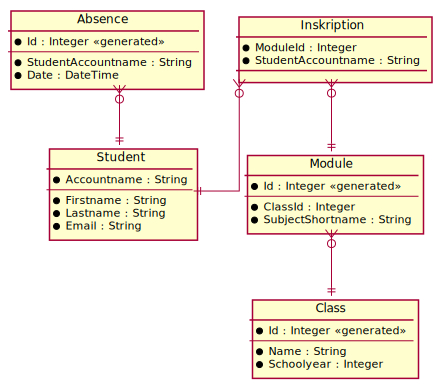

# Presence Manager

Das Unterrichtsministerium hat die Präsenzpflicht gem. Erlass auf
[www.bmbwf.gv.at](https://www.bmbwf.gv.at/Themen/schule/beratung/corona/sichereschule.html)
bis 28. Februar 2022 ausgesetzt. Das bedeutet, dass sich SchülerInnen und Studierende tageweise
vom Präsenzunterricht abmelden können.

## Datenmodell

Unsere Schule möchte diese Abmeldungen elektronisch erfassen. Das folgende ER Modell zeigt
eine mögliche Umsetzung:


<sup>
https://www.plantuml.com/plantuml/uml/bP5BQiCm48RNrIcqDlW29OI4Fi3GTkDUG946MuqqCgFHmZIvU_s8NFVHGhmn_3FytoTf5raH9-z4Qmr8RKax4F5eiLEal7GMWViEP21kWn20RBcNTqx5AD-57BwYCl9MLiZG0CdDfW44KWnckvtcPLdEUo_Amx1PCrbivgZMRGYk1qMV5UAyO6fE1f0pQAzrICYuxbaGDyMZfVXrE8HFwcVsu9LrIp0Mh9ZxGmJKSEtXBgf_AXRtYiTe_BrQ3oCneywXB4-dVDh5v3cOvAuMcPvclNpnIuStq5otWRxP3I8pANjC3Oj5XV58jcCRCAlCwsl6ltUGAQkcZ9gRVflaozW1ckJT1m00
</sup>
### Erklärung des Modelles

Die Tabelle *Class* speichert die Klassen der Schule über mehrere Schuljahre hinweg. Es kann eine
3CAIF im Schuljahr 2020 (= 2020/21) und 2021 (=2021/22) geben. Pro Klasse werden die angebotenen
Module in der Tabelle *Module* eingetragen. So wird z. B. in der 3CAIF im Schuljahr 2021 POS, DBI,
... angeboten. Der Schuljahresbezug ist wichtig, da sich der Lehrplan auch ändern kann.

Die Studierenden sind in der Tabelle *Student* erfasst. Sie können sich für die einzelnen Module
inskribieren (Tabelle *Inskription*). Die Erfassung der Inskriptionen ist deswegen wichtig, um
die Fehlzeiten durch Abmeldungen für eine Statistik ermitteln zu können. 

Meldet sich ein Studierender tageweise vom Präsenzunterricht ab, wird ein entsprechender Eintrag
in die Tabelle *Absence* geschrieben.

### Constraints

Zusätzlich sind folgende - nicht im Modell abgebildete - Constraints sinnvoll:

- Felder mit schwarzen Punkt sind als NOT NULL Felder zu definieren.
- Primärschlüssel und Attribute werden wir üblich durch den Strich getrennt. Dadurch sind
  zusammengesetzte Schlüssel erkennbar.
- Ein Student kann sich pro Modul nur 1x inskribieren.
- Eine Klasse darf im gleichen Schuljahr nur 1x existieren. Eine 3CAIF z. B. darf es aber im Schuljahr
  2021 und 2022 geben.
- Es darf nur eine Abneldung pro Student und Tag eingetragen werden.
- Pro Klasse und Gegenstand darf es nur einen Eintrag in der Modultabelle geben.
- Abwesenheiten dürfen nicht an Sonntagen eingetragen werden.

## Arbeitsauftrag

Kopieren Sie das untenstehende SQL Skript in DBeaver. Schreiben Sie die CREATE TABLE Anweisungen so,
dass die nachfolgenden INSERT Anweisungen funktionieren. Es ist nur der Inhalt der CREATE TABLE
Anweisung zu Implementieren. Der Rest der SQL Datei darf nicht geändert werden.

Für Fremdschlüssel oder Constraints gibt es INSERT Anweisungen, die fehlschlagen müssen. Im Kommentar
ist angegeben, welches Constraint geprüft wird. Bilden Sie dies in Ihrem CREATE TABLE Statement
ab.

Das SQL Skript muss bis zu den Insert Anweisungen, die scheitern sollen, auch mehrmals hintereinander ausführbar sein. Sie können dies testen, indem Sie die entsprechenden Anweisungen markieren und
*Execute SQL Skript (ALT+X)* in DBeaver wählen.

### Abgabe

Schreiben Sie Ihren Namen in das SQL Skript und geben es in Microsoft Teams unkomprimiert
(kein ZIP!) unter dem Namen (Accountname).sql ab, wobei (Accountname) durch Ihren Accountnamen zu
ersetzen ist.

## Bewertung

- **2P** Die INSERT Anweisungen für die Tabelle Class, die erfolgreich ausgeführt werden sollen, funktionieren.
- **2P** Die INSERT Anweisungen für die Tabelle Student, die erfolgreich ausgeführt werden sollen, funktionieren.
- **2P** Die INSERT Anweisungen für die Tabelle Module, die erfolgreich ausgeführt werden sollen, funktionieren.
- **2P** Die INSERT Anweisungen für die Tabelle Inskription, die erfolgreich ausgeführt werden sollen, funktionieren.
- **2P** Die INSERT Anweisungen für die Tabelle Absence, die erfolgreich ausgeführt werden sollen, funktionieren.
- **4P** Die FK Prüfungen liefern wie erwartet einen foreign key constraint Fehler (1P pro INSERT)
- **5P** Die anderen Constraints sind implementiert (1P pro INSERT)

Die Beurteilung wird nach folgendem Schema gegeben:
19 - 18P: Sehr gut, 17 - 16P: Gut, 15 - 13P: Befriedigend, 12 - 10P: Genügend

```sql
-- *************************************************************************************************
-- 2. Prüfung in SQL
-- 3CAIF, 19. Jänner 2022
-- Vor- und Zuname:
-- *************************************************************************************************

PRAGMA foreign_keys = ON;
DROP TABLE IF EXISTS Inskription;
DROP TABLE IF EXISTS Module;
DROP TABLE IF EXISTS Class;
DROP TABLE IF EXISTS Absence;
DROP TABLE IF EXISTS Student;

CREATE TABLE Student(

);

CREATE TABLE Absence(

);

CREATE TABLE Class(

);

CREATE TABLE Module(

);

CREATE TABLE Inskription(

);

-- *************************************************************************************************
-- Testen der Tabellen. Die nachfolgenden Anweisungen müssen funktionieren.
-- *************************************************************************************************

INSERT INTO Class (Id, Name, Schoolyear) VALUES (1, '3CAIF', 2021);
INSERT INTO Class (Id, Name, Schoolyear) VALUES (2, '3CAIF', 2020);

INSERT INTO Student (Accountname, Firstname, Lastname, Email) VALUES ('ACC1001', 'Firstname1', 'Lastname1', 'mail1@spengergasse.at');
INSERT INTO Student (Accountname, Firstname, Lastname, Email) VALUES ('ACC1002', 'Firstname2', 'Lastname2', 'mail2@spengergasse.at');
INSERT INTO Student (Accountname, Firstname, Lastname, Email) VALUES ('ACC1003', 'Firstname3', 'Lastname3', 'mail3@spengergasse.at');

INSERT INTO Module (Id, ClassId, SubjectShortname) VALUES (1, 1, 'POS');
INSERT INTO Module (Id, ClassId, SubjectShortname) VALUES (2, 1, 'DBI');
INSERT INTO Module (Id, ClassId, SubjectShortname) VALUES (3, 2, 'POS');

INSERT INTO Inskription (ModuleId, StudentAccountname) VALUES (1, 'ACC1001');
INSERT INTO Inskription (ModuleId, StudentAccountname) VALUES (2, 'ACC1001');
INSERT INTO Inskription (ModuleId, StudentAccountname) VALUES (3, 'ACC1002');

INSERT INTO Absence (Id, StudentAccountname, Date) VALUES (1, 'ACC1001', DATETIME('2022-01-18'));
INSERT INTO Absence (Id, StudentAccountname, Date) VALUES (2, 'ACC1001', DATETIME('2022-01-19'));
INSERT INTO Absence (Id, StudentAccountname, Date) VALUES (3, 'ACC1002', DATETIME('2022-01-18'));

-- *************************************************************************************************
-- Diese Anweisungen müssen jeweils einen Fehler werfen.
-- *************************************************************************************************

-- FK Prüfungen: Alle der nachfolgenden Anweisungen müssen mit der Meldung
--    "A foreign key constraint failed (FOREIGN KEY constraint failed)" fehlschlagen
-- Den Student ACC1005 gibt es nicht.
INSERT INTO Absence (Id, StudentAccountname, Date) VALUES (10, 'ACC1005', DATETIME('2022-01-18'));
-- Die Klasse 10 gibt es nicht.
INSERT INTO Module (Id, ClassId, SubjectShortname) VALUES (1, 10, 'POS');
-- Den Student ACC1005 gibt es nicht.
INSERT INTO Inskription (ModuleId, StudentAccountname) VALUES (1, 'ACC1005');
-- Das Modul 10 gibt es nicht.
INSERT INTO Inskription (ModuleId, StudentAccountname) VALUES (10, 'ACC1001');

-- Prüfen der Contraints
-- PK constraint failed (Student ist schon im Modul inskribiert)
INSERT INTO Inskription (ModuleId, StudentAccountname) VALUES (1, 'ACC1001');
-- UNIQUE CONSTRAINT failed (gleiche Klasse im selben Schuljahr)
INSERT INTO Class (Id, Name, Schoolyear) VALUES (4, '3CAIF', 2021);
-- UNIQUE CONSTRAINT failed (gleicher Student am selben Tag)
INSERT INTO Absence (Id, StudentAccountname, Date) VALUES (5, 'ACC1001', DATETIME('2022-01-18'));
-- UNIQUE CONSTRAINT failed (gleicher Gegenstand in der selben Klasse als Modul)
INSERT INTO Module (Id, ClassId, SubjectShortname) VALUES (6, 1, 'POS');
-- CONSTRAINT error: Tag ist ein Sonntag. Hinweis: STRFTIME('%w',Date) liefert 0 an einem Sonntag.
INSERT INTO Absence (Id, StudentAccountname, Date) VALUES (7, 'ACC1002', DATETIME('2022-01-23'));
```

