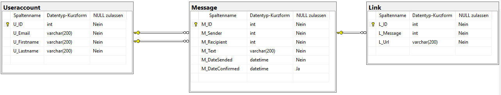

<!-- markdownlint-disable MD045 -->
# Übung: Ein kleiner Chat

Erstellen Sie in DBeaver eine SQLite Datenbank oder legen Sie einen User in Oracle an und verbinden
sich unter diesem User. Bilden Sie das folgende Datenmodell mittels *CREATE TABLE* Statements
ab:



Arbeiten Sie in Oracle, müssen Sie in den INSERT Statements den Datumswert mit der Funktion *TO_DATE()*
samt Formatangabe einfügen. Beispiel:

```sql
-- Version für SQL Server
INSERT INTO Message VALUES (1, 1, 2, 'Message1', '2019-03-13T08:00:00', NULL);
-- Version für Oracle
INSERT INTO Message VALUES (1, 1, 2, 'Message1', TO_DATE('2019-03-13T08:00:00', 'YYYY-MM-DD"T"HH24:MI:SS'), NULL);
```

## Anlegen einer leeren Datenbank in SQL Server

Mit folgendem Befehl die Datenbank *ChatDb* in der Shell des SQL Server Containers angelegt werden:

```bash
/opt/mssql-tools/bin/sqlcmd -U sa -P SqlServer2019 -Q "DROP DATABASE IF EXISTS ChatDb; CREATE DATABASE ChatDb;"

```

## SQL Skript

Zur Überprüfung verwenden Sie die nachfolgende Vorlage des SQL Skriptes. Es sind nach den *CREATE TABLE*
Anweisungen immer *INSERT* Anweisungen vorgegeben, die entweder funktionieren oder abgelehnt werden sollen.
So können Sie die Korrektheit überprüfen.

```sql
-- *************************************************************************************************
-- SQL DDL Übung
-- *************************************************************************************************
DROP TABLE IF EXISTS Link;
DROP TABLE IF EXISTS Message;
DROP TABLE IF EXISTS Useraccount;

-- *************************************************************************************************
-- TABELLE Useraccount
-- *************************************************************************************************
-- 1. U_ID ist der Primärschlüssel.
-- 2. U_Email, U_Firstname und U_Lastname dürfen nicht NULL sein.
-- 3. Die Länge der Mailadresse in U_Email muss mindestens 10 Zeichen lang sein.
--    Verwenden Sie die Funktion LENGTH() in Oracle, um die Länge des Strings zu prüfen.
-- 4. Die Mailadresse darf nicht mehrfach vergeben werden.
CREATE TABLE Useraccount (
    -- FÜGEN SIE HIER IHRE TABELLENDEFINITION EIN.
);

SET IDENTITY_INSERT Useraccount ON;
-- Diese INSERT Statements sollen funktionieren
INSERT INTO Useraccount VALUES (1, 'mail1@spengergasse.at', 'Firstname1', 'Lastname1');
INSERT INTO Useraccount VALUES (2, 'mail2@spengergasse.at', 'Firstname2', 'Lastname2');
INSERT INTO Useraccount VALUES (3, 'mail3@spengergasse.at', 'Firstname3', 'Lastname3');
-- Diese Statements sollen abgelehnt werden
INSERT INTO Useraccount VALUES (1, 'mail4@spengergasse.at', 'Firstname4', 'Lastname4'); -- PK Constraint
INSERT INTO Useraccount VALUES (5, 'mail1@spengergasse.at', 'Firstname5', 'Lastname5'); -- UNIQUE Mail Constraint
INSERT INTO Useraccount VALUES (6, 'to@short', 'Firstname6', 'Lastname6');              -- Mail Length Constraint
INSERT INTO Useraccount VALUES (7, NULL, 'Firstname7', 'Lastname7');                    -- Mail NULL Constraint
INSERT INTO Useraccount VALUES (8, 'mail8@spengergasse.at', NULL, 'Lastname8');         -- Firstname NULL Constraint
INSERT INTO Useraccount VALUES (9, 'mail9@spengergasse.at', 'Firstname9', NULL);        -- Lastname NULL Constraint

-- Korrekte Ausgabe des SELECT Statements (Datumsausgaben können im Format abweichen)
-- U_ID U_Email                 U_Firstname     U_Lastname
-- 1    mail1@spengergasse.at   Firstname1      Lastname1
-- 2    mail2@spengergasse.at   Firstname2      Lastname2
-- 3    mail3@spengergasse.at   Firstname3      Lastname3
SELECT * FROM Useraccount ORDER BY U_ID;

-- *************************************************************************************************
-- TABELLE MESSAGE
-- *************************************************************************************************
-- 1. M_ID ist der Primärschlüssel.
-- 2. M_Sender ist ein Fremdschlüssel für eine Useraccount-ID.
-- 3. M_Recipient ist ein Fremdschlüssel für eine Useraccount-ID.
-- 4. M_Sender, M_Recipient, M_Text, M_DateSended dürfen nicht NULL sein.
-- 5. M_DateConfirmed muss größer als M_DateSendet sein, falls eines eingefügt wird.
-- 6. M_Sender und M_Recipient dürfen nicht gleich sein.
CREATE TABLE Message (
    -- FÜGEN SIE HIER IHRE TABELLENDEFINITION EIN.
);
-- Diese INSERT Statements sollen funktionieren
SET IDENTITY_INSERT Message ON;
INSERT INTO Message VALUES (1, 1, 2, 'Message1', '2019-03-13T08:00:00', NULL);
INSERT INTO Message VALUES (2, 1, 3, 'Message2', '2019-03-13T09:00:00', NULL);
INSERT INTO Message VALUES (3, 2, 3, 'Message3', '2019-03-13T10:00:00'), '2019-03-13T11:00:00';
-- Diese Statements sollen abgelehnt werden
INSERT INTO Message VALUES (1, 1, 2, 'Message4', '2019-03-13T08:00:00', NULL);     -- PK Constraint
INSERT INTO Message VALUES (11, 1, 2, 'Message5', '2019-03-13T08:00:00'), '2019-03-13T07:00:00'; -- Confirmed Constraint
INSERT INTO Message VALUES (12, 1, 1, 'Message6', '2019-03-13T08:00:00', NULL);    -- Recipient Constraint
INSERT INTO Message VALUES (13, NULL, 2, 'Message7', '2019-03-13T08:00:00', NULL); -- Sender NULL Constraint
INSERT INTO Message VALUES (14, 1, NULL, 'Message8', '2019-03-13T08:00:00', NULL); -- Recipient NULL Constraint
INSERT INTO Message VALUES (15, 1, 2, NULL, '2019-03-13T08:00:00', NULL);          -- Message NULL Constraint
INSERT INTO Message VALUES (16, 1, 2, 'Message10', NULL, NULL);                    -- DateSended NULL Constraint
INSERT INTO Message VALUES (17, 1, 10, 'Message11', '2019-03-13T08:00:00', NULL);  -- FK Constraint
INSERT INTO Message VALUES (18, 11, 2, 'Message12', '2019-03-13T08:00:00', NULL);  -- FK Constraint

-- Korrekte Ausgabe des SELECT Statements (Datumsausgaben können im Format abweichen)
-- M_ID M_Sender    M_Recipient M_Text      M_DateSended                M_DateConfirmed
-- 1    1           2           Message1    2019-03-13 08:00:00.000     NULL
-- 2    1           3           Message2    2019-03-13 09:00:00.000     NULL
-- 3    2           3           Message3    2019-03-13 10:00:00.000     2019-03-13 11:00:00.000
SELECT * FROM Message ORDER BY M_ID;

-- *************************************************************************************************
-- TABELLE Link
-- *************************************************************************************************
-- 1. L_ID ist der Primärschlüssel.
-- 2. L_Message ist der Fremdschlüssel für die Message-ID.
-- 3. L_Message, L_Url dürfen nicht NULL sein.
-- 4. Es dürfen keine gleichen Url Werte (L_Url) in einer Message (L_Message) sein.
CREATE TABLE Link (
    -- FÜGEN SIE HIER IHRE TABELLENDEFINITION EIN.
);
-- Diese INSERT Statements sollen funktionieren
SET IDENTITY_INSERT Link ON;
INSERT INTO Link VALUES (1, 1, 'http://www.url.at/file1');
INSERT INTO Link VALUES (2, 2, 'http://www.url.at/file1');
-- Diese Statements sollen abgelehnt werden
INSERT INTO Link VALUES (1, 1, 'http://www.url.at/file2');     -- PK Constraint
INSERT INTO Link VALUES (3, 100, 'http://www.url.at/file3');   -- FK Constraint
INSERT INTO Link VALUES (4, NULL, 'http://www.url.at/file4');  -- Message NULL Constraint
INSERT INTO Link VALUES (5, 1, NULL);                          -- Url NULL Constraint
INSERT INTO Link VALUES (6, 1, 'http://www.url.at/file1');     -- UNIQUE Constraint

-- Korrekte Ausgabe des SELECT Statements (Datumsausgaben können im Format abweichen)
-- L_ID L_Message   L_Url
-- 1    1           http://www.url.at/file1
-- 2    2           http://www.url.at/file1
SELECT * FROM Link ORDER BY L_ID;

```
