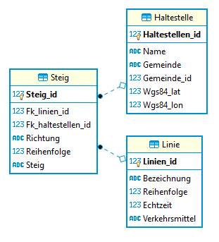

# Haltestellen Datenbank

## Problemstellung

Die Wiener Linien bieten auf
[data.gv.at](https://www.data.gv.at/katalog/dataset/stadt-wien_wienerlinienechtzeitdaten) ein
Verzeichnis aller Linien und Haltestellen an. Ihre Aufgabe ist es, eine Datenbank zu erstellen,
die diese Informationen aufnehmen kann.

Das Datenmodell besteht aus 3 Tabellen:

Erstellen Sie die korrekten CREATE TABLE Anweisungen, die folgende Fälle abdecken:

### Tabelle Linie

- **Linien_id**         Ganzzahliger Wert als Primärschlüssel.
- **Bezeichnung**       Bezeichnung der Linie. Maximal 16 Stellen lang. Darf nicht NULL sein.
- **Reihenfolge**       Ganzzahliger Wert, der für die Sortierung verwendet wird. Darf nicht NULL
                        sein.
- **Echtzeit**          Ganzzahliger Wert (1 oder 0), der angibt, ob Echtzeitdaten verfügbar sind.
                        Darf nicht NULL sein, der Standardwert soll 0 sein wenn nichts angegeben wurde.
- **Verkehrsmittel**    Ein Wert aus der Liste *ptBusCity, ptBusNight, ptBusRegion, ptMetro,
                        ptTrainS, ptTram, ptTramVRT, ptTramWLB*. Darf nicht NULL sein.
- Die Bezeichnung der Linie muss eindeutig sein.
- Es dürfen nur Verkehrsmittel eingefügt werden, dessen Wert aus der oben genannten Liste kommt.
- Die Spalte Echtzeit darf nur 0 oder 1 als Wert aufnehmen.

#### Beispieldaten

|Linien_id|Bezeichnung|Reihenfolge|Echtzeit|Verkehrsmittel|
|---------|-----------|-----------|--------|--------------|
|214433687|U1         |1          |1       |ptMetro       |
|214433717|D          |10         |0       |ptTram        |

### Tabelle Haltestelle

- **Haltestellen_id**   Ganzzahliger Wert als Primärschlüssel.
- **Name**              Name der Haltestelle. Maximal 64 Stellen. Darf nicht NULL sein.
- **Gemeinde**          Name der Gemeinde. Maximal 64 Stellen. Darf nicht NULL sein.
- **Gemeinde_id**       Gemeindekennzahl. Ganzzahliger Wert, der nicht NULL sein darf.
- **Wgs84_lat**         Breitengrad. Maximal 2 Vorkomma- und 13 Nachkommastellen.
- **Wgs84_lon**         Längengrad. Maximal 3 Vorkomma- und 13 Nachkommastellen.
- Die Gemeinde ID muss 5 Stellen aufweisen.
- Bei den Koordinaten müssen entweder beide Werte (also *Lat* und *Lon*) ungleich NULL oder beide
  Werte gleich NULL sein. Eine "Mischung" aus Wert und NULL soll nicht möglich sein.
- Pro Gemeinde ID muss der Haltestellenname eindeutig sein.

#### Beispieldaten

|Haltestellen_id|Name|Gemeinde|Gemeinde_id|Wgs84_lat|Wgs84_lon|
|---------------|----|--------|-----------|---------|---------|
|214666497|Oberlaa|Wien|90001|48.142442551082|16.3999582372354|
|230828919|Neulaa|Wien|90001|48.1457452971493|16.3864835079736|
|230828920|Neulaa|Klosterneuburg|90002|||
|345540619|Absberggasse|Wien|90001|||
|378056605|Hlawkagasse|Wien|90001|48.1791264615246|16.3828722805315|

### Tabelle Steig

- **Steig_id**      Ganzzahliger Wert als Primärschlüssel.
- **Fk_linien_id**  Fremdschlüssel für die Linien ID aus der Tabelle Linie. Darf nicht NULL sein.
- **Fk_haltestellen_id**    Fremdschlüssel für die Haltestellen ID aus der Tabelle Haltestelle.
                            Darf nicht NULL sein.
- **Richtung**      Hin- oder Rückrichtung. Einstelliges Zeichen, entweder *H* oder *R*.
                    Darf nicht NULL sein.
- **Reihenfolge**   Reihenfolge für die Sortierung. Ganzzahliger Wert, darf nicht NULL sein.
- **Steig**         Name des Steiges. Maximal 16 Stellen, darf NULL sein.
- Prüfen Sie, ob die Richtung nur den Wert *H* oder *R* hat.

#### Beispieldaten

|Steig_id|Fk_linien_id|Fk_haltestellen_id|Richtung|Reihenfolge|Steig|
|--------|------------|------------------|--------|-----------|-----|
|231116889|214433687|214666497|H|1|U1-H|
|378112298|214433717|345540619|H|1||

## Durchführen der Arbeit

Erstellen Sie in DBeaver eine leere SQLite Datenbank, indem Sie bei *Browse* eine neue
Datei angeben. 

Schreiben Sie die CREATE TABLE Anweisungen in den vorgegebenen Bereich der SQL Datei
[wiener_linien_angabe.sql](wiener_linien_angabe.sql).

Die Anweisungen im unteren Teil dienen zur Kontrolle ihrer Arbeit. Hinweis: In DBeaver können Sie mehrere
Anweisungen markieren und mit *ALT + X* oder *Execute SQL Script* nur diese Anweisungen ausführen.

Die Anweisung *PRAGMA foreign_keys = ON;* muss nur in SQLite ausgeführt werden, damit die Prüfung
des Fremdschlüssels aktiviert wird. Fehler können Sie mit *Ignore* ignorieren, damit das Skript
weiter ausgeführt wird.
