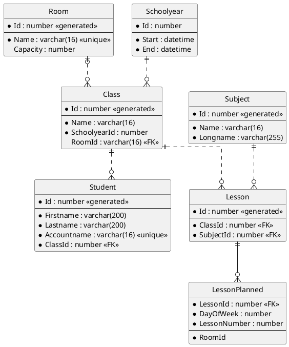

# Modellierungstools

## PlantUML und VS Code als Modellierungswerkzeug

Im Gegensatz zu relationalen Datenbanken, wo ER Diagramme als datenbankenunabhängiges Modellierungstool
verwendet werden können, gibt es für NoSQL keine einheitliche "Modellierungssprache". Da aber
schlussendlich der Datenbestand mittels Modelklassen in Java oder C# verwaltet wird (bzw. werden kann)
können Klassendiagramme verwendet werden. Solche Diagramme könenn wie folgt erzeugt werden:

1. Prüfe, ob Java installiert und im PATH eingetragen ist. Der Befehl *java -version* muss erkannt werden.
1. Installiere [Visual Studio Code](https://code.visualstudio.com). Achtung: Aktiviere beim Setup
   die Option "In den Explorer integrieren", damit Sie im Kontextmenü VS Code starten können.
1. Installiere die folgenden Extensions:
   - Markdown PDF
   - Markdown Preview Enhanced
   - PlantUML
1. Öffne die VS Code Konfiguration (*F1* - "*settings*" eingeben - "*Preferences: Open Settings (JSON)*" wählen)
   und füge folgende Zeilen hinzu:

```javascript
    "markdown-pdf.plantumlOpenMarker": "```plantuml\n",
    "markdown-pdf.plantumlCloseMarker": "```"   
```

Nun steht durch die Extension *Markdown Preview Enhanced* ein Icon bereit, welches eine Vorschau mit
dem gerenderten Diagramm bietet:


### Demo Markdownfile mit PlantUML

Kopieren Sie den folgenden Code in die Datei *demo.md*. Es sollte ein ER Diagramm gerendert werden:
````
# Ein kleines Diagramm

Mit der Extension *Markdown Preview Enhanced* können Sie PlantUML Diagramme in Markdown
Dateien einbetten. Die Voransicht sollte nun an dieser Stelle ein kleines ER Diagramm rendern. Es
gelten folgende Regeln:

- Erforderliche Felder (NOT NULL) werden mit einem Stern (\*) gekennzeichnet.
- Primärschlüssel werden im oberen Teil angegeben. Danach kommen 3 Striche.
  Darunter die restlichen Attribute.
- Generierte Werte (wie autoincrement Werte) werden mit \<\<generated\>\> gekennzeichnet.
- Beziehungen kommen in mehreren Arten vor:
  - `||..o{` definiert eine nicht identifizierende 1 : n Beziehung. Der FK ist also ein Attribut.
  - `|o..o{` definiert eine (0, 1) : n Beziehung. Der Fremdschlüssel ist also auf der n Seite
    optional.
  -  `||--0{` definiert eine identifizierende 1 : n Beziehung. Der FK ist also Teil des Primärschlüssels.
- Fremdschlüssel werden mit \<\<FK\>\> gekennzeichnet.


````

Die Syntax ist auf https://plantuml.com/de/ie-diagram nachzulesen.

## Installation von erwin Data Modeler
erwin Data Modeler ist eine Software, mit der Datenmodelle erstellt und in eine beliebige Zieldatenbank übertragen werden kann. In der Academic Edition gelten folgende Limitierungen <a href="https://support.erwin.com/hc/en-us/articles/115001820927-What-is-erwin-Data-Modeler-Academic-Edition-What-are-the-limitations-and-usages-" target="_blank">[1]</a>

* Diagramming is limited to 25 entities
* The license is limited to one year
* Single user only
* APIs and other advanced functionality is disabled

So kommen Sie zu Ihrer Version:

1. Auf <a href="https://www.erwin.com/register/129709/" target="_blank">[www.erwin.com]</a> können Sie eine Academic Licence beantragen. Verwenden Sie dafür folgende Daten:
    - Ihren Namen
    - Ihre Schul-Mailadresse (endet auf *@spengergasse.at*), diese wird akzeptiert.
    - Den Schulnamen *HTL Spengergasse*
    - Den Namen Ihres DBI Lehrers 
    - Den Kursnamen *Data Modelling*

1. Nach dem Absenden der Daten erhalten Sie eine Email mit weiteren Schritten. Die Lizenz ist an Ihre MAC Adresse gebunden, deswegen warten Sie bitte auf dieses Mail.

1. In der Mail von *erwin info* klicken Sie auf den Punkt *Licencing* und füllen das Formular mit den Informationen, die in der Mail stehen, aus. Als Telefonnummer können Sie natürlich die Schulnummer (+43154615) angeben. Die Macadresse können Sie in der Konsole mit `ipconfig /all` unter dem Eintrag *Physische Adresse* herausfinden, markieren und mit Enter in die Zwischenablage kopieren. Wenn Sie eine Virtualisierungssoftware installiert haben, achten Sie darauf, dass Sie keinen virtuellen Adapter (sie haben alle *Virtual Ethernet Adapter* im Namen) auswählen.

1. Während Sie auf die weitere Mail mit dem Lizenzcode warten, können Sie schon einmal über den Downloadlink in der ersten Mail (*Download erwin Data Modeler*) die Installationsdateien herunterladen.

1. Die Installation kann mit den Standardwerden erfolgen. Ein Neustart ist nicht notwendig. Unter *C:\programme\erwin\Data Modeler r9* kann die Datei *erwin.exe* gestartet werden, falls noch kein Eintrag im Startmenü vorhanden ist.

1. In der weiteren Mail von *erwin support* erhalten Sie den Licence Key. Kopieren Sie diesen in das Startfenster von Erwin. Dort müssen Sie auch noch einmal Ihre Schul Mailadresse angeben.