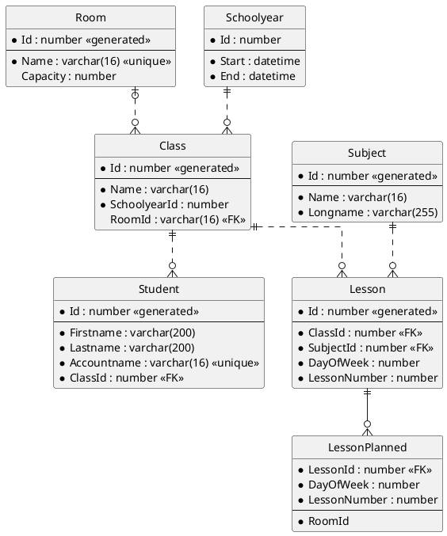

# Ein kleines Diagramm

Mit der Extension *Markdown Preview Enhanced* können Sie PlantUML Diagramme in Markdown
Dateien einbetten. Die Voransicht sollte nun an dieser Stelle ein kleines ER Diagramm rendern. Es
gelten folgende Regeln:

- Erforderliche Felder (NOT NULL) werden mit einem Stern (\*) gekennzeichnet.
- Primärschlüssel werden im oberen Teil angegeben. Danach kommen 3 Striche.
  Darunter die restlichen Attribute.
- Generierte Werte (wie autoincrement Werte) werden mit \<\<generated\>\> gekennzeichnet.
- Beziehungen kommen in mehreren Arten vor:
  - `||..o{` definiert eine nicht identifizierende 1 : n Beziehung. Der FK ist also ein Attribut.
  - `|o..o{` definiert eine (0, 1) : n Beziehung. Der Fremdschlüssel ist also auf der n Seite
    optional.
  -  `||--0{` definiert eine identifizierende 1 : n Beziehung. Der FK ist also Teil des Primärschlüssels.
- Fremdschlüssel werden mit \<\<FK\>\> gekennzeichnet.

