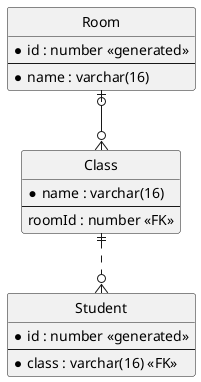

# Ein kleines Diagramm

```plantuml
@startuml
' hide the spot
hide circle

' avoid problems with angled crows feet
skinparam linetype ortho

entity Room {
    *id : number <<generated>>
    ---
    *name : varchar(16)
}

entity Class {
    *name : varchar(16)
    ---
    roomId : number <<FK>>
}
Room |o--o{ Class

entity Student {
    *id : number <<generated>>
    ---
    *class : varchar(16) <<FK>>
}

Class ||..o{ Student

@enduml

```