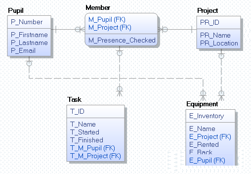

# INSERT INTO Anweisungen

Insert Anweisungen können in 3 Arten vorkommen:

**Art 1:** Fügt die angegebenen Werte in die Tabelle *Project* ein. Die Spalten, die befüllt werden 
sollen, sind angegeben.

```sql
INSERT INTO Project (PR_Name, PR_Location) VALUES ('BWM Stand', 'C3.07');
INSERT INTO Project (PR_Name) VALUES ('Führungen');
```

**Art 2:** Wenn alle Spalten in der Reihenfolge ihrer Definition in *CREATE TABLE* befüllt werden sollen,
so kann auf die Angabe der Spalten verzichtet werden. Es müssen Werte für alle Spalten angegeben werden.
Dabei ist allerdings folgendes zu Beachten, da das INSERT Statement sonst nicht mehr funktioniert:

- Die Reihenfolge der Spalten kann sich ändern (beim Ändern der Tabelle).
- Es können Spalten hinzugefügt oder entfernt werden.
- Wird *NULL* für Spalten angegeben, die nullable sind, wird nicht der Defaultwert eingetragen.
- Wird ein Wert für Autoincrement Spalten angegeben, kann dies zu einem Fehler führen.

```sql
INSERT INTO Pupil VALUES (1, 'Firstname1', 'Lastname1', 'testmail@spengergasse.at');
```

**Art 3:** Möchte man Werte, die aus einem SELECT gewonnen werden, einfügen, ist dies ebenfalls möglich.
Es gelten hier die selben Regeln wie beim INSERT ohne Spaltenangebe. Es ist auch möglich, beim
INSERT die Spalten anzugeben.

```sql
INSERT INTO Table
SELECT Col1, Col2, ...
FROM ...
```

Folgendes Script zeigt die Möglichkeiten unter den entsprechenden CREATE TABLE Statements. Diese
Beispiele verwenden SQLite. Möchte man ab Oracle 12c Spalten mit einem Autowert anlegen, kann dies
mit folgender Definition erledigt werden.

```sql
CREATE TABLE Project (
    PR_ID       NUMBER GENERATED ALWAYS AS IDENTITY,
    PR_Name     VARCHAR2(100) NOT NULL,
    PR_Location VARCHAR2(10),
);
```

## Beispiele in der Infotage Datenbank

Unter den entsprechenden *CREATE TABLE* Statements kommen die verschiedenen Varianten der *INSERT*
Anweisungen vor.



```sql
-- Nur SQLite: Fremdschlüssel prüfen.
PRAGMA foreign_keys = ON;

-- SQL Script für DBeaver und SQLite. Die Anpassungen für Oracle sind in den Kommentaren.
DROP TABLE IF EXISTS Task;          -- Oracle: DROP TABLE Task
DROP TABLE IF EXISTS Equipment;
DROP TABLE IF EXISTS Member;
DROP TABLE IF EXISTS Project;
DROP TABLE IF EXISTS Pupil;

CREATE TABLE Pupil (
    P_Number    INTEGER PRIMARY KEY,
    P_Firstname VARCHAR(200) NOT NULL,
    P_Lastname  VARCHAR(200) NOT NULL,
    P_Email     VARCHAR(100),
    UNIQUE (P_Email),
    CHECK (LENGTH(P_Email) > 20 AND P_Email LIKE '%@spengergasse.at')
);

-- INSERT ohne Angabe der Spalten, das bedeutet dass ALLE Spalten mit der entsprechenden Reihenfolge 
-- angegeben werden. Beachte, dass die Email 20 Stellen lang sein muss.
INSERT INTO Pupil VALUES (10, 'Firstname10', 'Lastname10', 'testmail10@spengergasse.at');
INSERT INTO Pupil VALUES (11, 'Firstname11', 'Lastname11', 'testmail11@spengergasse.at');
INSERT INTO Pupil VALUES (12, 'Firstname12', 'Lastname12', 'testmail12@spengergasse.at');

-- *************************************************************************************************
CREATE TABLE Project (
    PR_ID       INTEGER PRIMARY KEY AUTOINCREMENT,  -- Oracle 12c: PR_ID NUMBER GENERATED ALWAYS AS IDENTITY,
    PR_Name     VARCHAR(100) NOT NULL,
    PR_Location VARCHAR(10)  DEFAULT 'Unknown',
    UNIQUE (PR_Name, PR_Location)
);

-- INSERT mit Spaltenauswahl. Da PR_ID ein Autowert ist, wird dieser nicht eingefügt.
-- Beim ersten Beispiel wird Unknown als Defaultwert eingefügt, beim 2. Beispiel wird NULL eingetragen.
INSERT INTO Project (PR_Name) VALUES ('Führungen');
INSERT INTO Project (PR_Name, PR_Location) VALUES ('Bilderkennung', NULL);
INSERT INTO Project (PR_Name, PR_Location) VALUES ('BWM Stand', 'C3.07');

-- *************************************************************************************************
CREATE TABLE Member (
    M_Pupil            INTEGER,
    M_Project          INTEGER,
    M_Presence_Checked DATETIME,
    PRIMARY KEY (M_Pupil, M_Project),
    FOREIGN KEY (M_Pupil)   REFERENCES Pupil(P_Number),
    FOREIGN KEY (M_Project) REFERENCES Project(PR_ID) 
);

-- Füge 3 zufällige Zuordnungen zwischen Projekt und Pupil ein. Dafür erzeugen wir mit dem CROSS
-- JOIN alle möglichen Kombinationen aus Pupil und Project. Nur diese können aus als Fremdschlüssel
-- eingetragen werden. Das Sortieren nach einer Zufallszahl und Begrenzen auf 3 Werte nimmt drei
-- zufällige Einträge.
INSERT INTO Member
SELECT P_Number, PR_ID, NULL
FROM Pupil CROSS JOIN Project
ORDER BY RANDOM()
LIMIT 3;                        -- Oracle 12c: FETCH FIRST 3 ROWS ONLY;

-- *************************************************************************************************
CREATE TABLE Task (
    T_ID        INTEGER PRIMARY KEY AUTOINCREMENT,  -- Oracle 12c: T_ID NUMBER GENERATED ALWAYS AS IDENTITY,
    T_Name      VARCHAR(200) NOT NULL,
    T_Started   DATETIME,
    T_Finished  DATETIME,
    T_M_Pupil   INTEGER,
    T_M_Project INTEGER,
    FOREIGN KEY (T_M_Pupil, T_M_Project) REFERENCES Member(M_Pupil, M_Project),
    CHECK(T_Finished IS NULL OR T_Finished > T_Started)
);

-- Wenn Spalten NULL enthalten dürfen, sollte das auch in den Musterdaten enthalten sein. Dafür
-- generieren wir mit ABS(RANDOM() % 100) eine Zufallszahl zwischen 0 und 99. Ist diese kleiner
-- als 10 (das sind 10% der Fälle), schreiben wir NULL.
INSERT INTO Task (T_Name, T_Started, T_Finished, T_M_Pupil, T_M_Project)
SELECT  'Vorbereitung',  
        '2019-12-11', 
        -- Wenn Zufallszahl < 10 dann NULL, sonst '2019-12-13'
        CASE WHEN ABS(RANDOM() % 100) < 10
            THEN NULL
            ELSE '2019-12-13'      -- Oracle: TO_DATE('2019-12-13', 'YYYY-MM-DD')
        END AS Finished,
        M_Pupil,
        M_Project
FROM Member;

-- Nochmals, damit wir auch einen 2. Eintrag pro Projekt haben.
INSERT INTO Task (T_Name, T_Started, T_Finished, T_M_Pupil, T_M_Project)
SELECT  'Equipment Test',  
        '2019-12-11', 
        -- Wenn Zufallszahl < 10 dann NULL, sonst '2019-12-13'
        CASE WHEN ABS(RANDOM() % 100) < 10
            THEN NULL
            ELSE '2019-12-13'      -- Oracle: TO_DATE('2019-12-13', 'YYYY-MM-DD')
        END AS Finished,
        M_Pupil,
        M_Project
FROM Member;

-- *************************************************************************************************
CREATE TABLE Equipment (
    E_Inventory VARCHAR(16)  PRIMARY KEY,
    E_Name      VARCHAR(200) NOT NULL,
    E_Project   INTEGER,
    E_Rented    DATETIME,
    E_Back      DATETIME,
    E_Pupil     INTEGER     REFERENCES Pupil(P_Number),
    FOREIGN KEY (E_Project) REFERENCES Project(PR_ID),
    CHECK(E_Back IS NULL OR E_Back > E_Rented)
);
```

## Übung

Fügen Sie 10 Schüler in die Tabelle *Pupil* ein.

Schüler sollen nun Equipment ausborgen. Dafür erstellen Sie 6 Datensätze in der Tabelle *Equipment*
mit folgenden Regeln:

- Die Inventarnummer (*E_Inventory*) ist *ABS(RANDOM())*, damit ein zufälliger Primärschlüssel generiert wird.
  *E_Name* soll immer 'XXX' sein.
- Das Feld *E_Rented* soll in 50 % der Fälle leer sein, ansonsten hat es den Datumswert 2019-12-01.
  *E_Back* ist immer NULL.
- Um Musterdaten zu bekommen führen Sie dafür einen *CROSS JOIN* zwischen *Pupil* und *Project* durch.
  Danach wählen Sie 6 Datensätze zufällig aus und fügen die oben erwähnten Werte hinzu.
