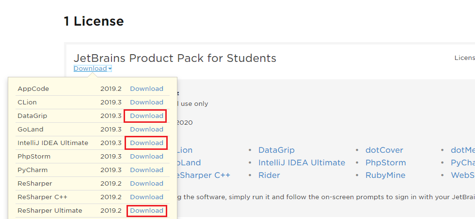

# JetBrains DataGrib

Aus https://intranet.spengergasse.at/news/jetbrains-produkte-in-den-laboren-und-auf-den-laptops-von-studierenden-und-lehrkraeften/:
> In enger Zusammenarbeit mit dem ZID (herzlichen Dank hierfür) ist es uns gelungen den von der
> Firma JetBrains zur Verfügung gestellten Lizenzserver für unsere Labor-Rechner aufzusetzen.
>
> Wir haben nun die Möglichkeit bis zu 300 Laborrechner nicht nur mit IntelliJ sondern vielmehr mit
> sämtlichen Produkten des Herstellers auszustatten. An den aktualisierten Images wird seitens des
> ZID gearbeitet.
>
> Selbstverständlich können sowohl Studierende als auch Lehrkräfte eine individuelle Lizenz über alle
> Produkte für den persönlichen Laptop auf der [JetBrains Registrierungsseite](https://www.jetbrains.com/student/) 
> mit einer @spengergasse.at eMail beantragen. Diese Lizenz läuft wie immer ein Jahr und kann solange man eine @spengergasse.at
> eMail Adresse hat, verlängert werden.

Nach der Registrierung können die beliebtesten Produkte von https://account.jetbrains.com/licenses/assets
geladen werden:

## Zugriff auf Access

VOn https://stackoverflow.com/questions/36820072/how-do-i-connect-a-ms-access-database-to-jetbrains-datagrip:
For Future readers this is still very doable (I'm on DataGrip version 208.1.4):

Get [UcanAccess](http://ucanaccess.sourceforge.net/)

1. Download and extract UcanAccess somewhere: pathToUcanAccess
2. In Datagrip goto add new connection: "Driver And Data source"
   - this will create a connection "Database Driver -" and a Driver "Database Driver"
3. Edit the newly created Driver "Database Driver":
   1. Under Additional Files add:
      - <pathToUcanAccess>\ucanaccess-4.0.4.jar
      - <pathToUcanAccess>\lib\commons-lang-2.6.jar
      - <pathToUcanAccess>\lib\commons-logging-1.1.3.jar
      - <pathToUcanAccess>\lib\hsqldb.jar
      - <pathToUcanAccess>\lib\jackcess-2.1.11.jar
   2. For Dialect select "SQL Driver"
   3. Hit Apply (this should load the classes from the added files)
   4. Under the class combo you should now see net.ucanaccess.jdbc.UcanaccessDriver, select it and hit apply again.
   5. Under Url templates add a new template, for name enter "default" for template enter `jdbc:ucanaccess://{file::identifier.sqlite};newdatabaseversion=V2010`
   6. Hit apply.
4. Now edit the database connection "Database Driver -":
   1. Next to the text box for url, in the drop down select default (or what ever you named the template in step 3.5)
      - A file select field should replace the previously visible "user" and "password" fields
   2. In the file selector, select your mdb
      - the url field should now look like `jdbc:ucanaccess://C:/data/MDBs/myMdbFile.mdb;newdatabaseversion=V2010`
   3. Hit apply and then ok.
   
You should see your Connection popup in the list, double-click to connect, expand it down the tree `("Public \ <unnamed> \ tables")` and you should see your tables.
