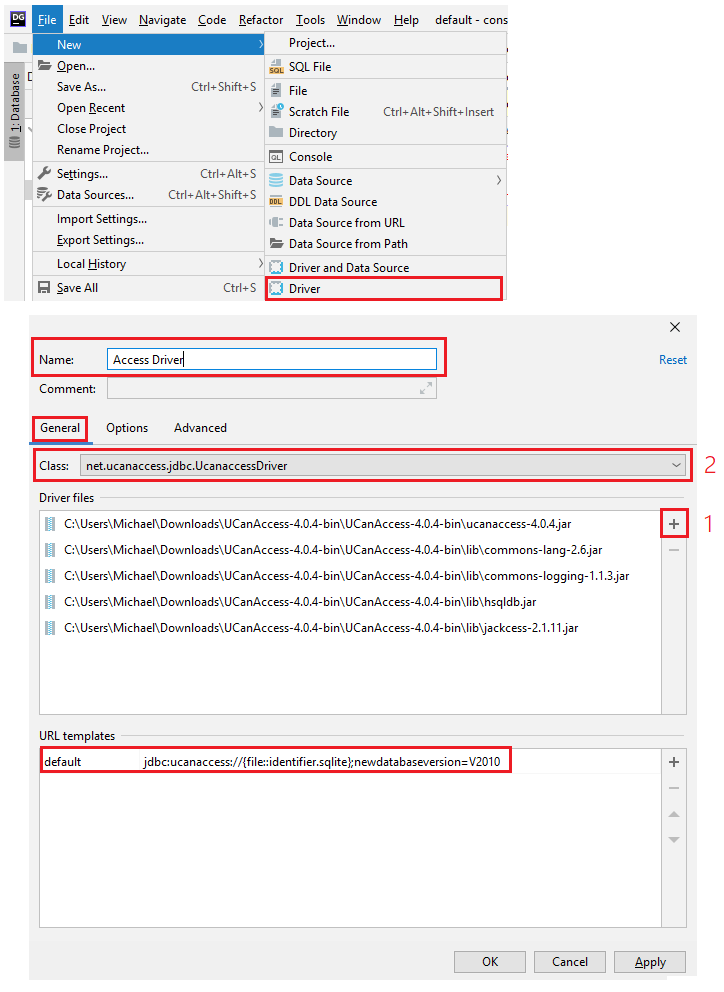
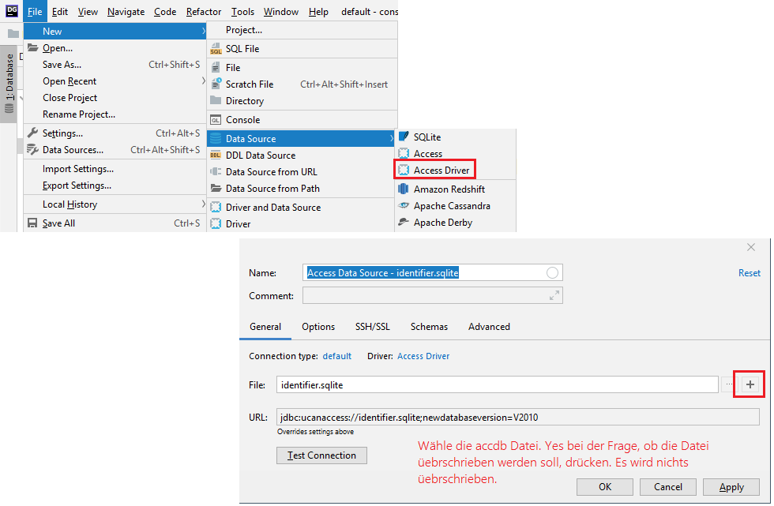

# JetBrains DataGrib

Aus https://intranet.spengergasse.at/news/jetbrains-produkte-in-den-laboren-und-auf-den-laptops-von-studierenden-und-lehrkraeften/:
> In enger Zusammenarbeit mit dem ZID (herzlichen Dank hierfür) ist es uns gelungen den von der
> Firma JetBrains zur Verfügung gestellten Lizenzserver für unsere Labor-Rechner aufzusetzen.
>
> Wir haben nun die Möglichkeit bis zu 300 Laborrechner nicht nur mit IntelliJ sondern vielmehr mit
> sämtlichen Produkten des Herstellers auszustatten. An den aktualisierten Images wird seitens des
> ZID gearbeitet.
>
> Selbstverständlich können sowohl Studierende als auch Lehrkräfte eine individuelle Lizenz über alle
> Produkte für den persönlichen Laptop auf der [JetBrains Registrierungsseite](https://www.jetbrains.com/student/) 
> mit einer @spengergasse.at eMail beantragen. Diese Lizenz läuft wie immer ein Jahr und kann solange man eine @spengergasse.at
> eMail Adresse hat, verlängert werden.

Nach der Registrierung können die beliebtesten Produkte von https://account.jetbrains.com/licenses/assets
geladen werden:

## Zugriff auf Access

Für Access muss der Treiber [UcanAccess](http://ucanaccess.sourceforge.net/) heruntergeladen werden.
Danach erfolgt die Konfiguration in DataGrib:

1. Wähle *File* - *New* - *Driver* und lade die folgenden Dateien:
   - <pathToUcanAccess>\ucanaccess-4.0.4.jar
   - <pathToUcanAccess>\lib\commons-lang-2.6.jar
   - <pathToUcanAccess>\lib\commons-logging-1.1.3.jar
   - <pathToUcanAccess>\lib\hsqldb.jar
   - <pathToUcanAccess>\lib\jackcess-2.1.11.jar
2. Erstelle ein URL Template mit dem Namen default und dem Wert `jdbc:ucanaccess://{file::identifier.sqlite};newdatabaseversion=V2010`
3. Wähle `net.ucanaccess.jdbc.UcanaccessDriver` als Class
4. Speichere den Treiber unter Access Driver (oder einem anderen Namen).

Für den Zugriff wird der Treiber nun verwendet:

Da die Autocompletition immer Anführungszeichen um die Tabellen- und Spaltennamen setzt, muss es dem
Ausführen des Statements mit *CTRL+R* entfernt werden (ersetze " durch nichts)