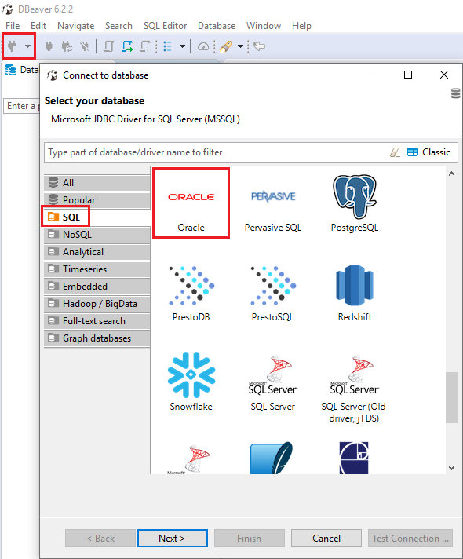
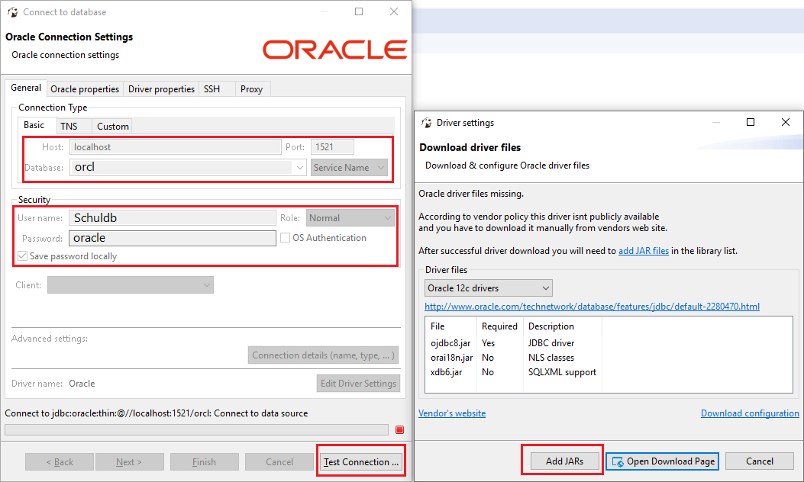
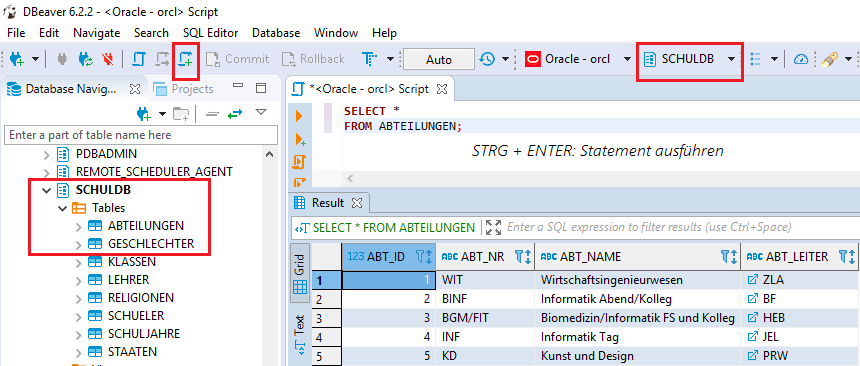
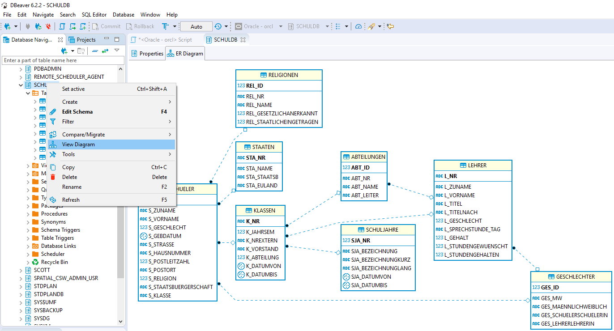

# Arbeiten mit DBeaver Community
Als SQL Editor kann auch DBeaver verwendet werden. Er kann sich über die JDBC Treiberarchitektur
zu verschiedenen Datenbanken - darunter auch Oracle - verbinden. Das Programm kann auf der [DBeaver Downloadseite](https://dbeaver.io/download/)
heruntergeladen werden.

## Verbinden zur Oracle Datenbank in der VM
Durch den Button *New Database Connection* kann der Verbindungsdialog geöffnet werden. In diesem Dialog
muss Oracle als Datenbanksystem ausgewählt werden:

Zum Verbinden müssen wie in SQL Developer die Verbindungsdaten eingegeben werden:
- Hostname: *localhost*
- Database: *orcl* (Service Name)
- Username: *SchulDb* (oder *System*, falls noch kein User existiert)
- Passwort: *oracle*

Da Oracle den JDBC Treiber nicht ohne Login zum Download anbietet, muss er nach dem Klicken auf Test
Connection mittels Add JARs geladen werden. Die Dafür benötigte Datei *ojdbc7.jar* ist in diesem Ordner
im Repository enthalten.

## Zugriff auf das Schema
DBeaver listet alle Schemata der Datenbank auf. Um SQL Abfragen im Schema *SchulDB*
auszuführen, muss ein SQL Editor geöffnet werden. Am Schnellsten geht das mit *STRG* + *ENTER*, es gibt
auch einen Button in der Symbolleiste. Achten Sie darauf, dass das richtige Schema in der Symbolleiste
als Ziel der Abfrage ausgewählt ist. Sonst bekommen Sie den Fehler *table or view does not exist*.

EInzelne Abfragen werden mit *STRG* + *ENTER* ausgeführt. Möchten Sie das ganze SQL Skript ausführen, so
klicken Sie auf *Execute Script* oder drücken *ALT* + *X*.

## Diagramme erzeugen
Ein nettes Feature ist das automatische Erzeugen von ER Diagrammen von einem Schema aus. Dies erreicht
man im Kontextmenü des Schemas in der Navigation:

## Zugriff auf Access Datenbanken
Sie können auch eine neue Verbindung zu einer Access Datenbank herstellen. Dabei wird beim erstmaligen
Verbinden der JDBC Treiber geladen. 