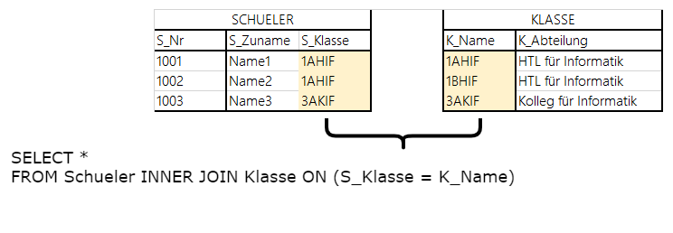
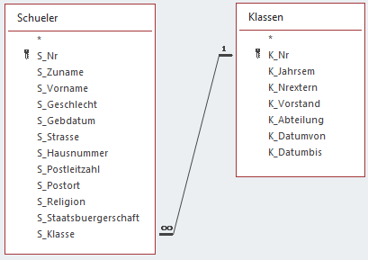
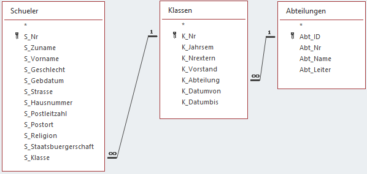
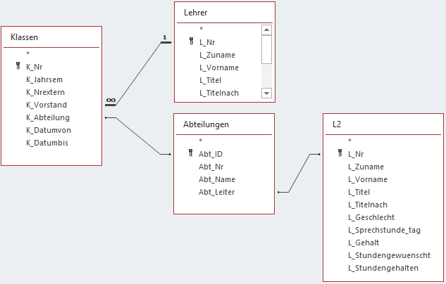

# INNER JOIN in SQL



Ausgehend vom Dump der Schuldatenbank (https://raw.githubusercontent.com/schletz/Dbi1Sem/master/03_OracleSQL/schuldb.sql)
werden folgende Beispiele zum Thema WHERE in SQL Developer gelöst.

## Liste alle Schüler mit Klasse und Abteilung der Abteilung 2



```sql
SELECT s.S_Nr, s.S_ZUNAME, s.S_VORNAME, k.K_NR, k.K_ABTEILUNG
FROM Schueler s INNER JOIN Klassen k ON (s.S_Klasse = k.K_Nr)
WHERE K_Abteilung = 2;
```

## Liste alle Schüler mit Klasse und Abteilungsname


```sql
SELECT s.S_Nr, s.S_ZUNAME, s.S_VORNAME, k.K_NR, a.ABT_NAME
FROM Schueler s INNER JOIN Klassen k ON (s.S_Klasse = k.K_Nr)
                INNER JOIN Abteilungen a ON (k.K_ABTEILUNG = a.ABT_ID)
```

## Liste alle Klassen mit KV und AV auf.
Besonderheit: Lehrer wird 2x verwendet, deshalb verwenden wir l für den KV und l2 für den AV.



```sql
SELECT k.K_NR, l.L_ZUNAME AS KVZuname, l.L_VORNAME AS KVVorname,
               l2.L_ZUNAME AS AVZuname, l2.L_VORNAME AS AVVorname
FROM Klassen k INNER JOIN Lehrer l ON (k.K_VORSTAND = l.L_NR)
               INNER JOIN Abteilungen a ON (k.K_ABTEILUNG = a.ABT_ID)
               INNER JOIN Lehrer l2 ON (a.ABT_LEITER = l2.L_NR);
```

## Liste alle Klassen und ihren KV. 

Eine Klasse ohne JV (NULL) fällt gänzlich raus, da der Gleichheitsausdruck im Join für NULL nie wahr liefert.
```sql
SELECT k.K_NR, l.L_Zuname, l.L_Vorname
FROM Klassen k INNER JOIN Lehrer l ON (k.K_VORSTAND = l.L_NR);
```

## Übung
Schreiben Sie die Übung des Punktes "Abfragen aus mehreren Tabellen (INNER JOIN, basierend auf schuldb1_ablecture3.accdb)"
unter https://github.com/schletz/Dbi1Sem/tree/master/01_Access/Access_Uebungen#3-abfragen-aus-mehreren-tabellen-inner-join-basierend-auf-schuldb1_ablecture3accdb als SQL Anweisungen in
SQL Developer.

