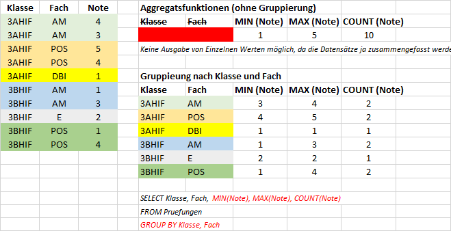

# GROUP BY



Auf Basis der Datenbank [https://github.com/schletz/Dbi1Sem/blob/master/01_Access/Access_Uebungen/schnee.accdb](Schnee.accdb) 
werden folgende Abfragen durchgeführt.

Liefert alle Schigebiete des Bundeslandes Kärnten, dessen maximal gemessene Schneehöhe über 300 cm ist.
*WHERE* filtert vor der Gruppierung, *HAVING* danach.
```sql

SELECT m.`M_Skigebiet`, s.`S_Name`, MAX(sm.`Sm_schnee`) AS MaxSchnee
FROM `Schneemessung` sm INNER JOIN `Messstellen` m ON (sm.`Sm_Messstelle` = m.`M_Id`)
                        INNER JOIN `skigebiete` s ON (m.`M_Skigebiet` = s.S_ID)
WHERE s.`S_Bundesland` = 'Ktn'
GROUP BY m.`M_Skigebiet`, s.`S_Name`
HAVING MAX(sm.`Sm_schnee`) > 300
ORDER BY MAX(sm.`Sm_schnee`) DESC;
```

COUNT(*) liefert die Anzahl der Datensätze pro Gruppe, während *COUNT(Spalte)* die Anzahl der
Datensätze liefert, wo *Spalte* ungleich null ist. Diese Abfrage liefert die Bundesländer, die
Skigebiete ohne eingetragene Tourismusregion haben.
```sql
SELECT s.`S_Bundesland`, COUNT(*), COUNT(s.`Tourismusregion`),
	COUNT(*) - COUNT(s.`Tourismusregion`)  AS RegionIsNull
FROM `skigebiete` s
GROUP BY s.`S_Bundesland`
HAVING COUNT(*) - COUNT(s.`Tourismusregion`) > 0;
```

In *GROUP BY* können auch SQL Funktionen wie YEAR() verwendet werden:
```sql
SELECT YEAR(s.`Sm_DatumZeit`), AVG(s.`Sm_schnee`)
FROM `Schneemessung` s
GROUP BY YEAR(s.`Sm_DatumZeit`);
```

## Übung: Lösen Sie die Aufgaben bis auf Beispiel (5) auf 
https://github.com/schletz/Dbi1Sem/tree/master/01_Access/Access_Uebungen#5-abfragen-mit-gruppierungen-group-by-basierend-auf-schuldb1_ablecture3accdb