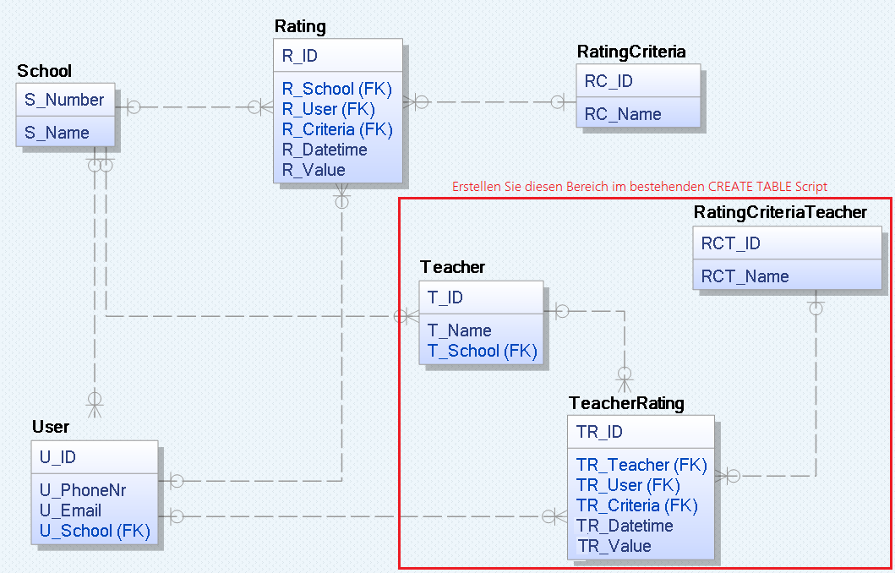

# Übung 1: Kleines Datenmodell für die Lernsieg App

In der neuen (und nicht mehr existierenden) App Lernsieg konnten User Schulen und Lehrer anhand von
verschiedenen Kriterien bewerten.

Ein Datenmodell, welches diese Anforderungen (minimal) abdeckt, könnte so aussehen:



## CREATE TABLE Statements

```sql
-- Für SQLite aktivieren wir den Foreigen Key Check. Je nach Datenbankeditor wird die Datenbank
-- eventuell ohne diese Einstellung angelegt.
PRAGMA foreign_keys = ON;

-- SQL Script für DBeaver und SQLite

-- Umgekehrte Reihenfolge wie bei CREATE TABLE!
-- In ORACLE ist 
-- DROP TABLE School CASCADE CONSTRAINTS;
-- möglich, um Tabellen trotz Fremdschlüsselreferenzen zu löschen.
DROP TABLE Rating;
DROP TABLE User;
DROP TABLE RatingCriteria;
DROP TABLE School;


CREATE TABLE School (
--  SPALTENNAME  DATENTYP     CONSTRAINT/S
	S_Number     INTEGER      PRIMARY KEY,
	S_Name       VARCHAR(100) NOT NULL
);

CREATE TABLE RatingCriteria (
	RC_ID        INTEGER      PRIMARY KEY AUTOINCREMENT,   -- PK mit Autowert
	RC_Name      VARCHAR(100) NOT NULL UNIQUE              -- Der Name darf nicht mehrmals vorkommen.
);

CREATE TABLE User (
	U_ID        INTEGER     PRIMARY KEY AUTOINCREMENT,
	U_PhoneNr   VARCHAR(20) NOT NULL UNIQUE,
	U_Email     VARCHAR(100),
	U_School    INTEGER     NOT NULL,                -- U_School ist ein FK, daher auch ein INTEGER!
	-- U_School zum FK machen. References verweist auf die "1er Seite"
	-- FOREIGN KEY (FK Columns) REFERENCES PKTable(PK Columns)
	FOREIGN KEY (U_School) REFERENCES School(S_Number)
);

CREATE TABLE Rating (
	R_ID       INTEGER  PRIMARY KEY AUTOINCREMENT,
	R_School   INTEGER  NOT NULL,
	R_User     INTEGER  NOT NULL,
	R_Criteria INTEGER  NOT NULL, 
	R_Datetime DATETIME NOT NULL,
	R_Value    INTEGER  NOT NULL,
	FOREIGN KEY (R_School)   REFERENCES School(S_Number),
	FOREIGN KEY (R_User)     REFERENCES User(U_ID),
	FOREIGN KEY (R_Criteria) REFERENCES RatingCriteria(RC_ID)
);
```

## Übung
1. Vervollständigen Sie dieses CREATE TABLE Skript, sodass auch die rot umrandeten Tabellen im Modell
   erstellt werden.
2. Erstellen Sie eine SQLite oder ORACLE Datenbank mit Ihrem CREATE TABLE Skript.
3. Schreiben Sie folgende SELECT Statements für dieses Modell:
   1. Geben Sie pro Schule die durchschnittlichen Werte jedes Ratingkriteriums aus.
   1. Geben Sie pro Lehrer die durchschnittlichen Werte jedes Ratingkriteriums aus.
   1. Geben Sie pro Schule die durchschnittlichen Werte jedes Ratingkriteriums aus, allerdings nur
      wenn mehr als 3 Ratings eingetragen wurden.
   1. Geben Sie die Anzahl der 5 Sterne Bewertungen (*R_Value* ist 5) pro Schule und Kriterium aus.