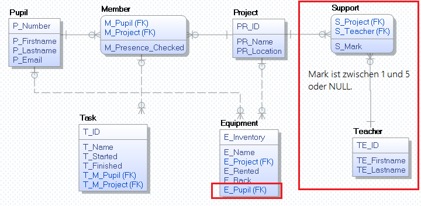

# Übung 2: Infotage



## CREATE TABLE Statements

```sql
-- Für SQLite aktivieren wir den Foreigen Key Check. Je nach Datenbankeditor wird die Datenbank
-- eventuell ohne diese Einstellung angelegt.
PRAGMA foreign_keys = ON;

-- SQL Script für DBeaver und SQLite
DROP TABLE IF EXISTS Task;
DROP TABLE IF EXISTS Equipment;
DROP TABLE IF EXISTS Member;
DROP TABLE IF EXISTS Project;
DROP TABLE IF EXISTS Pupil;

CREATE TABLE Pupil (
	P_Number    INTEGER PRIMARY KEY,
	P_Firstname VARCHAR(200) NOT NULL,
	P_Lastname  VARCHAR(200) NOT NULL,
	P_Email     VARCHAR(100),
	UNIQUE (P_Email),
	CHECK (LENGTH(P_Email) > 20 AND P_Email LIKE '%@spengergasse.at')
);

CREATE TABLE Project (
	PR_ID       INTEGER PRIMARY KEY AUTOINCREMENT,
	PR_Name     VARCHAR(100) NOT NULL,
	PR_Location VARCHAR(10),
	UNIQUE (PR_Name, PR_Location)
);

CREATE TABLE Member (
	M_Pupil            INTEGER,
	M_Project          INTEGER,
	M_Presence_Checked DATETIME,
	PRIMARY KEY (M_Pupil, M_Project),
	FOREIGN KEY (M_Pupil)   REFERENCES Pupil(P_Number),
	FOREIGN KEY (M_Project) REFERENCES Project(PR_ID) 
);

CREATE TABLE Task (
	T_ID        INTEGER PRIMARY KEY AUTOINCREMENT,
	T_Name      VARCHAR(200) NOT NULL,
	T_Started   DATETIME,
	T_Finished  DATETIME,
	T_M_Pupil   INTEGER,
	T_M_Project INTEGER,
	FOREIGN KEY (T_M_Pupil, T_M_Project) REFERENCES Member(M_Pupil, M_Project),
	CHECK(T_Finished IS NULL OR T_Finished > T_Started)
);

CREATE TABLE Equipment (
	E_Inventory VARCHAR(16)  PRIMARY KEY,
	E_Name      VARCHAR(200) NOT NULL,
	E_Project   INTEGER,
	E_Rented    DATETIME,
	E_Back      DATETIME,
	FOREIGN KEY (E_Project) REFERENCES Project(PR_ID),
	CHECK(E_Back IS NULL OR E_Back > E_Rented)
);
```

## Übung
1. Vervollständigen Sie dieses CREATE TABLE Skript, sodass auch die rot umrandeten Tabellen im Modell
   erstellt werden.
2. Erstellen Sie eine SQLite oder ORACLE Datenbank mit Ihrem CREATE TABLE Skript.
