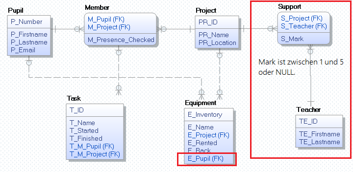

# INSERT INTO Anweisungen



```sql
PRAGMA foreign_keys = ON;

-- SQL Script für DBeaver und SQLite
DROP TABLE IF EXISTS Task;
DROP TABLE IF EXISTS Equipment;
DROP TABLE IF EXISTS Member;
DROP TABLE IF EXISTS Project;
DROP TABLE IF EXISTS Pupil;

CREATE TABLE Pupil (
	P_Number    INTEGER PRIMARY KEY,
	P_Firstname VARCHAR(200) NOT NULL,
	P_Lastname  VARCHAR(200) NOT NULL,
	P_Email     VARCHAR(100),
	UNIQUE (P_Email),
	CHECK (LENGTH(P_Email) > 20 AND P_Email LIKE '%@spengergasse.at')
);

-- INSERT ohne Angabe der Spalten, das bedeutet dass ALLE Spalten mit der entsprechenden Reihenfolge angegeben werden.
INSERT INTO Pupil VALUES (1, 'Firstname1', 'Lastname1', 'testmail@spengergasse.at');
INSERT INTO Pupil VALUES (10, 'Firstname10', 'Lastname10', 'testmail2@spengergasse.at');
INSERT INTO Pupil VALUES (13, 'Firstname13', 'Lastname13', 'testmail3@spengergasse.at');

CREATE TABLE Project (
	PR_ID       INTEGER PRIMARY KEY AUTOINCREMENT,
	PR_Name     VARCHAR(100) NOT NULL,
	PR_Location VARCHAR(10),
	UNIQUE (PR_Name, PR_Location)
);

INSERT INTO Project (PR_Name) VALUES ('Führungen');
INSERT INTO Project (PR_Name, PR_Location) VALUES ('BWM Stand', 'C3.07');

CREATE TABLE Member (
	M_Pupil            INTEGER,
	M_Project          INTEGER,
	M_Presence_Checked DATETIME,
	PRIMARY KEY (M_Pupil, M_Project),
	FOREIGN KEY (M_Pupil)   REFERENCES Pupil(P_Number),
	FOREIGN KEY (M_Project) REFERENCES Project(PR_ID) 
);

-- Füge 3 zufällige Zuordnungen zwischen Projekt und Pupil ein.
INSERT INTO Member
SELECT P_Number, PR_ID, NULL
FROM Pupil CROSS JOIN Project
ORDER BY RANDOM()
LIMIT 3;


CREATE TABLE Task (
	T_ID        INTEGER PRIMARY KEY AUTOINCREMENT,
	T_Name      VARCHAR(200) NOT NULL,
	T_Started   DATETIME,
	T_Finished  DATETIME,
	T_M_Pupil   INTEGER,
	T_M_Project INTEGER,
	FOREIGN KEY (T_M_Pupil, T_M_Project) REFERENCES Member(M_Pupil, M_Project),
	CHECK(T_Finished IS NULL OR T_Finished > T_Started)
);

INSERT INTO Task (T_Name, T_Started, T_Finished, T_M_Pupil, T_M_Project)
SELECT	'Vorbereitung',  
		'2019-12-11', 
		-- Wenn Zufallszahl < 10 dann NULL, sonst Zeit
		CASE WHEN ABS(RANDOM() % 100) < 10
			THEN NULL
			ELSE '2019-12-13'
		END AS Finished,
		M_Pupil, 
		M_Project 
FROM Member;

INSERT INTO Task (T_Name, T_Started, T_Finished, T_M_Pupil, T_M_Project)
SELECT	'Equipment Test',  
		'2019-12-11', 
		-- Wenn Zufallszahl < 10 dann NULL, sonst Zeit
		CASE WHEN ABS(RANDOM() % 100) < 10
			THEN NULL
			ELSE '2019-12-13'
		END AS Finished,
		M_Pupil, 
		M_Project 
FROM Member;

CREATE TABLE Equipment (
	E_Inventory VARCHAR(16)  PRIMARY KEY,
	E_Name      VARCHAR(200) NOT NULL,
	E_Project   INTEGER,
	E_Rented    DATETIME,
	E_Back      DATETIME,
	E_Pupil     INTEGER     REFERENCES Pupil(P_Number),
	FOREIGN KEY (E_Project) REFERENCES Project(PR_ID),
	CHECK(E_Back IS NULL OR E_Back > E_Rented)
);
```

## Übung
Fügen Sie 10 Schüler in Pupil ein.
Schüler sollen Equipment ausborgen. Die Inventarnummer ist ABS(RANDOM()).
E_Name soll immer 'XXX' sein.
Führen Sie dafür einen CROSS JOIN zwischen Pupil und Project durch und fügen 
Sie 6 Datensätze ein.
Das Feld E_Rented soll in 50 % der Fälle leer sein, ansonsten hat es den
Wert 2019-12-01. E_Back ist immer NULL.


