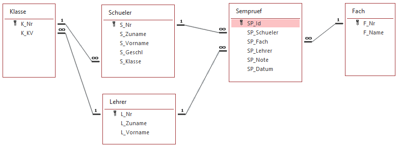

# Update und Delete

Die folgende Beispiele sind von https://www.w3schools.com/sql/sql_update.asp bzw.
https://www.w3schools.com/sql/sql_delete.asp entnommen.

## UPDATE Syntax

```sql
UPDATE table_name
SET column1 = value1, column2 = value2, ...
WHERE condition;
```

### Beispiel

```sql
UPDATE Customers
SET ContactName = 'Alfred Schmidt', City= 'Frankfurt'
WHERE CustomerID = 1;
```

## DELETE Syntax

```sql
DELETE FROM table_name WHERE condition;
```

### Beispiel

```sql
DELETE FROM Customers WHERE CustomerName = 'Alfreds Futterkiste';
```

## Übung zu DML (INSERT, UPDATE und DELETE)

In diesem Ordner gibt es eine SQLite Datenbank [Sempruef.db](Sempruef.db). Sie hat folgendes
Modell:



Alle auf *Id* endenden Spalten sind AUTOINCREMENT Werte, für Nr Spalten sind selbst Werte
einzufügen.

Bilden Sie die folgenden Geschäftsfälle ab. Prüfen Sie die Richtigkeit, indem Sie die Tabellen
mit einem SELECT am Ende ausgeben.

1. Legen Sie in der Tabelle *Fach* ein neues Fach *DBI* mit dem Fachnamen *Datenbanken* an.
2. Legen Sie in der Tabelle Lehrer einen neuen Lehrer *SZ* (Michael Schletz) an.
3. Legen Sie alle Semesterprüfungen, die noch nicht oder mit 5 beurteilt sind, mit Datum 24. Feb
   2020 ohne Note aber mit den selben Daten (Fach, Prüfer, Schüler) erneut an.
4. Aktualisieren Sie alle Schüler ohne Geschlecht auf den Wert *m*.
5. Verschlechtern Sie alle Semesterprüfungen von BAK um 1 Notengrad (also + 1). Beachten Sie,
   dass es keine Noten größer als 5 geben kann. Verwenden Sie deshalb Min() zur Lösung dieses
   Problemes.
6. Löschen Sie die Klasse 3BHIF samt aller Daten aus dem System. Beachten Sie das Datenmodell.
   Gibt es eine Reihenfolge, in der Sie vorgehen müssen?
7. Der Lehrer *MEA* hat ein anderes Kürzel bekommen: *MEA2*. Versuchen Sie, den Primärschlüssel zu
   ändern. Was passiert? Wie können Sie alle Daten von *MEA* korrekt *MEA2* zuordnen?
8. Fügen Sie in der Tabelle Schueler eine Spalte *Email* mit einem geeigneten Datentyp ein. Lesen
   Sie hierfür auf https://www.w3schools.com/sql/sql_alter.asp den Punkt *ALTER TABLE - ADD Column*
   durch. Die Grundsyntax dieses Befehles ist

   

   Danach aktualisieren Sie die Spalte Email mit dem Wert *S_Zuname@spengergasse.at*, wobei für
   *S_Zuname* der Spaltenwert zu verwenden ist. Überlegen Sie, wie sie die Mailadresse als NOT NULL
   definieren könnten.
