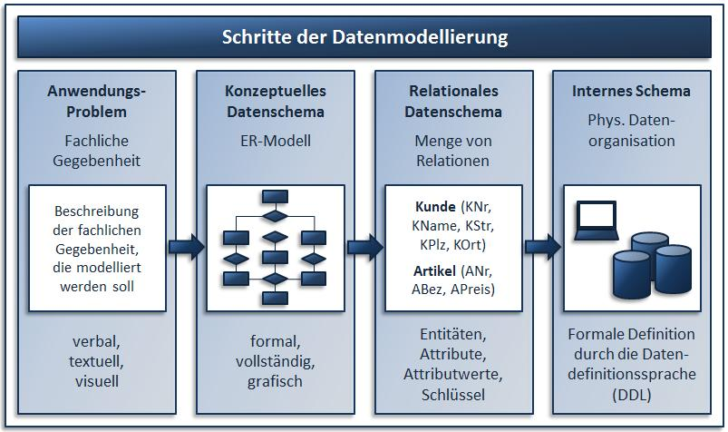
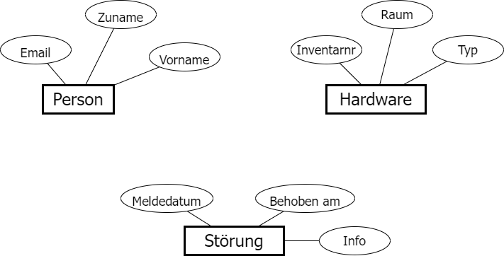

# Einstieg in die Datenmodellierung: Das ER Diagramm

Literatur: Datenmodellierung und Datenbanksysteme, https://docplayer.org/53344071-Datenmodellierung-und-datenbanksysteme.html

Die meiste Zeit verbringt jede/r von uns mit dem Suchen nach Daten. Sei es die Suche nach einem
Problem auf Stack Overflow, das Nachsehen in WebUntis oder das Suchen einer E-Mail mit einem
bestimmten Inhalt.

Als Einstieg denken wir uns das Postfach des ZID, wo Störungen gemeldet werden können. Die Störungen
werden per Mail gemeldet. Eine typische Woche könnte so aussehen:

> *Prof. Eifrig schrieb am 4.4.2022 14:32:*
> Der Beamer in C4.10 ist leider wieder kaputt. Ich wollte gerade eine Präsentation zeigen, aber das
> konnte ich nicht machen.

> *Prof. Schlau schrieb am 6.4.2022 12:22:*
> Ein PC im Labor B3.08 startet nicht.

> *Prof. Schlau schrieb am 6.4.2022 13:12:*
> Der Kopierer schreibt, dass er einen Servicetechniker braucht.

> *Prof. Mild schrieb am 7.4.2022 11:12:*
> Seit gestern flackert das Bild am Beamer in C3.07 wenn ich mich über HDMI anschließe.
> Antwort des ZID am 8.4.2022 7:43:
> Das Problem wurde gelöst, wir haben das Kabel getauscht.

## Unstrukturierte vs. strukturierte Daten

Die Mails stellen unstrukturierte Daten dar. Wir können nicht mit einer Abfrage herausfinden, welche
Störungen im C-Gebäude gemeldet wurden. Die Information liegt im Fließtext für Menschen lesbar
vor, aber es braucht einen Menschen um sie auswerten zu können. Außerdem sind unnötige Informationen
(*...ich wollte eine Präsentation zeigen*) enthalten. Dafür sind wiederum wichtige Informationen nicht
enthalten (*Welcher Kopierer ist kaputt?*).

Um effizient arbeiten zu können, müssen wir also zuerst erheben welche Informationen für ein
effizientes Meldesystem für Störungen notwendig sind. Dafür gibt es standardisierte Entwurfsprozesse.

Quelle: Schwickert: Datenmodellierung und Datenbanksysteme, S 11

## Entity Relationship Modeling als Entwurfsmuster

Bereits in den 1970er Jahren mit dem Aufkommen der ersten Großrechnersysteme wurde sich überlegt,
wie Information strukturiert werden kann. Dafür wurden einige Begriffe definiert:

| **Begriff**      |  **Erklärung**     |
| -------------    | ----- |
| **Entity**       | Ein Exemplar von Dingen, Personen oder Begriffen aus der realen Welt. Vergleichbar mit der *Instanz* einer Klasse. Zudem muss dieses Exemplar *identifizierbar* sein. Später wird dies der Datensatz in der Datenbank sein. |
| **Atribute**     | Eigenschaften, die ein Entity besitzt. Vergleichbar mit den *Membervariablen* einer Klasse. Später werden dies die Spalten der Tabelle werden. |
| **Entity Set**   | Alle Entities gleicher Eigenschaften werden zu einem Entity Set zusammengefasst. Dies ist vergleichbar mit der *Klassendefinition* in Programmieren. Später wird dies die Tabelle in der Datenbank sein. |

Wir erkennen aus den Mails mehrere Exemplare aus der realen Welt:
- Die Person, die die Störung meldet.
- Das Gerät, welches Defekt ist.
- Die Störung.

### Grafische Darstellung: Die Chen Notation

Eine Möglichkeit, die Entity Sets mit ihren Attributen darzustellen, ist die sog. Chen Notation.
Die Entity Sets werden als Rechteck gezeichnet, in den Ellipsen befinden sich die Attribute. Auf
Basis der Mails können wir die Information wie folgt strukturieren:

Wir diskutieren folgende Fragestellungen:
- Warum ist die Info bei der Störung und nicht bei der Hardware? Was würde passieren, wenn sie
  an die Hardware gebunden ist? Wie viele Infos pro Gerät kann es daher geben?
- Warum ist die Person kein Attribut bei Störung? Denke an ein Klassendiagramm in der OOP Programmierung.
- Welchen Wert kann das Attribut *Behoben am* haben?

## Übung

Verwende die Seite https://app.diagrams.net/, um ein ER Modell nach der Chen Notation für folgenden
Auftrag eines Kunden zu erstellen:

> Ich betreibe ein Studentenheim und vermiete mehrere Zimmer. Dafür müssen sich die Studenten mit
> Name, Matrikelnummer, Geburtsdatum und Adresse registrieren. Im Büro weise ich dann für den Studenten
> ein Zimmer zu. Dabei schreibe ich das Von- und Bisdatum der Vermietung auf eine Liste. Die Zimmer
> haben 3 Kategorien (Single, Double, Appartment). Der Preis pro Monat sind vom Zimmer abhängig.

