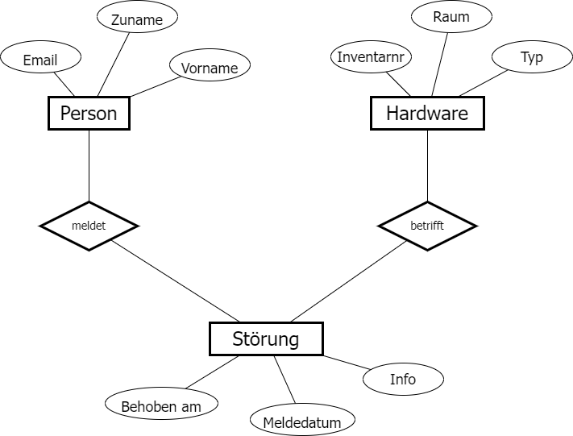

# Das erste logische ER Model mit PlantUML

Im vorigen Kapitel haben wir in einem Grafikprogramm mit der sogenannten Chen Notation
3 Entity Sets samt Attributen gezeichnet. Dies sah so aus:



Diese Darstellung benötigt jedoch viel Platz. Wir wollen in Zukunft daher eine kompaktere
Darstellung verwenden. Konkret handelt es sich um die
[Crow’s Foot Notation](https://vertabelo.com/blog/crow-s-foot-notation/#:~:text=In%20crow's%20foot%20notation%3A,represented%20by%20an%20empty%20circle.)
zur Darstellung von Entity Sets und ihren Beziehungen.

Natürlich können auch diese Diagramme mit einem Grafikprogramm gezeichnet werden. Wir verwenden
allerdings PlantUML. Dieses Tool hat mehrere Vorteile:

- Die Quelldatei ist textbasierend und kann daher in Repositories, etc. verwaltet werden.
- Die Darstellung wird automatisch gerendert.
- Eine Änderung des Modelles ist sehr schnell möglich. Das ist gerade in der Konzeptphase wichtig.
- PlantUML bietet auch die Darstellung für UseCase Diagramme, Klassendiagramme, etc. an.

Um das erste ER Model mit PlantUML zu erstellen, gehe dabei so vor:
- Erstelle im Explorer eine neue Datei ticket_system.puml mit dem Kontextmenü und 
  *Neu* - *Textdatei*. Achte darauf, dass in Windows die Erweiterung stets angezeigt wird
  [Anleitung](https://www.howtogeek.com/205086/beginner-how-to-make-windows-show-file-extensions/)
- Öffne die Datei mit Visual Studio Code.
- Füge den unten angezeigten Code ein.
- Drücke *Alt + D*, um die Vorschau anzuzeigen.

```
@startuml
hide circle

entity Person {
    *Email
    ---
    *Firstname
    *Lastname
}

@enduml
```

## Syntaktische Elemente eines Entity Sets in PlantUML

- Ein PlantUML Diagramm beginnt immer mit `@startuml` und endet mit `@enduml`.
- Da ein ER Model eine Erweiterung des Klassendiagrammes ist, wollen wir die üblichen Kreise mit "E"
  nicht anzeigen. Deswegen verstecken wir sie mit `hide circle`.
- Ein Entity Set wird mit `entity` und dem Namen definiert.
- Attribute werden einfach in das Entity Set geschrieben.
- Mit 3 Strichen trennen wir identifizierende Attribute (den Schlüssel) vom Rest.
- Mit einem Stern `*` kennzeichnen wir notwendige Attribute (mandatory). Sie dürfen in der Datenbank
  nicht NULL sein.


## Was bedeutet logisch?

In der Überschrift ist von *logischen ER Modellen* die Rede. In der Datenmodellierung müssen wir
zuerst - unabhängig von der verwendeten Datenbank - verschiedene Sachverhalte identifizieren:

- Welche Entity Sets gibt es?
- Welche Attribute besitzen dies und was sind identifizierende Attribute?
- Wie stehen die Entity Sets in Beziehung?

Für diese Punkte müssen wir noch nicht wissen, ob wir SQL Server, MySQL oder eine Filedatenbank
wie SQLite als Datenspeicher verwenden. Der nächste Schritt - nach der logischen Modellierung -
ist die *physische Abbildung* für ein konkretes Datenbanksystem. Im Endeffekt wird das Modell durch
*CREATE TABLE* Anweisungen umgesetzt. Dafür brauchen wir weitere Informationen, die im
*physischen Modell* oder *Schema* erfasst werden:

- Konkrete Datentypen (diese sind abhängig von der Datenbank)
- Primary Keys; sie sind nicht immer ident mit identifizierenden Attributen. Bei Keys spielen auch
  Performanceüberlegungen mit.
- Abbildung von Konzepten wie n:m Beziehungen, Generalisierung, ... die nicht direkt in der
  Datenbank so gespeichert werden können.

### Logisch und physisch: Eine unscharfe Trennung

ER Modelle werden üblicherweise von Personen entworfen, die mit Datenbanken arbeiten und daher ihre
Möglichkeiten kennen. Daher werden oft in der Modellierungsphase schon Konzepte einer Relationalen
Datenbank wie Fremdschlüssel, Datentypen, Constraints, aufgelöste n:m Beziehungen, etc. berücksichtigt.

Das "reine" logische ER Model kann durch die Chen Notation wie zu Beginn gezeigt erzeugt werden.
Es ist im universitären Bereich verbreitet.
Wir werden beim Erstellen von logischen ER Modellen auch schon physische Überlegungen einfließen 
lassen. Dies betrifft die Wahl eines effizienten Schlüssels und das Abbilden von Beziehungen
mittels Fremdschlüssel.

Die wichtigste Regel für jede Konzeptionsphase: Die verwendete Darstellung muss vom ganzen
Entwicklerteam verstanden und konsistent verwendet werden.

## Übung

Erstelle für das oben gezeigte Chen Diagramm die Entity Sets mit PlantUML. Verwende dafür die
Namen *Person*, *Ticket* (für Störung) und *Hardawre*. Gehe dabei so vor:
1. Erstelle mit VS Code eine neue Datei mit dem Namen *ticketsystem.puml*. Aktiviere mit
   *Alt + D* die live Vorschau.
2. Erstelle die Entity Sets. Überlege dir auch sinnvolle zusätzliche Attribute und welche
   Attribute NULL sein dürfen.
3. Überlege dir Schlüsselattribute. Falls sich kein Schlüssel findet, verwende das Attribut *Id*.
   Wer schon mit Datenbanken gearbeitet hat, kann auch
   die Fremdschlüssel schon einsetzen. Dies ist noch nicht erforderlich, dies wird im nächsten
   Kapitel diskutiert.
