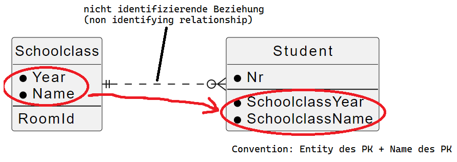

# Schlüsselattribute

Bis jetzt haben wir Schlüsselattribute in unseren ER Modellen intuitiv gesetzt. Nun wollen wir
die genauen Eigenschaften von Schlüssel diskutieren.

## Eigenschaften von Schlüsselattributen

> Schlüsselattribute müssen eindeutig sein und müssen immer einen Wert haben (dürfen nicht NULL)
> sein.

Dies erscheint einmal logisch. Die Eindeutigkeit ist aber nicht immer so einfach zu bestimmen.
Beispiel: Es sollen Klassen gespeichert werden (3AHIF, 4BHIF, 5CHIF, ...). Auf den ersten Blick
sind diese Klassenbezeichnungen eindeutig. Betrachten wir aber folgende Fragestellungen:

- Unsere Datenbank läuft über mehrere Schuljahre.
- Wir wollen auch andere Schulen mit unserer Datenbank verwalten.

Eindeutigkeit muss also über den *im Modell definierten Scope* gegeben sein. Es ist durchaus
legitim zu argumentieren, dass nur ein Schuljahr verwaltet werden soll wenn dies der Auftraggeber
wünscht.

## Empfohlene Eigenschaften von Schlüsselattributen

Darüber hinaus sollten Schlüsselattribute noch weitere Eigenschaften besitzen:

> Ein Schlüsselattribut sollte unveränderlich (immutable) sein.
> Ein Schlüsselattribut sollte kurz sein, damit die Werte performant verglichen werden können.

Gerade der erste Punkt wird in der Modellierung oft vergessen. So wird z. B. die E-Mail Adresse
oder das Lehrerkürzel als Schlüsselattribut verwendet. Eine E-Mail Adresse kann sich jedoch ändern
(in jedem Webshop sollte man auch eine neue Mail angeben können). Das Lehrerkürzel erscheint zwar
unveränderlich, es ist jedoch vom Nachnamen abgeleitet. Da bei einer Heirat sich der Name ändern kann,
wird sich dann auch das Kürzel ändern.

Warum ist die *Kürze* des Schlüssels wichtig? Eine E-Mail Adresse kann durchaus über 20 Zeichen
lang sein. In einer Datenbank wird der Schlüssel für Vergleiche bei einer JOIN Operation verwendet.
Strings zu vergleichen ist - im Gegensatz zu int Werten - sehr aufwändig, da jedes Zeichen
verglichen werden muss. Zudem sind Effekte wie case sensitive / case insensitive noch zu
berücksichtigen.

## Logische und physische Schlüssel

Wie eingangs erwähnt trennen wir *logische* und *physische* Modellierung. In der *logischen*
Modellierung müssen wir nur die verpflichtenden Eigenschaften (Eindeutigkeit, nicht NULL)
berücksichtigen. So kann z. B. das Lehrerkürzel durchaus im Modell als Schlüsselattribut dienen.

Legen wir dann aber das physische Modell in Form von CREATE TABLE Anweisungen an, werden wir auch
die empfohlenen Eigenschaften berücksichtigen. In der Regel werden wir im Falle des Lehrerkürzels
einen Auto-increment Wert als physischen Schlüssel wählen und den Wert des Kürzels mit einem
sogenannten *UNIQUE constraint* definieren. Dadurch bleibt die Datenqualität erhalten und es
existieren nicht 2 gleiche Kürzel zur selben Zeit in der Lehrertabelle.

## Mehrteilige Schlüssel

Im Beispiel mit den Schulklassen haben wir die Frage gestellt, ob wir auch mehrere Schuljahre
verwalten können. Wir können mit einem sogenannten *zusammengesetztem Schlüssel* das Entityset
*Klasse* so definieren:

Schoolyear und Name bilden nun einen zusammengesetzten Schlüssel. Die Eindeutigkeit ist dabei so
definiert, dass zwar einzelne Teile mehrmals vorkommen dürfen (4AHIF im Jahr 2021, 4AHIF im Jahr 2022),
der ganze Schlüsselwert (das *Tupel*) muss aber eindeutig sein (4AHIF im Jahr 2021 darf nur 1x vorkommen).

Auch hier ergibt sich ein Unterschied zwischen der *logischen* und *physischen* Sichtweise. Schlüssel
sollten kurz sein. Bei mehrteiligen Schlüssel nimmt die Komplexität der Vergleichsoperation noch zu.
Daher werden wir im physischen Modell nur mit *einteiligen* Schlüsseln arbeiten. Wir können dann
auch über mehrere Spalten ein *UNIQUE* constraint in SQL legen.

> Hinweis: Bei einem mehrteiligem Schlüssel muss jeder Teil ungleich NULL sein. Ein Schlüssel mit dem
> Wert 4AHIF und NULL für das Schuljahr ist also ungültig.

## Fremdschlüssel und Schlüsselattribute

### Die nicht identifizierende Beziehung

Wie bereits im Kapitel [Beziehungen und Schlüssel](30_RelationsAndKeys.md) erwähnt, wird der
Primärschlüssel bei einer 1:n Beziehung zum *Fremdschlüssel*. Bei einem Primärschlüssel, der aus
mehreren Teilen besteht, werden einfach alle Teile als Fremdschlüssel verwendet:

Wir bezeichnen diese Beziehung auch als *nicht identifizierende Beziehung*, da der Fremdschlüssel
ein normales Attribut ist und nicht Teil des Schlüssels von Student.

In PlantUML wird die nicht identifizierende Beziehung mit Punkten abgebildet. Es wird in diesem
Beispiel also `||...o{` für die Definition der Beziehung zwischen Schoolclass und Student verwendet.

```plantuml
@startuml
hide circle
left to right direction

entity Schoolclass {
   * Year
   * Name
   ---
   RoomId
}

entity Student {
   * Nr
   ---
   * SchoolclassYear
   * SchoolclassName
}

Schoolclass ||...o{ Student
@enduml
 ```

### Die identifizierende Beziehung

Es gibt auch identifizierende Beziehungen. In diesem Beispiel wird eine Prüfung (ein Exam) gespeichert.
Bei einer Prüfung prüft ein Lehrer einen Studierenden. Das Fach und andere Daten wurden zur Vereinfachung
der Grafik weggelassen.

![](relation_identifying_0902.png)

Wir erkennen, dass die Schülernummer (*Nr* in *Student*) zum Teil des *Primärschlüssels* von *Exam*
wird. Das Lehrerkürzel (*Shortname* in *Teacher*) wird ebenso zum Teil des Schlüssels von *Exam*.

```plantuml
@startuml
hide circle
left to right direction
entity Schoolclass {
   * Year
   * Name
   ---
   RoomId
}

entity Student {
   * Nr
   ---
   * SchoolclassYear <<FK>>
   * SchoolclassName <<FK>>
}

entity Teacher {
    * Shortname
   ---
   * Firstname
   * Lastname
}

entity Exam {
   * StudentNr <<FK>>
   * TeacherShortname <<FK>>
   ---
   * Date
   Grade
}
Student ||---o{ Exam
Teacher ||---o{ Exam
Schoolclass ||...o{ Student
@enduml
```

## Übung: Prüfungsverwaltung

Nach dem letzten Modell (Teacher, Student und Exam) darf ein Studierender von einem Lehrer genau
1x geprüft werden. Überlege dir weitere Tabellen für eine sinnvollere Verwaltung von Prüfungen.
Denke an die Wiederholungsprüfungen: 

- Eine Wiederholungsprüfung kann aus mehreren Teilen bestehen. Ein Exam hat also mehrere *Parts*.
  Dieser Teil kann schriftlich, praktisch oder mündlich sein. Grund: In Programmieren gibt es z. B.
  am Vormittal die praktische Prüfung und am Nachmittag die mündliche Prüfung.
- Im Protokoll ist auch das Geburtsdatum des Schülers anzuführen. Dieses Attribut muss also auch
  gespeichert werden.
- Es gibt auf das gesamte Exam 2 Noten: Eine Prüfungsnote und die neue Zeugnisnote.

Wie ändert sich dein Modell, wenn du es über mehrere Schuljahre verwenden möchtest? Müssen Änderungen
vorgenommen werden?
