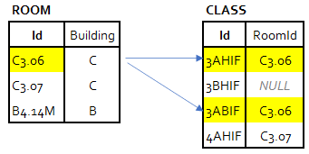
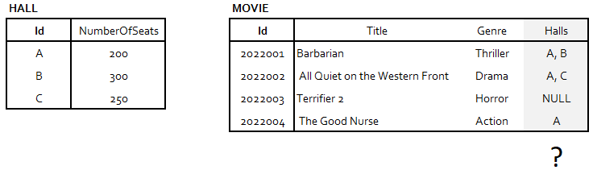
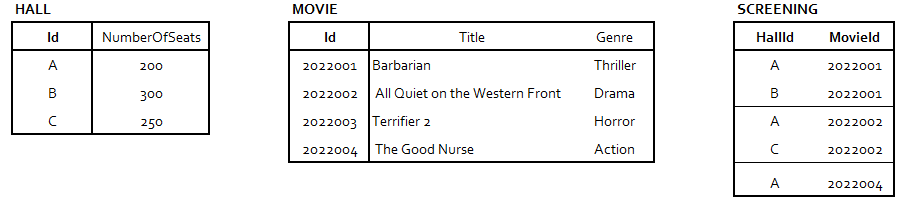

# n:m und 1:1 Beziehungen

## Wiederholung: 1:n Beziehungen

Bis jetzt haben wir 1:n Beziehungen kennen gelernt. Sie liegen dann vor, ein Datensatz in Tabelle A
mit n (beliebig vielen) Datensätzen in Tabelle B zugeordnet ist. Umgekehrt wird einem Datensatz
in Tabelle B maximal ein Datensatz aus Tabelle A zugeordnet.

Als Beispiel haben wir folgende sprachliche Formulierung gewählt:

- **1** Raum ist Stammraum von **n** Klassen. **1** Klasse hat **0 oder 1** Stammraum.
- **1** Klasse besuchen **n** Schüler. **1** Schüler besucht **1** Klasse.

Sehen wir uns einmal konkrete Tabellen an, die diesen Sachverhalt in einer Datenbank abbilden.



Wir erkennen folgende Sachverhalte:

- Der Datensatz *C3.06* in der Tabelle *Room* steht mit mehreren Datensätzen in der Tabelle *Class*
  in Beziehung. Ein Datensatz der Tabelle *Class* steht aber nur mit genau einem Datensatz der 
  Tabelle *Room* in Beziehung. Im ER Diagramm sehen wir deswegen einen Krähenfuß beim
  Entity *Class*.
- Der Datensatz der Klasse *3BHIF* steht mit *keinem* Datensatz der Tabelle Room
  in Beziehung. Technisch gesehen ist der Fremdschlüssel *NULL*. Diese Klasse hat
  also keinen Stammraum.
- Der Raum B4.14M ist keiner Klasse als Stammraum zugeordnet.

Im ER Diagramm ist dieser Sachverhalt exakt ablesbar:

- Beim Entity *Class* ist ein Krähenfuß mit einer kleinen 0 (Kreis). Es bedeutet
  "0 oder beliebig viele".
- Beim Entity *Room* ist ein Symbol mit einem Abstrich und einer 0. Es bedeutet
  "0 oder 1". Wir brauchen diese 0, da es auch Klassen ohne Raum geben kann.
- Der Fremdschlüssel im Entity *Class*, das Attribut *RoomId*, ist daher nullable
  (kein schwarzer Punkt).

Diese Punkte müssen konsistent verwendet werden.


## n:m Beziehungen

Stellen wir uns ein Kino vor. In einem Saal werden mehrere Filme gezeigt. Ein Film
wird aber auch in mehreren Sälen gezeigt. Wie bei jeder Beziehung ist auf den
*Scope* zu achten. Zum Zeitpunkt t läuft im Saal A zwar nur ein Film, aber wir wollen ja
alle Filme, die gezeigt werden, speichern. Also müssen wir die gesamte Zeitachse berücksichtigen.
Somit gilt folgender sprachlicher Zusammenhang:

> **1** Saal zeigt **n** Filme. **1** Film wird in **n** Sälen gezeigt.

### Logisches und physisches Modell

Im *logischen Modell*, also rein auf Konzeptebene, können wir mit 2 Krähenfüßen diese Beziehung
darstellen:


Wo sind allerdings unsere Fremdschlüssel? Der Fremdschlüssel ist bereits eine Idee aus dem
*physischen Modell*, also der konkreten Ralisierung des Modelles als Datenbanktabellen. Allerdings
können wir auf Tabellenebene eine n:m Beziehung nicht direkt darstellen. 



So eine Lösung (Beistrichliste) ist natürlich schlecht, wir können diese Spalte nur schwer
in SQL abfragen. Später sehen wir, dass diese Tabelle die *1. Normalform* (Attribute müssen
atomar sein) verletzt.

In anderen Technologien ist das jedoch möglich. Bereits recht früh in der
Programmierausbildung wurde z. B. folgender Code geschrieben:

```java
class Hall {
    private String id;
    private int numberOfSeats;
}

class Movie {
    private int id;
    private String title;
    private String genre;
    private List<Hall> halls;
}
```

Wir sehen, dass Datenbanken Beziehungen nur über das "Hilfsmittel" Fremdschlüssel abbilden
können, und dieser Fremdschlüssel kann nur ein einziger Wert pro Zelle sein. Wie kann also
vorgegangen werden? Wir können die *Beziehung auflösen*:


Es entsteht nun ein 3. Entity: *Screening* (Vorführung). Manchmal finden sich dafür sprechende
Namen, manchmal werden diese Tabellen einfach mit einen Namen versehen, der die beiden Tabellen
kombiniert (z. B. *HallMovie*). Im Modell fallen mehrere Dinge auf:

- Die "Auflösungstabelle" hat einen Primärschlüssel, der aus den beiden Primärschlüsseln von
  *Hall* und *Movie* zusammengesetzt ist.
- Dementsprechend wird eine durchgezogene Linie gezeichnet, da der Fremdschlüssel (FK) ein
  Teil des Primärschlüssels von *Screening* ist.
- Die "1er Seite" wird mit 2 Abstrichen gekennzeichnet (also exakt 1 und nicht "0 oder 1"). Da
  der Fremdschlüssel Teil des Primärschlüssels von *Screening* ist, darf er auch nicht *null*
  sein.

In der Datenbank entsteht so eine 3. Tabelle, die die Zuordnung speichert. Somit kann ein Film
auch mehreren Sälen zugeordnet werden.



Oftmals muss die n:m Beziehung schon auf logischer Ebene aufgelöst werden. Wir wollen nämlich
speichern, wann die Vorstellung in einem bestimmten Saal nun statt findet. Die einzige Möglichkeit
ist das Platzieren des Attributes im Entity *Screening*:


> n:m Beziehungen werden meist auf logischer Ebene schon als 1:n Beziehung mit einer 
> Auflösungstabelle modelliert, da meist zusätzliche Informationen dort untergebracht werden müssen.

### Übung

Erweitere nun das obige Modell um folgende Sachverhalte:

- Filme können auch mehrere Genres haben.
- Filme haben mehrere Filmarten: 2D (ID *2D*), 3D (ID *3D*) und Originalfassung (ID *O*).
  Erstelle für die Filmarten ein Entity *MovieType* und ermögliche eine korrekte Zuordnung zu den 
  Filmen.
- Der Verkaufspreis der Filme richtet sich nach Film und Filmart. So wird z. B. für 3D ein
  höherer Preis verlangt. Wie kann das gespeichert werden?
- SQL Wiederholung: Schreibe - basierend auf deinem Modell - Abfragen, die folgendes herausfinden:
  - Welche Filme im Programm haben die Filmart "3D"?
  - Wie viele Filme gibt es pro Filmart?

Erstelle zu Beginn eine Datei *cinema.puml* in Visual Studio Code. Mit *ALT + D* kann die
Vorschau eingeblendet werden. Verwende den folgenden PlantUML Code als Ausgangsbasis:

<details>
<summary>PlantUML Code einblenden</summary>

```
@startuml
hide circle
left to right direction

entity Hall {
   * Id
   ---
   * NumberOfSeats
}


entity Movie {
   * Id
   ---
   * Title
   * Genre
}

entity Screening {
   * HallId <<FK>>
   * MovieId <<FK>>
   ---
   DateTime
}

Hall ||--o{ Screening
Movie ||--o{ Screening
@enduml
```
</details>

## Die 1:1 Beziehung

Kinokunden haben oft Movie Cards, die zur Kundebindung eingesetzt werden. Es sind z. B. 
Chipkarten, mit dessen Hilfe die Kunden ohne Anstellen an der Kasse in die Vorstellung gehen
können. Sprachlich besteht folgender Zusammenhang:

> **1** Kunde hat **0 oder 1** MovieCard, **1** MovieCard gehört **1** Kunden.


Beachte, dass ein Kunde *0 oder 1* Movie Card haben kann. Es gibt also durchaus Kunden, die diese
Möglichkeit nicht in Anspruch nehmen möchten. Deswegen hat auch das Entity *MovieCard* den
Fremdschlüssel, da dieser nie *null* sein kann. Dieser Fremdschlüssel ist nämlich zugleich der
Primärschlüssel des Entities *MovieCard*.
Umgekehrt (die Chipnummer der MovieCard, die auch eindeutig ist, wäre der Primärschlüssel von
Custimer) funktioniert das nicht, da es auch Kunden ohne Movie Cards gibt. Diese würden sonst
einen Primärschlüssel mit dem Wert *null* haben, was nicht möglich ist.

> Bei einer 1:1 Beziehung ist der Primärschlüssel von Entity A auch der Primärschlüssel von Entity B.

Technisch können wir die Daten auch in einem Entity unterbringen:


Allerdings hat diese Lösung den Nachteil, dass nun alle Felder, die die MovieCard betreffen,
*nullable* sein müssen. Bei Kunden ohne Karte können wir für diese Felder ja keine sinnvollen
Werte einfügen. Unsere Datenqualität hat sich also verschlechtert, da jetzt z. B. das Feld
*MovieCardChipNumber* befüllt, aber *MovieCardIssueDate* den Wert *null* haben kann.

Betrachten wir nun eine andere Beziehung. Unser System bietet für Kunden einen online Ticketverkauf.
Deswegen muss sich jede/r einmal registrieren, sonst haben wir keine Kundendaten. Es gilt:

> **1** Kunde hat **1** User, **1** User gehört zu **1** Kunden.

Wir können nun in einem einzigen Entity Kunden- und Userdaten vermischen. Dies ist allerdings
vom Zeitablauf kritisch. Zuerst meldet sich der Kunde an, es werden also einmal die Kundendaten
geschrieben. Die Userdaten mit der Zahlungsinformation entstehen erst nachdem der Kunde das 
Zahlungsmittel eingegeben hat und es durch den Payment Provider bestätigt wurde. Durch
diesen Zeitablauf entsteht dann genau genommen auch die Situation, dass ein Kunde
für kurze Zeit **0 oder 1** User haben kann.

### Übung

Füge in dein Kinomodell aus der oben beschriebenen Übung zu *n:m* Beziehungen nun
Kunden und Kundenkarten (Movie Cards) ein.
- Der Kunde wird mit den Attributen *Firstname*, *Lastname* und *Email* erfasst.
- Mit der Moviecard soll abgerufen werden, ob ein Kunde in einen Saal darf. Denke an eine
  automatische Zugangskontrolle, die beim Saaleingang vorhanden sein kann.
  Es muss also eine Zuordnung der Vorführung zum Kunden (oder Kundenkarte) hergestellt werden.
  Überlege dir dabei,
  dass Kunden ihre Karte verlieren können. Dann wird die alte MovieCard gelöscht und es wird
  eine neue angelegt. Die gekauften Tickets sollen aber auch mit der neuen Karte
  abgerufen werden können.
- SQL Wiederholung:
  - Schreibe eine Abfrage, die ausgehend von einer Kartennummer und einen Saal prüfen kann,
    ob ein Kunde Zutritt hat. Die Kunden dürfen 30 Minuten vor Beginn der Vorführung bis
    maximal 10 Minuten nach Vorführungsbeginn in den Saal.
