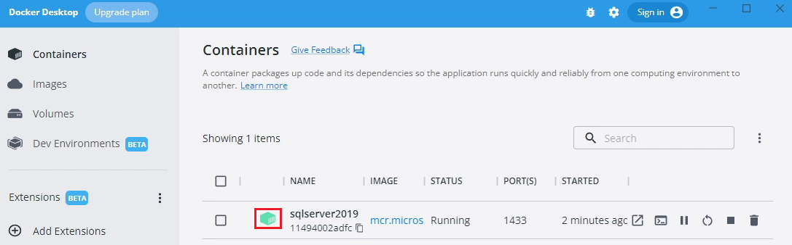
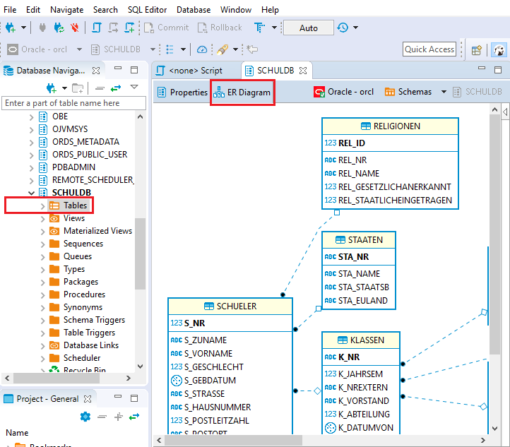

# Arbeiten mit DBeaver Community

Als SQL Editor kann auch DBeaver verwendet werden. Er kann sich über die JDBC Treiberarchitektur
zu verschiedenen Datenbanken - darunter auch SQL Server - verbinden. Das Programm kann auf
der [DBeaver Downloadseite](https://dbeaver.io/download/) heruntergeladen werden.

## Voraussetzung

Der Docker Container von SQL Server muss wie bei [SQL Server als Docker Image (für HIF Klassen)](https://github.com/schletz/Dbi2Sem/blob/master/01_SQLServer/README.md)
beschrieben laufen:

## Verbinden zur SQL Server Datenbank

Durch den Button *New Database Connection* kann der Verbindungsdialog geöffnet werden. In diesem Dialog
muss SQL Server als Datenbanksystem ausgewählt werden:

- **Host:** *localhost*
- **Database:** *master*
- **Username:** *sa*
- **Passwort:** *SqlServer2019*

Beim ersten Verbinden wird der Treiber aus dem Netz geladen

[Video dazu](dbeaver_sql_server_connect.mp4)

## Darstellung einer Datenbank als ER Diagramm

Ein nettes Feature ist das automatische Erzeugen von ER Diagrammen von einem Schema aus. Dies erreicht
man im Kontextmenü des Schemas in der Navigation:

