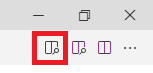

## PlantUML und VS Code als Modellierungswerkzeug

### [Zum Video](https://youtu.be/h5f-jg_jM98)

1. Prüfe, ob Java installiert und im PATH eingetragen ist. Der Befehl *java -version* muss erkannt werden.
   Java kann von https://jdk.java.net/18/ geladen werden. Entpacke das Archiv direkt nach *C:*, sodass
   ein Ordner *C:\jdk-18.0.2.1* entsteht. Füge *C:\jdk-18.0.2.1\bin* zur PATH Variable hinzu
   ([Anleitung](https://www.architectryan.com/2018/03/17/add-to-the-path-on-windows-10/)).
2. Installiere [Visual Studio Code](https://code.visualstudio.com). Achtung: Aktiviere beim Setup
   die Option "In den Explorer integrieren", damit Sie im Kontextmenü VS Code starten können.
3. Installiere die folgenden Extensions:
   - Markdown PDF
   - Markdown Preview Enhanced
   - PlantUML
4. Öffne die VS Code Konfiguration (*F1* - "*settings*" eingeben - "*Preferences: Open Settings (JSON)*" wählen)
   und füge folgende Zeilen hinzu:

```javascript
    "markdown-pdf.plantumlOpenMarker": "```plantuml",
    "markdown-pdf.plantumlCloseMarker": "```"   
```

Nun steht durch die Extension *Markdown Preview Enhanced* ein Icon bereit, welches eine Vorschau mit
dem gerenderten Diagramm bietet:


### Demo Markdownfile mit PlantUML

Kopiere den Code aus der Datei [er_demo](er_demo.md) in eine neue Datei mit dem Namen
*er_demo.md*. **Wichtig: Klicke auf RAW, um den Code anzuzeigen. Dieser muss kopiert werden!**
Es sollte in der Vorschau mit Markdown Preview Enhanced ein ER Diagramm gerendert werden.
Mit *F1* - *Markdown PDF: Export (PDF)* kann ein PDF erzeugt werden. Es sollte so aussehen wie
die Datei [er_demo.pdf](er_demo.pdf)

Die Syntax ist auf https://plantuml.com/de/ie-diagram nachzulesen.
