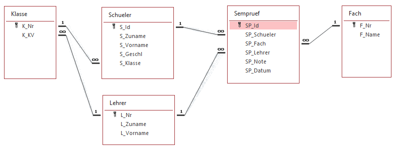

# Nachtest in DBI

Klasse: 3CAIF
Datum:  21. Jänner 2020
Prüfer: SZ

## SQL Aufgaben

Öffnen Sie die SQLite Datenbank *Sempruef.db* in DBeaver. Führen Sie danach die folgenden
Abfragebeispiele aus. Schreiben Sie in Ihrer SQL Datei die Angabe als Kommentar über jedes Ihrer
gelösten Beispiele. Die korrekten Lösungen sind hier angegeben.

In der Datenbank sind Semesterprüfungen abgebildet. Das Datenmodell sieht so aus:

(1) Geben Sie eine Liste aller eingetragenen Semesterprüfungen aus. Verwenden Sie nur Prüfungen,
   die auch eine Note haben. Ordnen Sie nach *L_Nr* und *S_Id*.

| L_Nr	| L_Zuname	| S_Id	| S_Zuname	| S_Vorname	| S_Klasse	| SP_Fach	| SP_Note	| 
| ----	| --------	| ----	| --------	| ---------	| --------	| -------	| -------	| 
| BAK 	| Bakesef 	| 1001	| Viney   	| Liè      	| 3AHIF   	| D      	| 3      	| 
| BAK 	| Bakesef 	| 1010	| Gaffney 	| Magdalène	| 3CHIF   	| D      	| 2      	| 
| BAK 	| Bakesef 	| 1010	| Gaffney 	| Magdalène	| 3CHIF   	| D      	| 5      	| 
| MEA 	| Measures	| 1003	| Allmann 	| Edmée    	| 3AHIF   	| AM     	| 2      	| 
| MEA 	| Measures	| 1006	| McGeever	| Mélinda  	| 3BHIF   	| D      	| 3      	| 
| MEA 	| Measures	| 1006	| McGeever	| Mélinda  	| 3BHIF   	| AM     	| 4      	| 
| ZIE 	| Ziemecki	| 1003	| Allmann 	| Edmée    	| 3AHIF   	| POS    	| 3      	| 
| ZIE 	| Ziemecki	| 1006	| McGeever	| Mélinda  	| 3BHIF   	| POS    	| 2      	| 

(2) In welchen Fächern hat die 3AHIF Semesterprüfungen? Geben Sie jedes Fach nur 1x aus.

| K_Nr 	| F_Nr	| F_Name       	| 
| -----	| ----	| -------------	| 
| 3AHIF	| AM  	| Mathematik   	| 
| 3AHIF	| D   	| Deutsch      	| 
| 3AHIF	| POS 	| Programmieren	| 

(3) Wie viele Semesterprüfungen sind pro Klasse im System eingetragen?

| K_Nr 	| Anzahl	| 
| -----	| ---------	| 
| 3AHIF	| 5        	| 
| 3BHIF	| 3        	| 
| 3CHIF	| 4        	| 

(4) Gibt es Lehrer ohne Semesterprüfungen?

| L_Nr	| L_Zuname     	| L_Vorname	| 
| ----	| -------------	| ---------	| 
| LIC 	| Licciardiello	| Östen    	| 
| DAI 	| Daice        	| Cloé     	| 

(5) Wann fand pro Lehrer die erste und letzte Semesterprüfung statt?

| L_Nr	| L_Zuname	| Erste	            | Letzte	        | 
| ----	| --------	| --------------	| --------------	| 
| BAK 	| Bakesef 	| 08.11.2019    	| 26.11.2019    	| 
| MEA 	| Measures	| 02.11.2019    	| 17.11.2019    	| 
| ZIE 	| Ziemecki	| 03.11.2019    	| 10.11.2019    	| 

(6) Wie viele Prüfungen hat ein Lehrer gesamt, und wie viele sind davon schon beurteilt? Geben Sie auch
   Lehrer ohne Semesterprüfung mit der Anzahl 0 aus.

| L_Nr	| L_Zuname     	| Gesamt	| Beurteilt	| 
| ----	| -------------	| ------	| ---------	| 
| BAK 	| Bakesef      	| 4     	| 3        	| 
| DAI 	| Daice        	| 0     	| 0        	| 
| LIC 	| Licciardiello	| 0     	| 0        	| 
| MEA 	| Measures     	| 5     	| 3        	| 
| ZIE 	| Ziemecki     	| 3     	| 2        	| 

(7) Welche Semesterprüfungen haben keine Note oder kein Prüfungsdatum?

| S_Id	| S_Zuname	| S_Klasse	| SP_Fach	| SP_Lehrer	| SP_Note	| SP_Datum  	| 
| ----	| --------	| --------	| -------	| ---------	| -------	| ----------	| 
| 1002	| Mudie   	| 3AHIF   	| POS    	| ZIE      	|        	|           	| 
| 1004	| Inch    	| 3AHIF   	| D      	| MEA      	|        	|           	| 
| 1008	| Dongall 	| 3CHIF   	| D      	| BAK      	|        	| 11.11.2019	| 
| 1009	| Mougeot 	| 3CHIF   	| AM     	| MEA      	|        	| 15.11.2019	| 

(8) Für jede Klasse sind alle Schüler und alle Semesterprüfungen auszugeben. Schüler, die keine
  Prüfung haben, sollen auch aufgelistet werden.

| K_Nr 	| K_KV	| S_Zuname	| SP_Fach	| SP_Lehrer	| 
| -----	| ----	| --------	| -------	| ---------	| 
| 3AHIF	| MEA 	| Allmann 	| POS    	| ZIE      	| 
| 3AHIF	| MEA 	| Allmann 	| AM     	| MEA      	| 
| 3AHIF	| MEA 	| Inch    	| D      	| MEA      	| 
| 3AHIF	| MEA 	| Mudie   	| POS    	| ZIE      	| 
| 3AHIF	| MEA 	| Viney   	| D      	| BAK      	| 
| 3BHIF	| LIC 	| Foye    	|        	|          	| 
| 3BHIF	| LIC 	| McGeever	| POS    	| ZIE      	| 
| 3BHIF	| LIC 	| McGeever	| D      	| MEA      	| 
| 3BHIF	| LIC 	| McGeever	| AM     	| MEA      	| 
| 3BHIF	| LIC 	| Webland 	|        	|          	| 
| 3CHIF	| ZIE 	| Dongall 	| D      	| BAK      	| 
| 3CHIF	| ZIE 	| Gaffney 	| D      	| BAK      	| 
| 3CHIF	| ZIE 	| Gaffney 	| D      	| BAK      	| 
| 3CHIF	| ZIE 	| Mougeot 	| AM     	| MEA      	| 

### Bewertung

Pro gelöstem Beispiel gibt es 1 Punkt. Ein Beispiel gilt dann als gelöst, wenn die Aussage mit der
angezeigten Musterausgabe übereinstimmt. Außerdem darf ihre Abfrage nur die in der Angabe angegebenen
Annahmen treffen.

## DDL

Fügen Sie in die Datenbank *Sempruef.db* folgende Tabellen mit Hilfe von CREATE TABLE Anweisungen
ein. Die abgezeigten Daten geben Ihnen einen Überblick, welche Daten dort gespeichert werden sollen.

(1) Erstellen Sie eine Tabelle *Lesson*. Sie soll speichern, welcher Lehrer welche Klasse in welchem
Fach zu welchen Zeitpunkt unterrichtet.

| LE_ID	| LE_Lehrer	| LE_Klasse	| LE_Fach	| LE_Tag	| LE_Stunde	| 
| -----	| ---------	| ---------	| -------	| ------	| ---------	| 
| 1001 	| BAK      	| 3AHIF    	| D      	| 1     	| 1        	| 
| 1002 	| BAK      	| 3AHIF    	| D      	| 1     	| 2        	| 
| 1003 	| MEA      	| 3AHIF    	| AM     	| 2     	| 1        	| 
| 1004 	| MEA      	| 3AHIF    	| AM     	| 2     	| 2        	| 
| 1005 	| ZIE      	| 3AHIF    	| POS    	| 3     	| 1        	| 
| 1006 	| ZIE      	| 3AHIF    	| POS    	| 3     	| 2        	| 
| 1007 	| MEA      	| 3AHIF    	| POS    	| 3     	| 1        	| 
| 1008 	| MEA      	| 3AHIF    	| POS    	| 3     	| 2        	| 

Stellen Sie mit Constraints sicher, dass folgende Regeln eingehalten werden:

- *LE_ID*: Primärschlüssel; ganze Zahl
- *LE_Lehrer*: String, der auf den Primärschlüssel in Lehrer verweist. Maximal 10 Stellen.
- *LE_Klasse*: String, der auf den Primärschlüssel in Klasse verweist. Maximal 10 Stellen.
- *LE_Fach*: String, der auf den Primärschlüssel in Fach verweist. Maximal 10 Stellen.
- *LE_Tag*: Wochentag der Unterrichtsstunde. Zahl (1 = Montag, 6 = Samstag).
- *LE_Stunde*: Unterrichtsstunde von 1 bis 16.
- Lehrer, Klasse und Fach dürfen nicht leer sein.
- Der Tag muss zwischen 1 und 6 sein.
- Die Stunde muss zwischen 1 und 16 sein.
- Pro Lehrer, Tag und Stunde darf es nur 1 Datensatz geben.

(2) Erstellen Sie eine Tabelle *Lernwerkstatt*. In einer Lernwerkstatt betreut ein Lehrer einen Schüler
in einem Fach. Die Tabelle kann so aussehen:

| LW_Schueler	| LW_Fach	| LW_Betreuer	| LW_Anmeldung	| 
| -----------	| -------	| -----------	| ---------------	| 
| 1004       	| POS    	| LIC        	| 1.11.2019      	| 
| 1004       	| E      	| LIC        	| 1.11.2019      	| 
| 1004       	| D      	| LIC        	| 5.12.2019      	| 
| 1004       	| AM     	| LIC        	| 1.11.2019      	| 
| 1004       	| E      	| DAI        	| 1.11.2019      	| 
| 1004       	| E      	| MEA        	| 3.12.2019      	| 
| 1004       	| POS    	| DAI        	| 3.12.2019      	| 
| 1004       	| AM     	| MEA        	| 3.12.2019      	| 

Stellen Sie mit Constraints sicher, dass folgende Regeln eingehalten werden:

- *LW_Schueler*: Wert, der auf den Primärschlüssel in Schüler verweist. Ganze Zahl.
- *LW_Fach*: String, der auf den Primärschlüssel in Fach verweist. Maximal 10 Stellen.
- *LW_Betreuer*: String, der auf den Primärschlüssel in Lehrer verweist. Maximal 10 Stellen.
- *LW_Anmeldung*: Datumswert.
- *LW_Betreuer* und *LW_Anmeldung* dürfen nicht leer sein.
- *LW_Schueler* und *LW_Fach* sind der Primärschlüssel.

(3) Erstellen Sie eine Tabelle *Arbeitsbericht*. Pro Schüler in der Lernwerkstatt sollen
Arbeitsberichte gespeichert werden können. Diese Tabelle sieht z. B. so aus:

| AB_Id	| AB_Schueler	| AB_Fach	| AB_Text          	| AB_Datum 	| 
| -----	| -----------	| -------	| -----------------	| ---------	| 
| 1001 	| 1004       	| POS    	| if Abfragen.     	| 1.11.2019	| 
| 1002 	| 1004       	| E      	| Vokabel abprüfen.	| 1.11.2019	| 
| 1003 	| 1004       	| POS    	| Schleifen üben.  	| 8.11.2019	| 
| 1004 	| 1004       	| E      	|               	| 8.11.2019	| 

Stellen Sie mit Constraints sicher, dass folgende Regeln eingehalten werden:

- *AB_Id*: Primärschlüssel. Ganzzahliger Wert.
- *AB_Schueler*: Wert, der auf die Spalte LW_Schueler in Lernwerkstatt verweist. Ganze Zahl.
- *AB_Fach*: String, der auf die SPalte LW_Fach in Lernwerkstatt verweist. Maximal 10 Stellen.
- *AB_Text*: Lehrstoff. Maximal 255 Stellen, darf auch leer sein.
- *AB_Datum*: Datum, wann die Stunde statt gefunden hat.
- *AB_Schueler* und *AB_Fach* müssen gemeinsam auf den Primärschlüssel in Lernwerkstatt verweisen.

### Bewertung
Pro umgesetztes Contraint gibt es 1 Punkt. Das bedeutet, dass bei Lesson 10 Punkte, bei Lernwerkstatt
6 Punkte und bei Arbeitsbericht 6 Punkte zu erreichen sind. Das sind in Summe 22 Punkte.

## Abgabe

Senden Sie Ihre SQL Datei (nicht die Datenbank!) unter dem Betreff *Nachtest 3BAIF 21.1.*
per Email an *schletz@spengergasse.at*