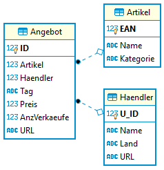

# 1. Prüfung in SQL
Klasse: 3CAIF
Datum: 5. November 2019
Prüfer: SZ


## Hinweise zur Bearbeitung der Aufgaben
1. In diesem Verzeichnis befindet sich die Datei *HaendlerDb.mdb*, falls Sie eine Accessdatenbank
   zur Lösung der Aufgaben verwenden möchten. Falls Sie mit SQLite arbeiten möchten, gibt es in
   *HaendlerDb.db* eine SQLite Version. Falls Sie die Aufgabenstellung mit einer Oracle Datenbank
   umsetzen möchten, befindet sich in [create_oracle.sql](create_oracle.sql) der SQL Dump für Oracle.
1. Falls Sie DBeaver oder SQL Developer verwenden, kopieren Sie den untenstehenden SQL Code mit den
   Angaben in ein neues
   Abfragefenster und führen Sie Ihre Lösung unter das jeweilige Beispiel ein. Falls Sie die 
   Abfragen mit Access lösen, kopieren Sie den SQL Code mit Hilfe eines Texteditors in diese Datei.
1. Ihre Ausgabe darf von der korrekten Ausgabe bezüglich der Formatierung und Sortierung abweichen
   (außer es ist eine spezielle Sortierung in der Angabe verlangt).
1. Wenn Sie fertig sind, senden Sie die SQL Datei mit allen Lösungen per Mail an *schletz@spengergasse.at*.

## Bewertung
Jede korrekt gelöste Aufgabe bringt 1 Punkt. 8 Punkte = Sehr gut, 7 Punkte = Gut, 6 Punkte = Befriedigend,
5 Punkte = Genügend, 4 oder weniger Punkte = Nicht genügend.

## Datenmodell



## SQL Datei

```sql
-- *************************************************************************************************
-- BEISPIEL 1: Welche Händler haben keine URL eingetragen?
--
-- Korrekte Ausgabe:
-- |U_ID|Name|Land|URL|
-- |----|----|----|---|
-- |1003|Alternate|GER|
-- *************************************************************************************************


-- *************************************************************************************************
-- BEISPIEL 2: 
-- Bei welchen Angeboten liegt der Nettopreis (das ist der eingetragene Preis vor der MWSt, also 
-- Preis / 1.2 ermitteln)
-- über 11740 Euro?
--
-- Korrekte Ausgabe:
-- |ID|Artikel|Haendler|Tag|Preis|AnzVerkaeufe|URL|
-- |--|-------|--------|---|-----|------------|---|
-- |1029|1006|1001|2018-12-14|14088.13||www.mediamarkt.at/product/1006|
-- |1030|1006|1001|2018-12-15|14369.89|6|www.mediamarkt.at/product/1006|
-- *************************************************************************************************


-- *************************************************************************************************
-- Beispiel 3:
-- Geben Sie den Umsatz aus, den der Händler 1003 an diesem Tag bei einem Angebot machte. Der Umsatz
-- ermittelt sich aus Preis x AnzVerkaeufe.
--
-- Korrekte Ausgabe:
-- |Haendler|Tag|Preis|AnzVerkaeufe|Umsatz|
-- |--------|---|-----|------------|------|
-- |1003|2018-12-10|81.6|27|2203.2|
-- |1003|2018-12-11|82.42|4|329.68|
-- |1003|2018-12-12|81.59|19|1550.21|
-- |1003|2018-12-13|82.41|||
-- |1003|2018-12-14|82.41|28|2307.48|
-- |1003|2018-12-15||4||
-- |1003|2018-12-10|231.8|||
-- |1003|2018-12-11|229.48|27|6195.96|
-- |1003|2018-12-12|229.48|7|1606.36|
-- |1003|2018-12-13|224.89|19|4272.91|
-- |1003|2018-12-14|222.64|16|3562.24|
-- |1003|2018-12-15||6||
-- |1003|2018-12-10|800|||
-- |1003|2018-12-11|800|29|23200|
-- |1003|2018-12-12|792|23|18216|
-- |1003|2018-12-13|799.92|||
-- |1003|2018-12-14|815.92|||
-- |1003|2018-12-15|832.24|||
-- *************************************************************************************************

-- *************************************************************************************************
-- Beispiel 4: An welchen Tagen gab es Angebote ohne Preis? Der Tag ist nur 1x auszugeben. Sortieren
-- Sie die Ausgabe aufsteigend nach dem Tag.
--
-- Korrekte Ausgabe:
-- |Tag|
-- |---|
-- |2018-12-10|
-- |2018-12-13|
-- |2018-12-15|
-- *************************************************************************************************


-- *************************************************************************************************
-- Beispiel 5
-- Welche Händler haben Angebote im Programm, dessen Preis über 10000 Euro ist?
--
-- Korrekte Ausgabe:
-- |U_ID|Name|Tag|Preis|
-- |----|----|---|-----|
-- |1001|Media Markt|2018-12-11|13675.14|
-- |1001|Media Markt|2018-12-12|13948.64|
-- |1001|Media Markt|2018-12-14|14088.13|
-- |1001|Media Markt|2018-12-15|14369.89|
-- *************************************************************************************************

-- *************************************************************************************************
-- Beispiel 6: Geben Sie eine Liste aller Artikel aus, die von einem österreichischen Händler angeboten werden. Der Artikel 
-- soll nur 1x erscheinen. Hinweis: Da die Spalte Name mehrmals vorkommt wird, müssen Sie einen Tabellenalias verwenden.
--
--  Korrekte Ausgabe
--  EAN             NAME        
--  1001            Raspberry Pi
--  1006            Sony KD-77A1
-- *************************************************************************************************

-- *****************************************************************************************************************************
-- Beispiel 7: Von welchen Händlern (U_ID und Name) gibt es Angebote, die mindestens einmal keinen Preis (Wert NULL) in der 
-- Angebotstabelle enthalten?
--
--  Korrekte Ausgabe
--  U_ID            NAME        ARTIKEL
--  1001            Media Markt 1001   
--  1001            Media Markt 1006   
--  1001            Media Markt 1006   
--  1003            Alternate   1001   
--  1003            Alternate   1002   
-- *************************************************************************************************

-- *************************************************************************************************
-- BEISPIEL 8: Welche Kategorien von Artikel verkaufen die Händler? 
--
-- Korrekte Ausgabe
-- U_ID	Name	    Kategorie
-- 1001	Media Markt	Fernseher
-- 1001	Media Markt	Hardware
-- 1003	Alternate	Hardware
-- 1003	Alternate	Haushalt    
-- *************************************************************************************************
```
