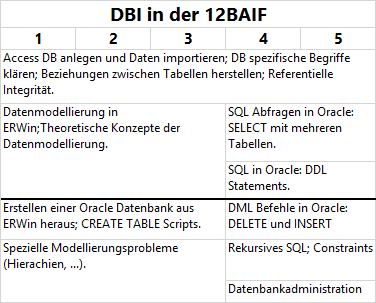

# DBI für das 1. Semester des Kollegs bzw. Aufbaulehrganges



## Synchronisieren des Repositories in einen Ordner
1. Laden Sie von https://git-scm.com/downloads die Git Tools (Button *Download 2.23.0 for Windows*)
    herunter. Es können alle Standardeinstellungen belassen werden, bei *Adjusting your PATH environment*
    muss aber der mittlere Punkt (*Git from the command line [...]*) ausgewählt sein.
2. Lege einen Ordner auf der Festplatte an, wo Sie die Daten speichern möchten 
    (z. B. *C:\Schule\DBI\Examples*). Das
    Repository ist nur die lokale Version des Repositories auf https://github.com/schletz/Dbi1Sem.git.
    Hier werden keine Commits gemacht und alle lokalen Änderungen dort werden bei der 
    nächsten Synchronisation überschrieben.
3. Initialisieren Sie den Ordner mit folgenden Befehlen, die in der Konsole in diesem Verzeichnis
    (z. B. *C:\Schule\DBI\Examples*) ausgeführt werden:
```bash {.line-numbers}
git init
git remote add origin https://github.com/schletz/Pos3xhif.git
```

4. Legen Sie in diesem Ordner eine Datei *syncGit.cmd* mit folgenden Befehlen an. 
    Durch Doppelklick auf diese Datei wird immer der neueste Stand geladen. Neu erstellte Dateien
    in diesem Ordner bleiben auf der Festplatte, geänderte Dateien werden allerdings durch 
    *git reset* auf den Originalstand zurückgesetzt.
```bash {.line-numbers}
git reset --hard
git pull origin master --allow-unrelated-histories
```
